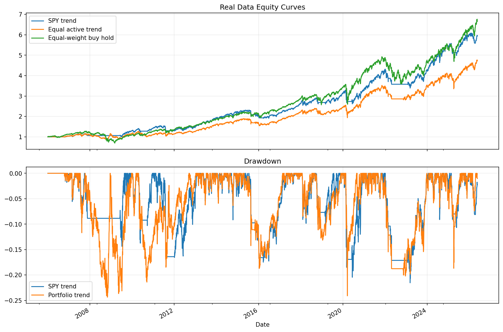

# 11 Equal Weight Trend Portfolio Report

日期：2026-05-19

## 本课问题

多个资产各自有趋势信号时，如何合成一个等权组合？

## 数据和参数

- symbols: SPY, QQQ, DIA, IWM, EFA, TLT
- start_date: 2006-01-03
- end_date: 2026-05-18
- rows: 5125
- setup: MA 10/200 band 1%, next-open, 3 bps cost

## 核心代码

```python
weights = positions.div(positions.sum(axis=1), axis=0).fillna(0)
portfolio_return = (weights * open_to_next_open_returns).sum(axis=1) - turnover * cost_rate
```

## 实跑结果

| case | final_equity | ann_return | ann_vol | max_drawdown | sharpe | calmar | turnover | avg_exposure |
| --- | --- | --- | --- | --- | --- | --- | --- | --- |
| SPY trend only | 5.9452 | 9.16% | 12.03% | -21.53% | 0.7617 | 0.4254 | 23.0000 | 75.24% |
| Equal active trend portfolio | 4.7201 | 7.93% | 13.67% | -24.36% | 0.5800 | 0.3255 | 108 | 91.94% |
| Equal-weight buy and hold | 6.6584 | 9.77% | 15.99% | -45.75% | 0.6111 | 0.2136 | nan | nan |

## 图示




## 结果解读

- 等权趋势组合把风险分散到股票、海外、债券和黄金等不同资产上。
- 组合的平均持仓数量比单资产策略更高，因此路径通常更平滑。
- 这不是证明组合一定更赚钱，而是先验证组合层是否改善风险路径。

## 本课结论

多资产趋势组合的价值不在于每个资产都更强，而在于把单一资产路径风险摊开。
