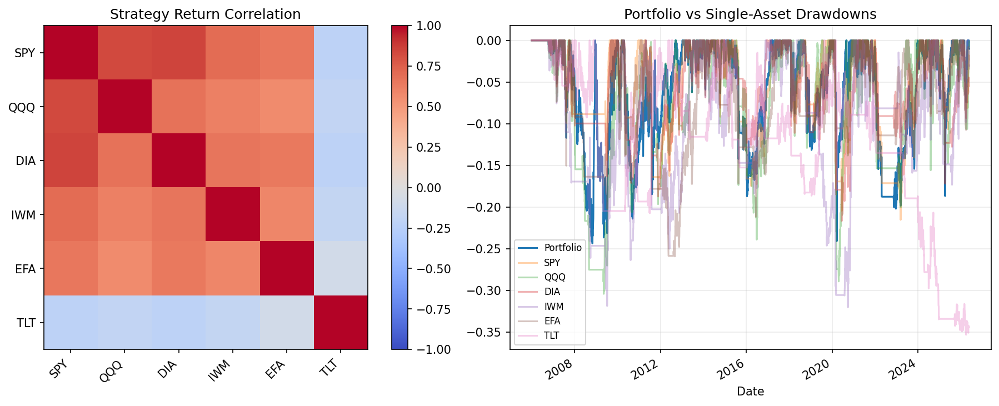

# 12 Portfolio Correlation and Drawdown Report

日期：2026-05-19

## 本课问题

为什么单个资产表现一般，组合以后可能更稳？

## 数据和参数

- symbols: SPY, QQQ, DIA, IWM, EFA, TLT
- start_date: 2006-01-03
- end_date: 2026-05-18
- rows: 5125
- setup: MA 10/200 band 1%; correlation on strategy returns

## 核心代码

```python
corr = strategy_returns.corr()
rolling_corr = returns['SPY'].rolling(126).corr(returns['TLT'])
```

## 实跑结果

| metric | value |
| --- | --- |
| average_pair_correlation | 0.3934 |
| min_pair_correlation | -0.2163 |
| max_pair_correlation | 0.8495 |
| portfolio_max_drawdown | -0.2436 |
| median_single_asset_max_drawdown | -0.2817 |
| latest_126d_SPY_TLT_corr | 0.1136 |

## 图示



## 附表：strategy_return_correlation

| symbol | SPY | QQQ | DIA | IWM | EFA | TLT |
| --- | --- | --- | --- | --- | --- | --- |
| SPY | 1.0000 | 0.8300 | 0.8495 | 0.7017 | 0.6530 | -0.2163 |
| QQQ | 0.8300 | 1.0000 | 0.6782 | 0.6143 | 0.5636 | -0.1871 |
| DIA | 0.8495 | 0.6782 | 1.0000 | 0.6578 | 0.6435 | -0.2141 |
| IWM | 0.7017 | 0.6143 | 0.6578 | 1.0000 | 0.5880 | -0.1795 |
| EFA | 0.6530 | 0.5636 | 0.6435 | 0.5880 | 1.0000 | -0.0818 |
| TLT | -0.2163 | -0.1871 | -0.2141 | -0.1795 | -0.0818 | 1.0000 |

## 结果解读

- 低相关资产能降低组合回撤，但相关性会随市场环境变化。
- SPY 与 TLT 的滚动相关性是观察股票/债券分散效果的重要窗口。
- 如果组合最大回撤没有明显低于单资产中位数，就要怀疑分散是否真实有效。

## 本课结论

相关性不是常数，组合风控必须关心危机时期相关性是否上升。
