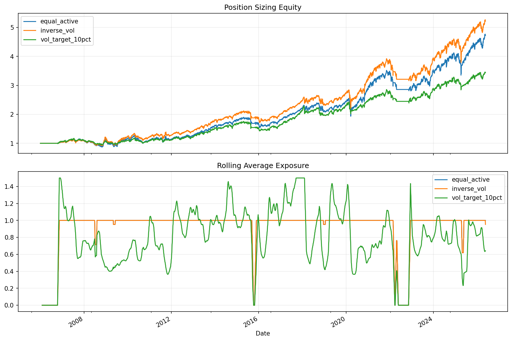

# 13 Position Sizing and Volatility Targeting Report

日期：2026-05-19

## 本课问题

信号告诉我们买不买，仓位管理决定买多少。

## 数据和参数

- symbols: SPY, QQQ, DIA, IWM, EFA, TLT
- start_date: 2006-01-03
- end_date: 2026-05-18
- rows: 5125
- setup: Equal, inverse-vol, and 10% volatility-target sizing

## 核心代码

```python
realized_vol = returns.rolling(63).std() * np.sqrt(252)
weight = (target_vol / realized_vol).clip(upper=max_leverage)
```

## 实跑结果

| case | final_equity | ann_return | ann_vol | max_drawdown | sharpe | calmar | turnover | avg_exposure |
| --- | --- | --- | --- | --- | --- | --- | --- | --- |
| equal_active | 4.7201 | 7.93% | 13.67% | -24.36% | 0.5800 | 0.3255 | 108 | 91.94% |
| inverse_vol | 5.2141 | 8.46% | 13.04% | -23.65% | 0.6488 | 0.3576 | 132 | 91.92% |
| vol_target_10pct | 3.4373 | 6.26% | 10.54% | -19.11% | 0.5940 | 0.3276 | 124 | 79.05% |

## 图示




## 结果解读

- 波动率倒数加权会降低高波动资产的权重，使单个资产不容易主导组合。
- 目标波动率能控制组合风险尺度，但会引入杠杆和低波动时期加仓风险。
- 仓位模型是否可用，要同时看收益、回撤、暴露和换手。

## 本课结论

仓位管理不是提高收益的魔法，它首先是把风险尺度拉回可比较状态。
