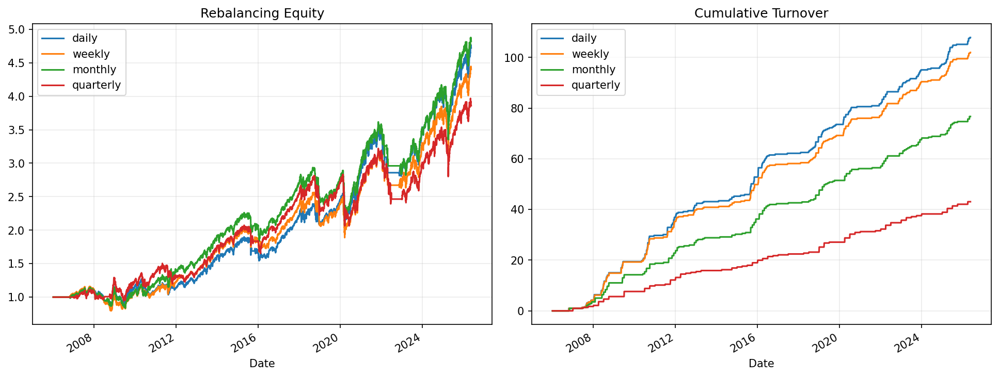

# 14 Rebalancing and Turnover Report

日期：2026-05-19

## 本课问题

组合多久调一次仓，成本和风险会发生什么变化？

## 数据和参数

- symbols: SPY, QQQ, DIA, IWM, EFA, TLT
- start_date: 2006-01-03
- end_date: 2026-05-18
- rows: 5125
- setup: Compare daily/weekly/monthly/quarterly rebalancing

## 核心代码

```python
target_weight = daily_weight.where(is_rebalance_day).ffill()
turnover = target_weight.diff().abs().sum(axis=1)
```

## 实跑结果

| case | final_equity | ann_return | ann_vol | max_drawdown | sharpe | calmar | turnover | avg_exposure |
| --- | --- | --- | --- | --- | --- | --- | --- | --- |
| daily | 4.7201 | 7.93% | 13.67% | -24.36% | 0.5800 | 0.3255 | 108 | 91.94% |
| weekly | 4.4010 | 7.56% | 13.72% | -31.43% | 0.5507 | 0.2404 | 102 | 91.86% |
| monthly | 4.8206 | 8.04% | 14.11% | -28.12% | 0.5700 | 0.2859 | 76.7000 | 91.71% |
| quarterly | 3.8586 | 6.86% | 14.20% | -27.13% | 0.4833 | 0.2530 | 43.0667 | 90.13% |

## 图示




## 结果解读

- 降低再平衡频率通常会减少换手，但也可能让组合偏离最新信号。
- 如果收益改善主要来自更高换手，必须把成本敏感性放在第一位。
- 个人量化更适合先用低频再平衡，减少执行复杂度。

## 本课结论

再平衡频率越高不一定越好，成本和信号延迟必须一起看。
