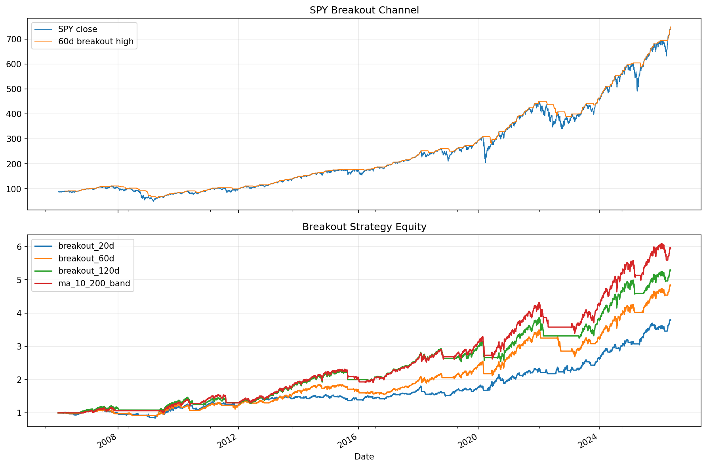

# 15 Breakout Strategy Report

日期：2026-05-19

## 本课问题

价格突破历史高点是否代表趋势开始？

## 数据和参数

- symbols: SPY
- start_date: 2006-01-03
- end_date: 2026-05-18
- rows: 5125
- setup: Donchian breakout, next-open, 3 bps cost

## 核心代码

```python
channel_high = close.rolling(lookback).max().shift(1)
signal = close > channel_high
```

## 实跑结果

| case | final_equity | ann_return | ann_vol | max_drawdown | sharpe | calmar | turnover | avg_exposure |
| --- | --- | --- | --- | --- | --- | --- | --- | --- |
| breakout_20d | 3.7889 | 6.77% | 10.52% | -24.37% | 0.6435 | 0.2778 | 153 | 65.58% |
| breakout_60d | 4.8283 | 8.05% | 11.09% | -23.02% | 0.7256 | 0.3496 | 47.0000 | 71.38% |
| breakout_120d | 5.2796 | 8.53% | 11.44% | -19.37% | 0.7450 | 0.4401 | 19.0000 | 71.36% |
| ma_10_200_band | 5.9452 | 9.16% | 12.03% | -21.53% | 0.7617 | 0.4254 | 23.0000 | 75.24% |

## 图示




## 结果解读

- 短周期突破更敏感，也更容易被假突破反复打脸。
- 长周期突破更慢，但通常能过滤更多噪声。
- 突破和均线都是趋势思想，差异主要在信号定义和反应速度。

## 本课结论

突破策略的核心风险是假突破；参数越短，反应越快，噪声也越多。
