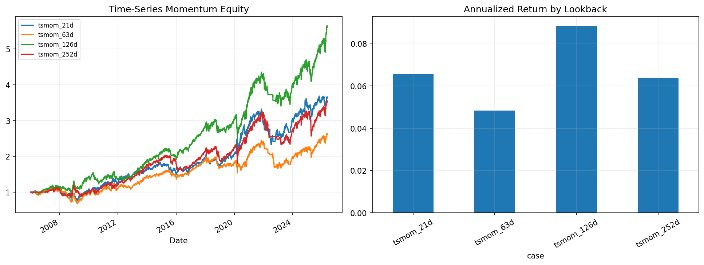

# 16 Time Series Momentum Report

日期：2026-05-19

## 本课问题

过去一段时间上涨的资产，未来是否更可能继续上涨？

## 数据和参数

- symbols: SPY, QQQ, DIA, IWM, EFA, TLT
- start_date: 2006-01-03
- end_date: 2026-05-18
- rows: 5125
- setup: Absolute momentum on 21/63/126/252 day lookbacks

## 核心代码

```python
momentum = close / close.shift(lookback) - 1
signal = momentum > 0
```

## 实跑结果

| case | final_equity | ann_return | ann_vol | max_drawdown | sharpe | calmar | turnover | avg_exposure |
| --- | --- | --- | --- | --- | --- | --- | --- | --- |
| tsmom_21d | 3.6304 | 6.55% | 13.41% | -31.89% | 0.4879 | 0.2052 | 1283 | 91.41% |
| tsmom_63d | 2.6138 | 4.84% | 13.20% | -40.53% | 0.3665 | 0.1194 | 759 | 92.96% |
| tsmom_126d | 5.6039 | 8.84% | 13.11% | -22.49% | 0.6747 | 0.3932 | 509 | 92.96% |
| tsmom_252d | 3.5179 | 6.38% | 13.40% | -28.38% | 0.4763 | 0.2249 | 308 | 90.75% |

## 图示




## 结果解读

- 时间序列动量不是预测具体价格，而是判断资产自身趋势是否为正。
- 不同窗口代表不同趋势尺度，窗口敏感性本身就是策略风险。
- 跨资产测试比单资产测试更能暴露动量规则是否稳健。

## 本课结论

时间序列动量要看跨资产一致性，不能只看一个窗口在一个资产上的表现。
