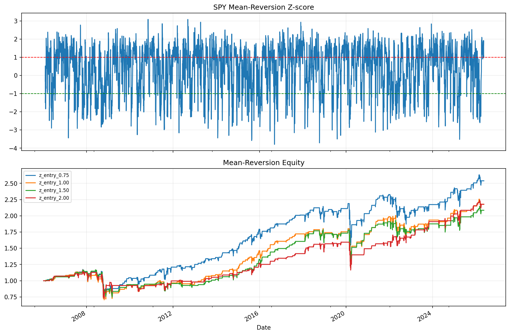

# 17 Mean Reversion Strategy Report

日期：2026-05-19

## 本课问题

价格偏离均值以后，什么时候会回归？

## 数据和参数

- symbols: SPY
- start_date: 2006-01-03
- end_date: 2026-05-18
- rows: 5125
- setup: 20d z-score long/cash mean reversion

## 核心代码

```python
z = (close - close.rolling(window).mean()) / close.rolling(window).std()
signal = z < -entry_z
```

## 实跑结果

| case | final_equity | ann_return | ann_vol | max_drawdown | sharpe | calmar | turnover | avg_exposure |
| --- | --- | --- | --- | --- | --- | --- | --- | --- |
| z_entry_0.75 | 2.5386 | 4.69% | 14.40% | -36.01% | 0.3255 | 0.1302 | 356 | 27.71% |
| z_entry_1.00 | 2.1773 | 3.90% | 14.15% | -39.47% | 0.2756 | 0.0988 | 302 | 25.70% |
| z_entry_1.50 | 2.0851 | 3.68% | 13.75% | -36.10% | 0.2676 | 0.1019 | 234 | 22.61% |
| z_entry_2.00 | 2.1773 | 3.90% | 13.04% | -36.53% | 0.2992 | 0.1068 | 176 | 18.50% |

## 图示




## 结果解读

- 均值回归信号在震荡市场更容易发挥作用，在单边趋势中容易持续逆势。
- entry_z 越高，信号越少，等待更极端的偏离。
- 均值回归策略正式使用前必须有止损和失效条件。

## 本课结论

均值回归最大的敌人是均值本身发生变化，所以必须承认连续亏损风险。
