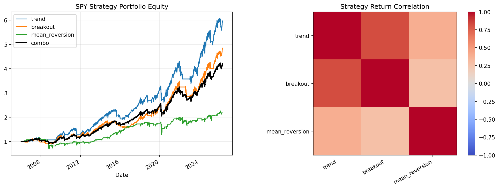

# 18 Multi-Strategy Portfolio Report

日期：2026-05-19

## 本课问题

趋势和均值回归能否互补？

## 数据和参数

- symbols: SPY
- start_date: 2006-01-03
- end_date: 2026-05-18
- rows: 5125
- setup: Trend, breakout, mean-reversion strategy basket

## 核心代码

```python
strategy_returns = pd.concat([trend_return, breakout_return, mean_reversion_return], axis=1)
combo_return = strategy_returns.mean(axis=1)
```

## 实跑结果

| case | final_equity | ann_return | ann_vol | max_drawdown | sharpe | calmar |
| --- | --- | --- | --- | --- | --- | --- |
| trend | 5.9452 | 9.16% | 12.03% | -21.53% | 0.7617 | 0.4254 |
| breakout | 4.8283 | 8.05% | 11.09% | -23.02% | 0.7256 | 0.3496 |
| mean_reversion | 2.1773 | 3.90% | 14.15% | -39.47% | 0.2756 | 0.0988 |
| equal_strategy_combo | 4.2001 | 7.31% | 10.02% | -20.76% | 0.7293 | 0.3522 |

## 图示



## 附表：strategy_correlation

| strategy | trend | breakout | mean_reversion |
| --- | --- | --- | --- |
| trend | 1.0000 | 0.8202 | 0.3871 |
| breakout | 0.8202 | 1.0000 | 0.2736 |
| mean_reversion | 0.3871 | 0.2736 | 1.0000 |

## 结果解读

- 趋势和突破通常同源，相关性往往比名字看起来更高。
- 均值回归可能与趋势类策略互补，但也可能拖累强趋势阶段。
- 多策略组合要看策略收益相关性，不是只数策略数量。

## 本课结论

多策略组合的关键不是策略数量，而是收益来源是否真的不同。
