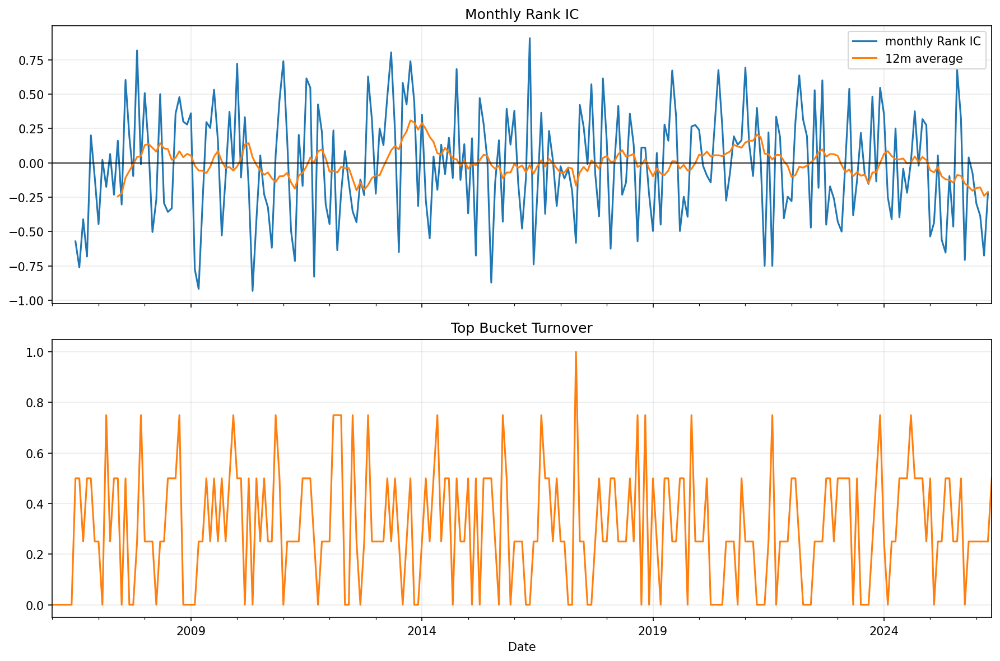

# 20 Factor IC and Turnover Report

日期：2026-05-19

## 本课问题

因子排序和未来收益到底有没有稳定关系？

## 数据和参数

- symbols: SPY, QQQ, DIA, IWM, EFA, TLT, GLD, XLE, XLF, XLK, XLU, XLV, XLI, XLY, XLP
- start_date: 2006-01-03
- end_date: 2026-05-18
- rows: 5125
- setup: Rank IC and top-bucket turnover for 6-month momentum

## 核心代码

```python
rank_ic = factor.rank(axis=1).corrwith(future_return.rank(axis=1), axis=1)
```

## 实跑结果

| metric | value |
| --- | --- |
| months | 238 |
| mean_rank_ic | -0.0171 |
| rank_ic_std | 0.3995 |
| icir | -0.0428 |
| positive_ic_rate | 0.4694 |
| average_top_bucket_turnover | 0.3051 |

## 图示



## 附表：rank_ic_tail

| Date | rank_ic |
| --- | --- |
| 2025-05-31 00:00:00 | -0.6536 |
| 2025-06-30 00:00:00 | -0.0964 |
| 2025-07-31 00:00:00 | -0.4643 |
| 2025-08-31 00:00:00 | 0.6750 |
| 2025-09-30 00:00:00 | 0.3214 |
| 2025-10-31 00:00:00 | -0.7071 |
| 2025-11-30 00:00:00 | 0.0393 |
| 2025-12-31 00:00:00 | -0.0750 |
| 2026-01-31 00:00:00 | -0.2964 |
| 2026-02-28 00:00:00 | -0.3857 |
| 2026-03-31 00:00:00 | -0.6750 |
| 2026-04-30 00:00:00 | -0.2214 |

## 结果解读

- Rank IC 衡量的是横截面排序和未来收益排序的关系。
- ICIR 比单个月 IC 更重要，因为它观察稳定性。
- 换手率高会让因子收益更难落地。

## 本课结论

高 IC 如果伴随极高换手，可能只是纸面优势。
