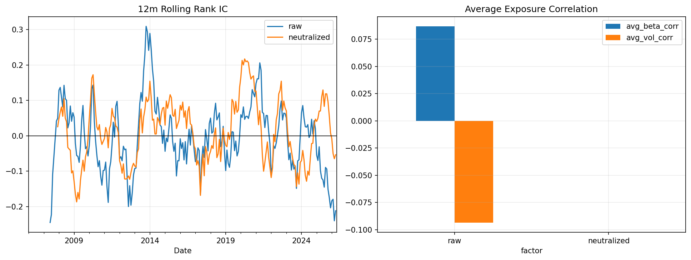

# 21 Factor Neutralization Report

日期：2026-05-19

## 本课问题

因子有效是真因子有效，还是暴露了 beta 或波动率？

## 数据和参数

- symbols: SPY, QQQ, DIA, IWM, EFA, TLT, GLD, XLE, XLF, XLK, XLU, XLV, XLI, XLY, XLP
- start_date: 2006-01-03
- end_date: 2026-05-18
- rows: 5125
- setup: Neutralize momentum factor against rolling beta and volatility

## 核心代码

```python
neutral_factor = factor - X @ np.linalg.lstsq(X, factor, rcond=None)[0]
```

## 实跑结果

| case | final_equity | ann_return | ann_vol | max_drawdown | sharpe | calmar | mean_rank_ic | icir | positive_ic_rate |
| --- | --- | --- | --- | --- | --- | --- | --- | --- | --- |
| raw | 0.8702 | -0.68% | 14.83% | -47.11% | -0.0458 | -0.0144 | -0.0171 | -0.0428 | 46.94% |
| neutralized | 1.1754 | 0.79% | 10.97% | -34.45% | 0.0725 | 0.0231 | 0.0068 | 0.0213 | 47.35% |

## 图示



## 附表：exposure_correlation

| factor | avg_beta_corr | avg_vol_corr |
| --- | --- | --- |
| raw | 0.0867 | -9.33% |
| neutralized | -0.0000 | -0.00% |

## 结果解读

- 中性化后 IC 变好，说明原因子里可能有不想要的 beta/波动率暴露。
- 中性化后 IC 变差，也不等于错误，可能说明暴露本身就是收益来源。
- 中性化要服务于问题定义，而不是机械套用。

## 本课结论

中性化是诊断工具，不是固定仪式；它可能去掉噪声，也可能去掉有效信息。
