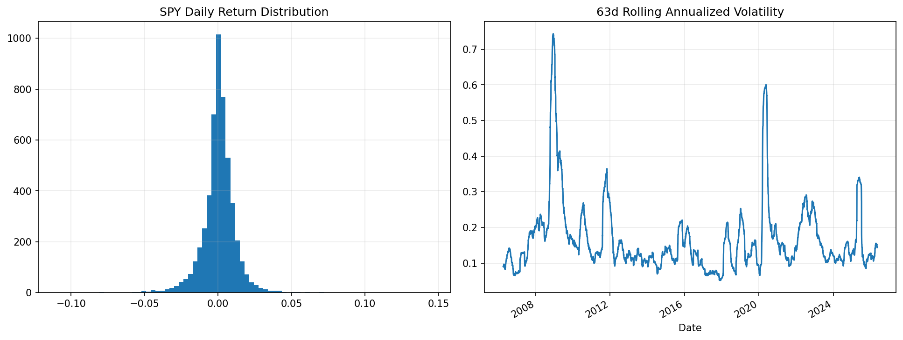

# 23 Financial Time Series Basics Report

日期：2026-05-19

## 本课问题

如何避免把随机噪声误判成规律？

## 数据和参数

- symbols: SPY
- start_date: 2006-01-03
- end_date: 2026-05-18
- rows: 5125
- setup: Daily return distribution and rolling statistics

## 核心代码

```python
autocorr = returns.autocorr(lag=1)
rolling_vol = returns.rolling(63).std() * np.sqrt(252)
```

## 实跑结果

| metric | value |
| --- | --- |
| daily_mean | 0.0005 |
| annualized_volatility | 0.1930 |
| skewness | -0.0018 |
| excess_kurtosis | 15.0166 |
| autocorr_1d | -0.1039 |
| autocorr_5d | -0.0130 |
| best_day | 0.1452 |
| worst_day | -0.1094 |

## 图示




## 结果解读

- SPY 日收益不是正态分布，厚尾和极端日会显著影响回撤。
- 自相关很弱时，不要轻易把短期涨跌解释成可预测规律。
- 滚动波动率说明市场风险状态会聚集，而不是每天独立同分布。

## 本课结论

金融时间序列的常态是噪声、厚尾和波动聚集，策略必须经得起这些基本事实。
