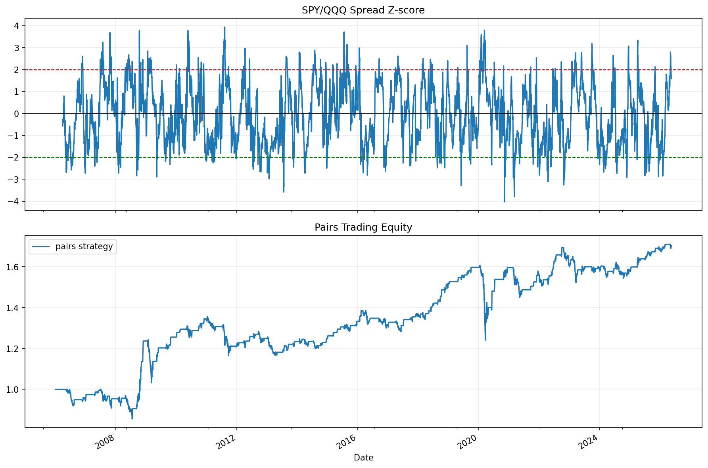

# 24 Pairs Trading and Cointegration Report

日期：2026-05-19

## 本课问题

两只资产价格一起走时，价差偏离能否交易？

## 数据和参数

- symbols: SPY, QQQ
- start_date: 2006-01-03
- end_date: 2026-05-18
- rows: 5125
- setup: OLS hedge ratio on first 60% sample; z-score spread trading

## 核心代码

```python
spread = log_y - hedge_ratio * log_x
z = (spread - spread.rolling(60).mean()) / spread.rolling(60).std()
```

## 实跑结果

| case | final_equity | ann_return | ann_vol | max_drawdown | sharpe | calmar | hedge_ratio | half_life_days | trades |
| --- | --- | --- | --- | --- | --- | --- | --- | --- | --- |
| SPY_QQQ_spread_reversion | 1.7046 | 2.66% | 7.41% | -22.79% | 0.3584 | 0.1166 | 1.3529 | 258.6158 | 213 |

## 图示




## 结果解读

- SPY 和 QQQ 高相关，但价差交易真正关心的是 spread 是否会回归。
- 半衰期只是粗略估计，不代表每次偏离都能按时回归。
- 双腿交易必须考虑两边成本和对冲比例误差。

## 本课结论

配对交易不是看到相关就交易，而是要验证价差是否有回归特征。
