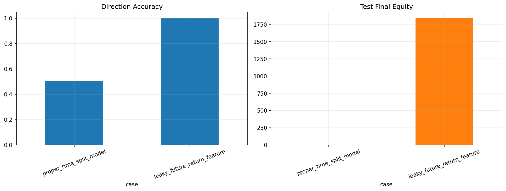

# 26 ML Validation and Leakage Report

日期：2026-05-19

## 本课问题

为什么机器学习量化最容易被数据泄露欺骗？

## 数据和参数

- symbols: SPY
- start_date: 2006-01-03
- end_date: 2026-05-18
- rows: 5125
- setup: Proper model versus intentionally leaky feature

## 核心代码

```python
train = data.iloc[:train_end]
test = data.iloc[test_start:]
# scaler and model are fitted only on train
```

## 实跑结果

| case | final_equity | ann_return | ann_vol | max_drawdown | sharpe | calmar | direction_accuracy |
| --- | --- | --- | --- | --- | --- | --- | --- |
| proper_time_split_model | 2.3072 | 12.63% | 16.42% | -22.24% | 0.7688 | 0.5676 | 50.68% |
| leaky_future_return_feature | 1838 | 191.22% | 12.12% | -0.07% | 15.7787 | 2784.6077 | 99.94% |

## 图示




## 结果解读

- 泄露特征直接包含未来收益，因此测试表现会异常漂亮。
- 这种漂亮结果不能交易，因为实盘当下拿不到未来收益。
- 机器学习量化第一原则：任何标准化、筛选和训练都只能使用过去数据。

## 本课结论

泄露模型的漂亮结果没有交易价值，验证纪律比模型复杂度更重要。
