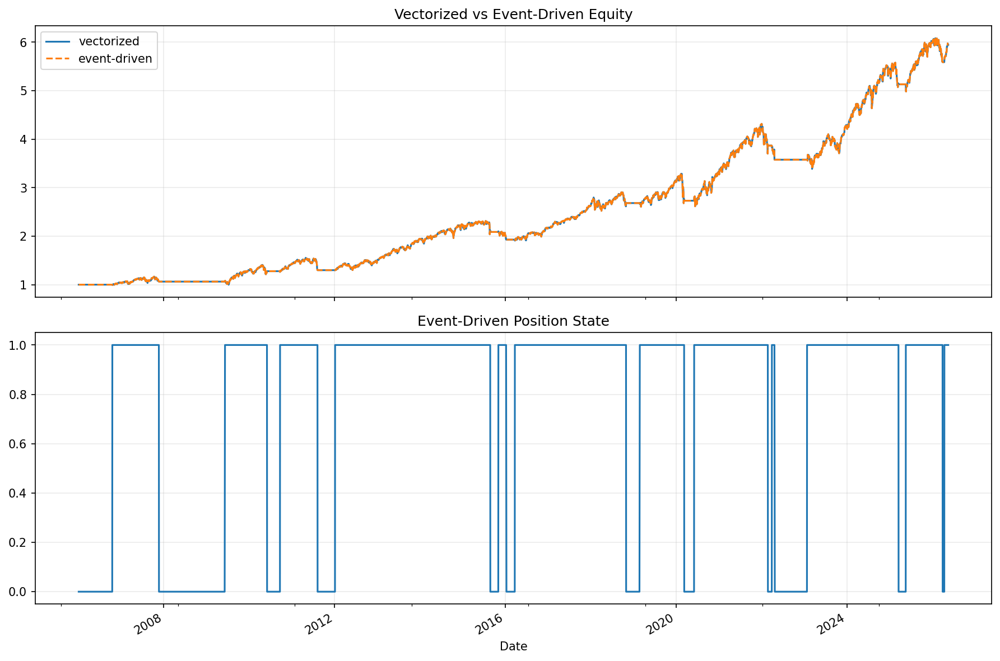

# 28 Backtest Framework Design Report

日期：2026-05-19

## 本课问题

什么时候向量化回测不够，需要事件驱动框架？

## 数据和参数

- symbols: SPY
- start_date: 2006-01-03
- end_date: 2026-05-18
- rows: 5125
- setup: Same MA strategy implemented by vectorized and event-driven loops

## 核心代码

```python
for bar in bars:
    signal = strategy.on_bar(bar)
    fill = broker.execute(signal)
    portfolio.update(fill)
```

## 实跑结果

| case | vectorized_final_equity | event_final_equity | max_equity_difference | orders |
| --- | --- | --- | --- | --- |
| vectorized_vs_event | 5.9452 | 5.9452 | 0.0000 | 23.0000 |

## 图示




## 结果解读

- 向量化回测适合快速研究，但订单、成交和状态边界不够显式。
- 事件驱动回测更接近实盘流程，能检查订单和持仓变化。
- 两者结果接近时，说明框架拆分没有改变策略逻辑。

## 本课结论

事件驱动框架牺牲简洁性，换来更清楚的订单、成交和状态边界。
