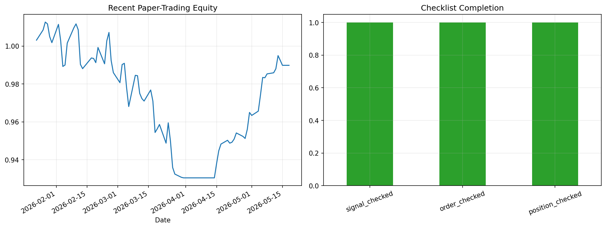

# 29 Paper Trading Checklist Report

日期：2026-05-19

## 本课问题

回测通过后，为什么还不能直接实盘？

## 数据和参数

- symbols: SPY
- start_date: 2006-01-03
- end_date: 2026-05-18
- rows: 5125
- setup: Last 80 trading days simulated from real SPY signals

## 核心代码

```python
paper_log.append({'date': today, 'signal': signal, 'order': order, 'fill': fill})
```

## 实跑结果

| metric | value |
| --- | --- |
| paper_days | 80.0000 |
| orders | 3.0000 |
| average_slippage_bps | 45.0539 |
| checklist_completion_rate | 1.0000 |
| paper_final_equity | 0.9898 |

## 图示



## 附表：paper_trading_log_tail

| Date | signal | position | order | fill_price | close | slippage_bps | strategy_return | signal_checked | order_checked | position_checked | checklist_complete |
| --- | --- | --- | --- | --- | --- | --- | --- | --- | --- | --- | --- |
| 2026-04-21 00:00:00 | 1.0000 | 1.0000 | 0.0000 | 710.2800 | 704 | 22.0123 | -0.16% | True | True | True | True |
| 2026-04-22 00:00:00 | 1.0000 | 1.0000 | 0.0000 | 709.1500 | 711 | 72.0090 | 0.05% | True | True | True | True |
| 2026-04-23 00:00:00 | 1.0000 | 1.0000 | 0.0000 | 709.5000 | 708 | 24.0438 | 0.18% | True | True | True | True |
| 2026-04-24 00:00:00 | 1.0000 | 1.0000 | 0.0000 | 710.7500 | 714 | 32.4651 | 0.34% | True | True | True | True |
| 2026-04-27 00:00:00 | 1.0000 | 1.0000 | 0.0000 | 713.1700 | 715 | 10.7855 | -0.19% | True | True | True | True |
| 2026-04-28 00:00:00 | 1.0000 | 1.0000 | 0.0000 | 711.8200 | 712 | 46.8417 | -0.12% | True | True | True | True |
| 2026-04-29 00:00:00 | 1.0000 | 1.0000 | 0.0000 | 711.0000 | 712 | 9.6953 | 0.51% | True | True | True | True |
| 2026-04-30 00:00:00 | 1.0000 | 1.0000 | 0.0000 | 714.6300 | 719 | 42.8622 | 0.93% | True | True | True | True |
| 2026-05-01 00:00:00 | 1.0000 | 1.0000 | 0.0000 | 721.2500 | 721 | 36.0397 | -0.16% | True | True | True | True |
| 2026-05-04 00:00:00 | 1.0000 | 1.0000 | 0.0000 | 720.0700 | 718 | 8.0485 | 0.24% | True | True | True | True |
| 2026-05-05 00:00:00 | 1.0000 | 1.0000 | 0.0000 | 721.7700 | 724 | 52.3671 | 0.89% | True | True | True | True |
| 2026-05-06 00:00:00 | 1.0000 | 1.0000 | 0.0000 | 728.1600 | 734 | 60.6540 | 0.95% | True | True | True | True |
| 2026-05-07 00:00:00 | 1.0000 | 1.0000 | 0.0000 | 735.0500 | 732 | 16.6247 | -0.02% | True | True | True | True |
| 2026-05-08 00:00:00 | 1.0000 | 1.0000 | 0.0000 | 734.9300 | 738 | 45.7910 | 0.21% | True | True | True | True |
| 2026-05-11 00:00:00 | 1.0000 | 1.0000 | 0.0000 | 736.4500 | 739 | 15.8616 | 0.06% | True | True | True | True |
| 2026-05-12 00:00:00 | 1.0000 | 1.0000 | 0.0000 | 736.8900 | 738 | 32.5980 | 0.21% | True | True | True | True |
| 2026-05-13 00:00:00 | 1.0000 | 1.0000 | 0.0000 | 738.4700 | 742 | 3.9283 | 0.70% | True | True | True | True |
| 2026-05-14 00:00:00 | 1.0000 | 1.0000 | 0.0000 | 743.6500 | 748 | 18.0521 | -0.25% | True | True | True | True |
| 2026-05-15 00:00:00 | 1.0000 | 1.0000 | 0.0000 | 741.7900 | 739 | 85.2748 | -0.26% | True | True | True | True |
| 2026-05-18 00:00:00 | 1.0000 | 1.0000 | 0.0000 | 739.8300 | 739 | 8.9294 | 0.00% | True | True | True | True |

## 结果解读

- 模拟盘日志要记录信号、订单、成交、持仓和检查项。
- 模拟盘不是为了证明能赚钱，而是验证流程是否稳定可复盘。
- 一旦日志字段缺失，实盘后就很难解释错误来自信号还是执行。

## 本课结论

模拟盘的重点不是赚钱，而是发现研究代码到交易流程之间的断点。
