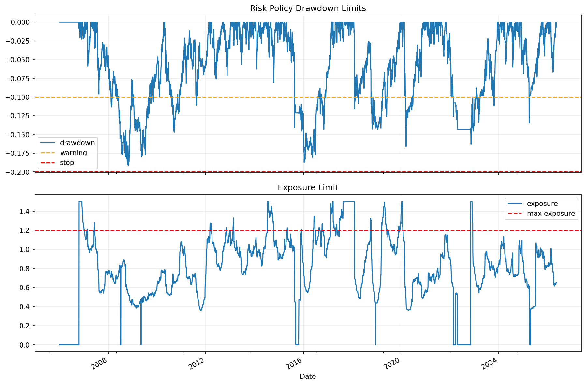

# 30 Risk Policy and Live Readiness Report

日期：2026-05-19

## 本课问题

什么条件下，一个策略才有资格进入小资金实盘？

## 数据和参数

- symbols: SPY, QQQ, DIA, IWM, EFA, TLT
- start_date: 2006-01-03
- end_date: 2026-05-18
- rows: 5125
- setup: 10% vol-target trend portfolio risk policy check

## 核心代码

```python
if drawdown < max_allowed_drawdown:
    halt_trading()
if exposure > max_exposure:
    reduce_position()
```

## 实跑结果

| risk_rule | limit | observed | breach_count |
| --- | --- | --- | --- |
| max_drawdown_warning | -10% | -19.11% | 1200 |
| max_drawdown_stop | -20% | -19.11% | 0 |
| daily_loss_warning | -3% | -6.34% | 9 |
| max_exposure | 120% | 150.00% | 543 |

## 图示



## 附表：risk_event_tail

| Date | drawdown_warning | drawdown_stop | daily_loss_warning | exposure_breach |
| --- | --- | --- | --- | --- |
| 2023-03-22 00:00:00 | True | False | False | False |
| 2023-03-23 00:00:00 | True | False | False | False |
| 2023-03-24 00:00:00 | True | False | False | False |
| 2023-03-27 00:00:00 | True | False | False | False |
| 2023-03-28 00:00:00 | True | False | False | False |
| 2023-03-29 00:00:00 | True | False | False | False |
| 2023-03-30 00:00:00 | True | False | False | False |
| 2023-04-06 00:00:00 | True | False | False | False |
| 2023-10-20 00:00:00 | True | False | False | False |
| 2023-10-25 00:00:00 | True | False | False | False |
| 2023-10-26 00:00:00 | True | False | False | False |
| 2023-10-27 00:00:00 | True | False | False | False |
| 2023-10-30 00:00:00 | True | False | False | False |
| 2023-10-31 00:00:00 | True | False | False | False |
| 2025-04-03 00:00:00 | True | False | False | False |
| 2025-04-04 00:00:00 | True | False | True | False |
| 2025-04-07 00:00:00 | True | False | False | False |
| 2025-04-08 00:00:00 | True | False | False | False |
| 2025-04-09 00:00:00 | True | False | False | False |
| 2025-04-10 00:00:00 | True | False | False | False |

## 结果解读

- 风险政策要写在实盘之前，不能亏损后再临时解释。
- 最大回撤、单日亏损和仓位暴露都需要明确阈值。
- 出现停止交易条件时，正确动作是降风险和复盘，而不是加倍下注。

## 本课结论

实盘前先定义停止条件；不能解释风险边界，就不应该加资金。
