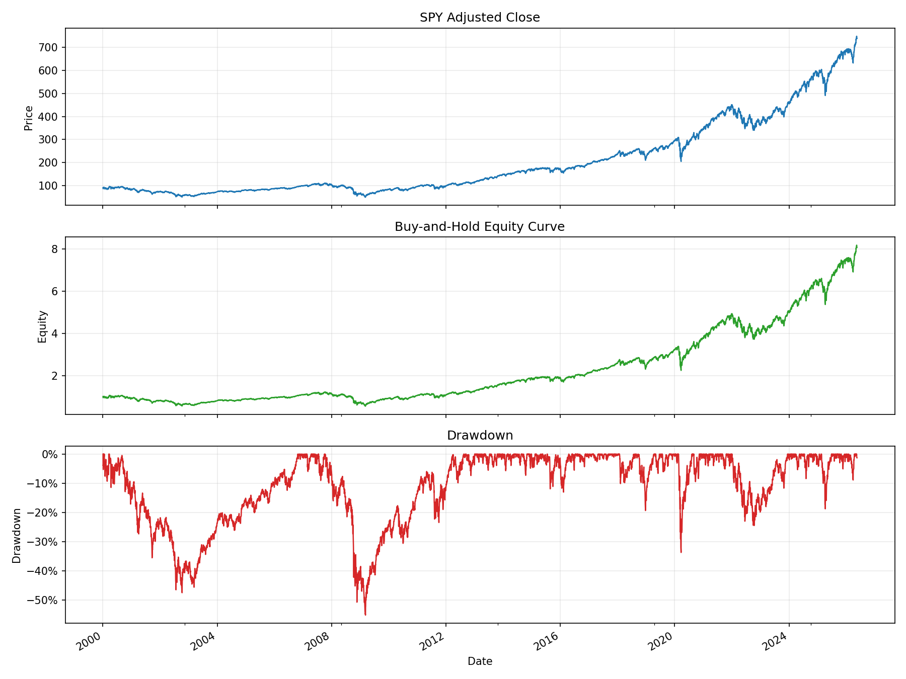

# 01 Market Data Basics

日期：2026-05-19

本课是量化学习的第一块地基：从一只 ETF 的日线行情出发，计算收益率、净值曲线和回撤曲线。

## 本课问题

我们先不预测市场，也不写策略，只回答一个最基础的问题：

```text
如果从 2000 年开始买入并持有 SPY，价格、净值和回撤分别长什么样？
```

这三个对象会贯穿后面所有课程：

```text
Close 收盘价 -> return 日收益率 -> equity 净值曲线 -> drawdown 回撤曲线
```

## 数据

本课使用 `yfinance` 下载 SPY 日线数据。

- 标的：SPY
- 含义：跟踪标普 500 指数的 ETF
- 起始日期：2000-01-01
- 价格处理：`auto_adjust=True`，使用复权价格

日线数据最常见的字段：

| 字段 | 含义 |
| --- | --- |
| Open | 开盘价 |
| High | 最高价 |
| Low | 最低价 |
| Close | 收盘价 |
| Volume | 成交量 |

## 关键代码

完整脚本在 `scripts/01_market_data_basics.py`。

核心流程是：

```python
df = download_ohlcv(symbol="SPY", start="2000-01-01", auto_adjust=True)
analyzed = add_return_equity_drawdown(df)
summary = summarize_performance(analyzed, symbol="SPY")
plot_price_equity_drawdown(analyzed, symbol="SPY", output_path=chart_path)
```

真正重要的是这三列：

```python
df["return"] = df["Close"].pct_change()
df["equity"] = (1 + df["return"]).cumprod()
df["drawdown"] = df["equity"] / df["equity"].cummax() - 1
```

逐句解释：

- `pct_change()`：计算今天相对昨天的涨跌幅。
- `(1 + return).cumprod()`：把每天收益连续复利，得到净值曲线。
- `equity.cummax()`：记录历史最高净值。
- `equity / equity.cummax() - 1`：计算当前距离历史最高点跌了多少。

## 图表



这张图一般分三层看：

- 上图：SPY 复权价格。
- 中图：买入持有净值曲线。
- 下图：回撤曲线。

价格曲线和净值曲线看起来很像，是正常的。对单一资产买入持有来说，净值本质上就是把起点标准化为 `1` 的价格曲线。

## 结果

本课运行结果：

| 指标 | 数值 |
| --- | ---: |
| 最终净值 | 8.0844 |
| 总收益 | 708.44% |
| 年化收益 | 8.27% |
| 年化波动 | 19.32% |
| 最大回撤 | -55.19% |

最重要的是最大回撤。

`-55.19%` 的意思不是今天跌了 55%，而是历史某个阶段，从当时最高净值到后续最低净值，最大亏损达到 55.19%。

## 本课结论

你现在要建立第一条量化直觉：

```text
收益不是只看涨了多少，还要看中途跌了多少。
```

长期看，SPY 的收益不错，但持有过程并不舒服。2008 年、2020 年这类极端阶段会让净值大幅回撤。

后面任何策略都不能只问“最终赚多少”，还要问：

```text
最大回撤是多少？
中途能不能拿住？
相比买入持有有没有更好的风险收益比？
```

## 复习题

1. 为什么第一天的 `return` 是空值？
2. 净值曲线为什么用累计连乘，而不是累计相加？
3. 回撤为什么通常是 0 或负数？
4. 最大回撤和当前回撤有什么区别？
5. 为什么长期投资不能只看最终收益？
