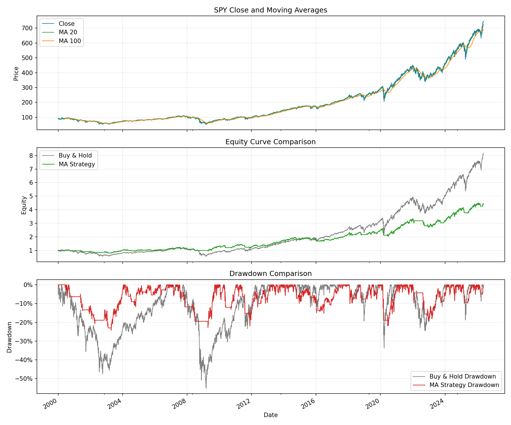

# 02 Moving Average Strategy

日期：2026-05-19

本课从买入持有进入第一个真正的规则策略：双均线趋势策略。

## 本课问题

买入持有的逻辑是：

```text
一直持有 SPY
```

双均线策略要回答的是：

```text
能不能在趋势强的时候持有，在趋势弱的时候空仓？
```

核心链条是：

```text
Close -> ma_short / ma_long -> signal -> position -> strategy_return -> strategy_equity
```

## 均线是什么

均线是最近一段时间价格的平均值。

```text
20 日均线 = 最近 20 个交易日收盘价平均值
100 日均线 = 最近 100 个交易日收盘价平均值
```

短均线反应更快，长均线更平滑。

如果短均线在长均线上方，说明短期价格相对长期均值更强，趋势可能偏强。

## 策略规则

本课策略：

- 当 20 日均线高于 100 日均线，持有 SPY。
- 当 20 日均线低于或等于 100 日均线，空仓。
- 只做多，不做空。
- 单边交易成本 1 bps。

## 关键代码

完整脚本在 `scripts/02_moving_average_strategy.py`。

核心代码在 `src/quant_trading/moving_average.py`：

```python
result["ma_short"] = result["Close"].rolling(short_window).mean()
result["ma_long"] = result["Close"].rolling(long_window).mean()

result["signal"] = (result["ma_short"] > result["ma_long"]).astype(int)
result["position"] = result["signal"].shift(1).fillna(0)

result["trade"] = result["position"].diff().abs().fillna(result["position"].abs())
result["transaction_cost"] = result["trade"] * transaction_cost_bps / 10_000

result["strategy_return_before_cost"] = result["position"] * result["return"]
result["strategy_return"] = (
    result["strategy_return_before_cost"] - result["transaction_cost"]
)
result["strategy_equity"] = (1 + result["strategy_return"]).cumprod()
```

最关键的一句是：

```python
position = signal.shift(1)
```

因为今天的收盘价只有收盘后才知道，今天的均线信号也只有收盘后才知道。今天产生的信号，最早只能明天执行。

如果不 `shift(1)`，就是假装自己在今天交易前已经知道今天收盘价，这是未来函数。

## 图表



读图顺序：

- 先看价格和两条均线。
- 再看策略净值是否比买入持有更平滑。
- 最后看回撤是否明显改善。

## 结果

策略：SPY `20/100` 双均线，单边交易成本 1 bps。

| 指标 | 买入持有 | 双均线策略 |
| --- | ---: | ---: |
| 最终净值 | 8.0844 | 4.4067 |
| 总收益 | 708.44% | 340.67% |
| 年化收益 | 8.27% | 5.80% |
| 最大回撤 | -55.19% | -24.29% |

策略交易次数：71 次。

在场时间：70.32%。

## 如何解读

这个策略没有跑赢买入持有的最终收益，但它显著降低了最大回撤。

这就是趋势策略常见的取舍：

```text
少吃一部分牛市收益
换取熊市中少亏一点
```

所以不能简单说它“好”或“不好”。要看你的目标：

- 如果目标是最大化长期收益，买入持有更强。
- 如果目标是降低大跌中的痛苦，双均线更有意义。

## 本课结论

你需要记住：

```text
signal 是策略想法，position 是真实持仓。
```

量化策略不是写出信号就结束了，必须把信号转换成下一期可执行的仓位。

## 复习题

1. 短均线和长均线分别代表什么？
2. 为什么 `signal` 和 `position` 不能混为一谈？
3. 为什么必须使用 `shift(1)`？
4. 双均线为什么可能降低回撤？
5. 策略没有跑赢买入持有，是否就一定没有价值？
