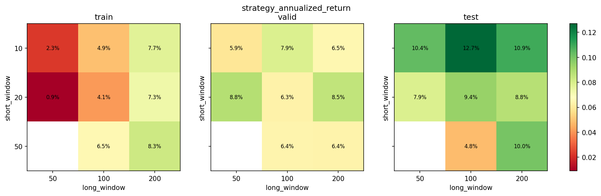

# 03 Sample Split and Overfitting

日期：2026-05-19

本课开始建立真正的研究纪律：不能只在历史上找最好看的参数。

## 本课问题

如果我们测试很多均线参数，总能找到一个历史表现很好的组合。

问题是：

```text
这个参数是真有规律，还是刚好贴合了历史噪声？
```

这就是过拟合问题。

## 样本切分

股票数据是按时间发生的。真实交易中，未来数据不可能提前知道。

所以时间序列不能随机打乱，应该按时间切：

```text
过去 -> 现在 -> 未来
```

本课使用：

| 区间 | 日期 | 用途 |
| --- | --- | --- |
| train | 2000-01-01 到 2014-12-31 | 研究和调参 |
| valid | 2015-01-01 到 2019-12-31 | 比较少数候选参数 |
| test | 2020-01-01 到 2026-05-18 | 最终样本外检验 |

测试区不能反复拿来调参。你一旦根据测试区结果改参数，它就不再是样本外。

## 关键代码

完整脚本在 `scripts/03_sample_split_and_overfitting.py`。

参数网格：

```python
short_windows = [10, 20, 50]
long_windows = [50, 100, 200]
```

评估所有参数：

```python
results = evaluate_moving_average_grid(
    df,
    short_windows=short_windows,
    long_windows=long_windows,
    transaction_cost_bps=1.0,
)
```

选训练区最好的参数：

```python
top_train = select_top_parameters(
    results,
    period="train",
    metric="strategy_calmar",
    n=3,
)
```

再看它在三个区间的表现：

```python
selected = compare_parameter_across_periods(
    results,
    short_window=10,
    long_window=200,
)
```

## 图表



这张热力图不是用来找唯一最优参数，而是看参数区域是否稳定。

更可靠的情况是：

```text
附近一片参数都可以
```

更危险的情况是：

```text
只有一个参数特别好，旁边参数都很差
```

## 结果

训练区按 Calmar 排名前三：

| period | short_window | long_window | 年化收益 | 最大回撤 | Calmar | 交易次数 | 在场时间 |
| --- | ---: | ---: | ---: | ---: | ---: | ---: | ---: |
| train | 10 | 200 | 7.70% | -15.09% | 0.51 | 25 | 62.21% |
| train | 50 | 200 | 8.26% | -17.31% | 0.48 | 15 | 62.23% |
| train | 20 | 200 | 7.27% | -17.31% | 0.42 | 21 | 62.34% |

训练区最佳参数 `10/200` 在三个区间的表现：

| period | short_window | long_window | 年化收益 | 最大回撤 | Calmar | 交易次数 | 在场时间 |
| --- | ---: | ---: | ---: | ---: | ---: | ---: | ---: |
| train | 10 | 200 | 7.70% | -15.09% | 0.51 | 25 | 62.21% |
| valid | 10 | 200 | 6.48% | -18.44% | 0.35 | 10 | 86.65% |
| test | 10 | 200 | 10.93% | -20.27% | 0.54 | 12 | 79.40% |

## 如何解读

`10/200` 没有在验证集和测试集崩溃，这是一件好事。

但这不等于策略已经可靠。原因是：

- 只测了 SPY。
- 参数网格很小。
- 只测了一个策略族。
- 测试区包含 2020 之后的大行情。
- 还没有做更多市场和更多成本假设。

所以正确结论是：

```text
这个策略通过了一次初步样本外检查，值得继续研究。
```

不是：

```text
这个策略已经可以实盘。
```

## 本课结论

你要建立一条纪律：

```text
训练区用来发现，验证区用来筛选，测试区用来考试。
```

不要把测试区当成反复调参的工具。

## 复习题

1. 为什么时间序列不能随机打乱？
2. 样本内、验证集、样本外分别负责什么？
3. 为什么历史最优参数不一定可靠？
4. 什么叫参数附近一片区域都有效？
5. 为什么测试区被反复使用后会被污染？
