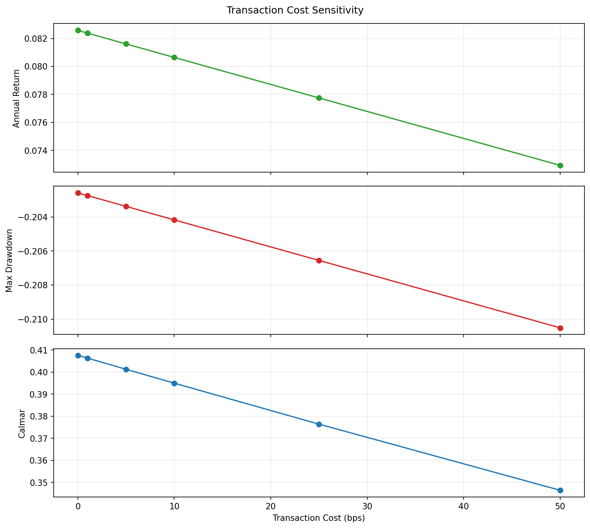

# 04 Transaction Cost Sensitivity

日期：2026-05-19

本课研究一个很现实的问题：交易成本会不会把策略收益吃掉。

## 本课问题

很多策略在纸面上赚钱，但一加入真实交易成本就失效。

所以不能只问：

```text
默认成本下赚不赚钱？
```

还要问：

```text
成本变高以后，它还能不能活？
```

## 什么是 bps

`bps` 是 basis points，中文叫基点。

```text
1 bps = 0.01%
10 bps = 0.10%
100 bps = 1.00%
```

如果单边交易成本是 `10 bps`，一次买入或卖出的成本就是 `0.10%`。

## 成本包括什么

真实成本不只是手续费，还包括：

- 佣金
- 滑点
- 买卖价差
- 冲击成本
- 税费
- 延迟造成的价格偏差

本课先用固定 bps 简化。

## 关键代码

完整脚本在 `scripts/04_transaction_cost_sensitivity.py`。

成本测试列表：

```python
costs_bps = [0, 1, 5, 10, 25, 50]
```

运行压力测试：

```python
results = evaluate_transaction_cost_sensitivity(
    df,
    short_window=10,
    long_window=200,
    transaction_costs_bps=costs_bps,
)
```

成本扣除逻辑：

```python
cost_rate = transaction_cost_bps / 10_000
result["transaction_cost"] = result["trade"] * cost_rate
result["strategy_return"] = (
    result["strategy_return_before_cost"] - result["transaction_cost"]
)
```

意思是：每发生一次买入或卖出，就从当天收益里扣掉对应成本。

## 图表



读图时看三件事：

- 成本上升时，年化收益下降多少。
- 成本上升时，最大回撤是否恶化。
- Calmar 是否还能保持。

## 结果

策略：SPY `10/200` 双均线。

| transaction_cost_bps | 最终净值 | 年化收益 | 最大回撤 | Calmar | 交易次数 | 总交易成本 |
| ---: | ---: | ---: | ---: | ---: | ---: | ---: |
| 0.0 | 8.0710 | 8.26% | -20.26% | 0.41 | 47 | 0.00% |
| 1.0 | 8.0332 | 8.24% | -20.27% | 0.41 | 47 | 0.47% |
| 5.0 | 7.8836 | 8.16% | -20.34% | 0.40 | 47 | 2.35% |
| 10.0 | 7.7004 | 8.06% | -20.42% | 0.39 | 47 | 4.70% |
| 25.0 | 7.1756 | 7.77% | -20.66% | 0.38 | 47 | 11.75% |
| 50.0 | 6.3777 | 7.29% | -21.05% | 0.35 | 47 | 23.50% |

## 如何解读

这个策略总交易次数只有 47 次，属于低频策略，所以成本影响没有毁灭性。

但即使是低频策略，成本从 0 bps 提高到 50 bps 后：

- 最终净值从 8.0710 降到 6.3777。
- 年化收益从 8.26% 降到 7.29%。
- Calmar 从 0.41 降到 0.35。

这说明成本不是细节，而是策略能不能真实存在的核心条件。

## 高频和低流动性为什么危险

如果一个策略每年交易 200 次，每次成本 5 bps：

```text
年成本大约 = 200 * 5 bps = 1000 bps = 10%
```

这意味着策略每年要先赚 10%，才刚刚覆盖成本。

低流动性股票成本更高，因为买卖价差更大，成交更难，大单还会冲击价格。

## 本课结论

你要记住：

```text
没有成本压力测试的回测，不值得相信。
```

一个策略在低成本下好看不够，成本变差后还能活，才更值得继续研究。

## 复习题

1. 1 bps 等于多少百分比？
2. 交易成本为什么不只是手续费？
3. 为什么高换手策略更容易失效？
4. 为什么成本压力测试比单一成本假设更有价值？
5. 低流动性股票为什么通常交易成本更高？
