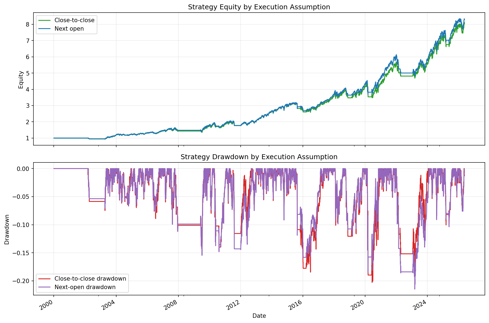

# 05 Execution Assumptions

日期：2026-05-19

本课从“策略信号”进入“真实成交假设”。

## 本课问题

均线策略在收盘后才能知道今天的信号。

那么问题来了：

```text
今天收盘后才知道信号，我到底能用什么价格成交？
```

如果这个问题不说清楚，回测很容易偷偷乐观。

## close-to-close

之前的策略使用：

```python
position = signal.shift(1)
strategy_return = position * close_return
```

其中：

```text
close_return = 今天收盘价 / 昨天收盘价 - 1
```

这避免了直接用今天信号赚今天收益，但它仍然比较抽象，因为收益围绕收盘价计算。

这个模型适合快速研究，但正式报告必须说明它的成交假设。

## next-open

更接近真实日线交易的流程是：

```text
今天收盘后计算信号
明天开盘执行
之后持有到下一次开盘
```

代码：

```python
result["open_to_next_open_return"] = result["Open"].shift(-1) / result["Open"] - 1
result["position"] = result["signal"].shift(1).fillna(0)
result["strategy_return_before_cost"] = (
    result["position"] * result["open_to_next_open_return"].fillna(0)
)
```

这意味着：

- 今天的仓位来自昨天收盘后的信号。
- 今天开盘执行。
- 收益从今天开盘算到下一交易日开盘。

## 关键代码

完整脚本在 `scripts/05_execution_assumptions.py`。

比较两个执行模型：

```python
close_to_close = add_moving_average_strategy(
    df,
    short_window=10,
    long_window=200,
    transaction_cost_bps=1.0,
)

next_open = add_moving_average_strategy_next_open(
    df,
    short_window=10,
    long_window=200,
    transaction_cost_bps=1.0,
)

comparison = compare_execution_assumptions(
    df,
    short_window=10,
    long_window=200,
    transaction_cost_bps=1.0,
)
```

## 图表



这张图用来比较同一策略在不同成交假设下的净值和回撤。

重点不是哪条线更好看，而是：

```text
执行假设会改变策略画像。
```

## 结果

策略：SPY `10/200` 双均线，交易成本 1 bps。

| execution_model | 最终净值 | 年化收益 | 最大回撤 | Calmar | 交易次数 | 在场时间 |
| --- | ---: | ---: | ---: | ---: | ---: | ---: |
| close_to_close | 8.0332 | 8.24% | -20.27% | 0.41 | 47 | 70.99% |
| next_open | 8.3003 | 8.37% | -21.46% | 0.39 | 47 | 70.99% |

## 如何解读

这次 `next-open` 最终净值略高，但最大回撤也更深，Calmar 反而略低。

这说明执行假设不一定总让结果变差。有时候开盘成交刚好更有利，有时候更不利。

真正重要的是：

```text
回测必须清楚写出成交假设。
```

## bid / ask

真实交易中：

- 立刻买入通常按 ask 或更差价格成交。
- 立刻卖出通常按 bid 或更差价格成交。
- 行情软件里的 last price 不一定是你能成交的价格。

所以日线回测用 `Close` 或 `Open` 都只是简化。SPY 这种高流动性 ETF 还可以接受，小盘低流动性股票就要更保守。

## 本课结论

对我们这种收盘后计算信号的日线策略：

```text
next-open 通常比 close-to-close 更合理。
```

但 next-open 仍然不是完全真实。下一步还要加入滑点、佣金、订单和交易日志。

## 复习题

1. 为什么今天收盘后的信号不能用于今天收盘前交易？
2. close-to-close 和 next-open 的核心区别是什么？
3. 为什么 next-open 更接近日线真实交易？
4. 为什么执行假设可能改变最大回撤？
5. 为什么流动性差的股票不能简单相信收盘价回测？
