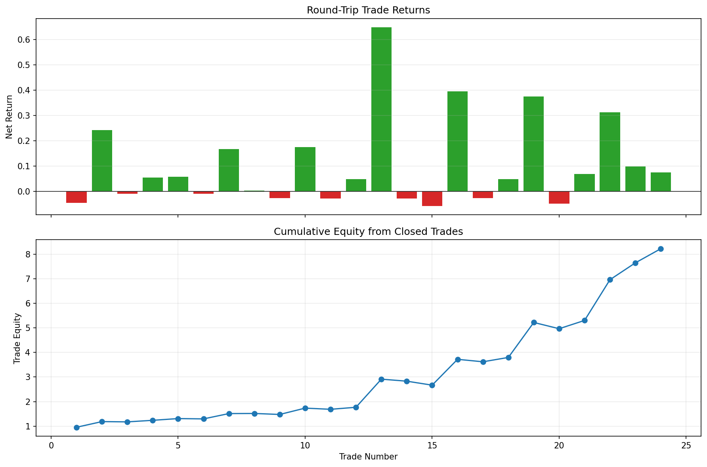

# 06 Trade Log and Slippage

日期：2026-05-19

本课把策略从“净值曲线”拆成“每一笔真实交易”。

## 本课问题

前面我们已经知道：

```text
收盘后产生信号
下一个交易日开盘执行
```

但真实复盘还要继续追问：

- 哪一天发出了订单？
- 哪一天成交？
- 买入成交价是多少？
- 卖出成交价是多少？
- 滑点和佣金吃掉了多少收益？
- 每一笔交易持有了多久？
- 哪些交易贡献了主要利润？

这就是交易日志，也就是 `trade log`。

## 三个核心概念

### 信号不是订单

`signal` 只是策略判断：

```text
我想持有，还是不想持有？
```

它不是交易本身。

### 订单不是成交

订单是你向市场发出的请求：

```text
我要买入
我要卖出
```

真实市场中，订单可能按预期价格成交，也可能以更差价格成交，甚至完全没有成交。

### 成交要考虑滑点

日线回测用 `Open` 代表成交价，但真实成交通常会差一点。

本课使用：

```text
买入成交价 = Open * (1 + slippage_bps / 10000)
卖出成交价 = Open * (1 - slippage_bps / 10000)
```

买入更贵一点，卖出更便宜一点，这是保守假设。

## 关键代码

完整脚本在 `scripts/06_trade_log_and_slippage.py`。

先生成 next-open 仓位：

```python
strategy = add_moving_average_strategy_next_open(
    df,
    short_window=10,
    long_window=200,
    transaction_cost_bps=0.0,
)
```

这里把 `transaction_cost_bps` 设为 `0.0`，因为成本交给执行层统一处理。

生成单边成交：

```python
fills = build_order_fills(
    strategy,
    slippage_bps=2.0,
    commission_bps=1.0,
)
```

生成完整交易日志：

```python
trade_log = build_round_trip_trade_log(
    strategy,
    slippage_bps=2.0,
    commission_bps=1.0,
)
```

汇总交易表现：

```python
summary = summarize_trade_log(trade_log)
```

## 图表



上图看每笔完整交易的收益，下图看按完整交易复利后的累计净值。

这张图比单纯净值曲线更适合复盘，因为它能看出策略到底靠哪些交易赚钱。

## 结果

策略设置：

- 标的：SPY
- 策略：10/200 双均线
- 执行模型：next-open
- 滑点：单边 2 bps
- 佣金：单边 1 bps

汇总结果：

| trades | closed_trades | marked_open_trades | win_rate | average_net_return | median_net_return | best_trade_return | worst_trade_return | average_holding_days | profit_factor | final_trade_equity | total_cost_drag |
| --- | ---: | ---: | ---: | ---: | ---: | ---: | ---: | ---: | ---: | ---: | ---: |
| 24 | 23 | 1 | 62.50% | 10.36% | 5.15% | 64.78% | -5.74% | 284.8 | 9.85 | 8.2201 | 1.59% |

## 单边交易和完整交易

之前我们说策略有 47 次交易，那是单边动作：

```text
买入算 1 次
卖出算 1 次
```

本课的 24 笔交易是 round-trip：

```text
一次买入 + 一次卖出 = 一笔完整交易
```

最后还有一笔仓位没有真正卖出，所以标记为：

```text
open_marked_to_market
```

意思是：这笔交易仍然开着，但为了复盘，暂时用最新开盘价按市值估算。

## 如何解读

这个策略不是靠高频小赚，而是靠少数长期趋势交易贡献主要收益。

几个关键信号：

- 胜率 62.50%，不是特别夸张。
- 最好一笔 64.78%，明显大于最差一笔 -5.74%。
- 平均持有 284.8 天，说明它是低频趋势策略。
- 成本拖累 1.59%，对 SPY 这种低频策略影响不致命。

如果换成高换手策略、小盘股或低流动性股票，成本拖累可能完全改变结论。

## 本课结论

你要记住一句话：

```text
净值曲线告诉你结果，交易日志告诉你结果是怎么来的。
```

从这一课开始，你不只是看策略结果，而是在看策略行为。

## 复习题

1. 为什么信号不是订单？
2. 为什么订单不是成交？
3. 单边交易和完整交易有什么区别？
4. 为什么买入滑点是加价，卖出滑点是减价？
5. 为什么最后一笔未平仓交易要标记为 `open_marked_to_market`？
