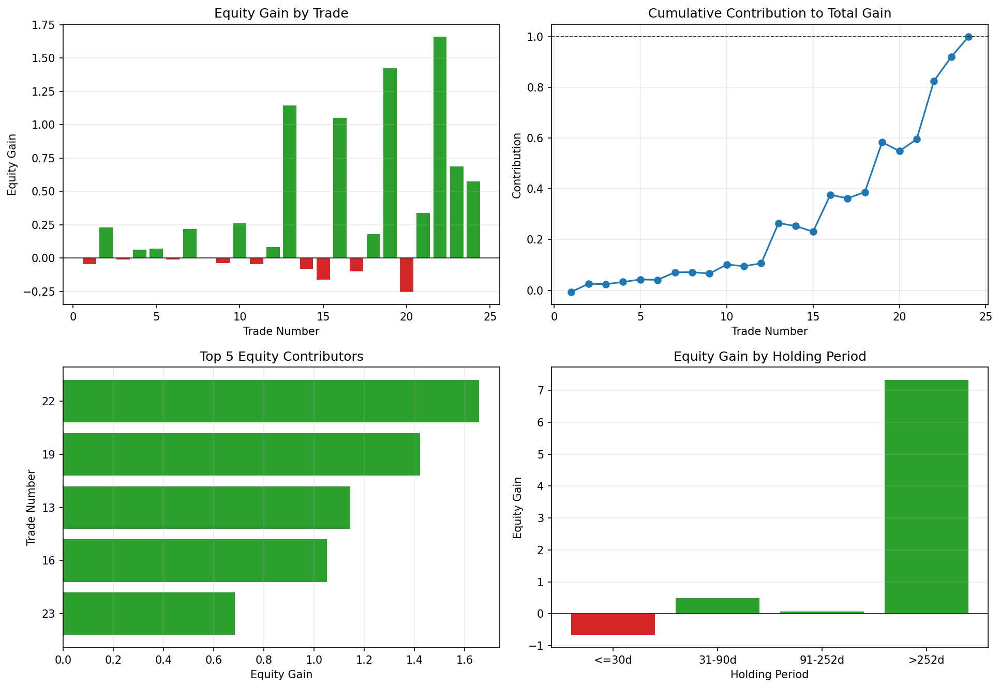

# 07 Trade Review and Attribution

日期：2026-05-19

这一课开始真正做“策略复盘”。

第 6 课我们已经知道每一笔交易什么时候买、什么时候卖、赚亏多少。第 7 课继续往下问：

```text
最终的钱到底是哪些交易赚出来的？
亏损又集中在哪些交易里？
```

## 本课问题

如果一个策略最终净值很好，有两种完全不同的可能：

```text
大多数交易都稳定赚钱
```

或者：

```text
大多数交易一般，少数几笔大赢家贡献了主要利润
```

这两种策略的风险完全不同。

本课要学习的就是收益归因：

```text
把最终净值增长拆到每一笔交易上。
```

## 为什么不能只看 net_return

假设两笔交易都赚 10%：

```text
第一笔发生在净值 1.0 时，贡献 0.1
第二笔发生在净值 5.0 时，贡献 0.5
```

所以单笔贡献不能只看收益率，还要看它发生时的账户净值。

这就是复利归因。

## 关键公式

本课使用：

```text
starting_equity = 这笔交易开始前的累计净值
ending_equity = 这笔交易结束后的累计净值
equity_gain = ending_equity - starting_equity
contribution_to_total_gain = equity_gain / (final_equity - 1)
```

其中：

- `equity_gain`：这笔交易实际让账户净值增加或减少了多少。
- `contribution_to_total_gain`：这笔交易占最终总收益的比例。

如果一笔交易的贡献是 `20%`，意思是：

```text
最终总净值增长里，有 20% 来自这笔交易。
```

## 关键代码

完整脚本在 `scripts/07_trade_review_and_attribution.py`。

先沿用第 6 课的交易日志：

```python
strategy = add_moving_average_strategy_next_open(
    df,
    short_window=10,
    long_window=200,
    transaction_cost_bps=0.0,
)

trade_log = build_round_trip_trade_log(
    strategy,
    slippage_bps=2.0,
    commission_bps=1.0,
)
```

然后做收益归因：

```python
attributed = add_trade_attribution(trade_log)
summary = summarize_trade_attribution(attributed)
duration_summary = summarize_by_duration(attributed)
top_winners = select_top_contributors(attributed, n=5, largest=True)
worst_losers = select_top_contributors(attributed, n=5, largest=False)
```

核心计算在 `src/quant_trading/attribution.py`：

```python
result["starting_equity"] = result["net_equity"].shift(1).fillna(1.0)
result["ending_equity"] = result["net_equity"]
result["equity_gain"] = result["ending_equity"] - result["starting_equity"]

total_gain = result["equity_gain"].sum()
result["contribution_to_total_gain"] = result["equity_gain"] / total_gain
```

这段代码把每笔交易从“收益率”变成了“对最终净值的实际贡献”。

## 图表



读图顺序：

- 左上：每笔交易对净值的增减。
- 右上：累计贡献如何走到最终 100%。
- 左下：前 5 大贡献交易。
- 右下：不同持有周期贡献了多少净值。

## 汇总结果

策略：SPY `10/200` 双均线，next-open 执行，单边 2 bps 滑点 + 1 bps 佣金。

| trades | top_trade_count | final_equity | total_equity_gain | positive_equity_gain | negative_equity_gain | top_trade_gain | top_trade_share | largest_trade_share | worst_trade_drag |
| --- | ---: | ---: | ---: | ---: | ---: | ---: | ---: | ---: | ---: |
| 24 | 5 | 8.2201 | 7.2201 | 7.9782 | -0.7581 | 5.9646 | 82.61% | 22.97% | -3.52% |

这个表最重要的是：

```text
前 5 笔交易贡献了 82.61% 的总净值增长。
```

也就是说，这个策略的收益并不是平均来自每一笔交易，而是明显集中在少数大趋势交易上。

## 前 5 大贡献交易

| trade_number | status | entry_date | exit_date | holding_days | net_return | equity_gain | contribution_to_total_gain | net_equity |
| --- | --- | --- | --- | ---: | ---: | ---: | ---: | ---: |
| 22 | closed | 2023-11-07 | 2025-03-17 | 496 | 31.28% | 1.6584 | 22.97% | 6.9600 |
| 19 | closed | 2020-06-02 | 2022-02-24 | 632 | 37.51% | 1.4239 | 19.72% | 5.2196 |
| 13 | closed | 2012-01-04 | 2015-08-25 | 1329 | 64.78% | 1.1448 | 15.86% | 2.9121 |
| 16 | closed | 2016-03-17 | 2018-10-29 | 956 | 39.44% | 1.0521 | 14.57% | 3.7197 |
| 23 | closed | 2025-05-16 | 2026-03-27 | 315 | 9.85% | 0.6854 | 9.49% | 7.6454 |

这些交易的共同特点是：

```text
持有时间都比较长。
```

趋势策略真正赚钱的时候，往往不是一天两天，而是拿住一整段趋势。

## 最差 5 笔交易

| trade_number | status | entry_date | exit_date | holding_days | net_return | equity_gain | contribution_to_total_gain | net_equity |
| --- | --- | --- | --- | ---: | ---: | ---: | ---: | ---: |
| 20 | closed | 2022-03-29 | 2022-04-19 | 21 | -4.87% | -0.2544 | -3.52% | 4.9652 |
| 15 | closed | 2015-12-30 | 2016-01-07 | 8 | -5.74% | -0.1626 | -2.25% | 2.6675 |
| 17 | closed | 2018-11-13 | 2018-11-21 | 8 | -2.71% | -0.1006 | -1.39% | 3.6190 |
| 14 | closed | 2015-10-29 | 2015-12-21 | 53 | -2.81% | -0.0819 | -1.13% | 2.8301 |
| 11 | closed | 2010-08-05 | 2010-08-17 | 12 | -2.78% | -0.0483 | -0.67% | 1.6851 |

这些亏损交易大多持有时间很短，说明它们更像：

```text
刚买入不久，趋势没有延续，很快被打出去。
```

这类交易在趋势策略里很常见，通常叫假突破或震荡期打脸。

## 持有周期归因

| duration_bucket | trades | win_rate | average_net_return | total_equity_gain | contribution_to_total_gain |
| --- | ---: | ---: | ---: | ---: | ---: |
| <=30d | 7 | 0.00% | -3.48% | -0.6653 | -9.21% |
| 31-90d | 4 | 50.00% | 1.02% | 0.4864 | 6.74% |
| 91-252d | 1 | 100.00% | 5.72% | 0.0708 | 0.98% |
| >252d | 12 | 100.00% | 21.93% | 7.3282 | 101.50% |

这一张表非常重要。

`>252d` 的交易贡献了 `101.50%`，超过 100%，不是算错了。

原因是：

```text
长期交易赚了超过最终总收益的金额
短期亏损交易抵消了一部分收益
最后净贡献回到 100%
```

所以这个策略的真实画像是：

```text
短期交易整体亏钱
长期交易贡献全部利润
```

## 本课结论

趋势策略的本质不是每一笔都赚钱，而是：

```text
用多次小亏，换少数大趋势。
```

这节课你要记住：

```text
复盘不是看最终净值，而是拆解最终净值从哪里来。
```

对于这个 SPY 双均线策略，后续改进方向很明确：

```text
减少短期假突破
保留长期趋势持仓能力
```

但注意，这两个目标经常冲突。过滤太多假突破，可能也会错过真正大趋势。

## 复习题

1. 为什么不能只用 `net_return` 判断单笔交易重要性？
2. `equity_gain` 和 `net_return` 的区别是什么？
3. 为什么前 5 笔交易贡献 82.61% 很重要？
4. 为什么 `>252d` 持有周期贡献可以超过 100%？
5. 趋势策略为什么经常表现为“多次小亏，少数大赚”？
