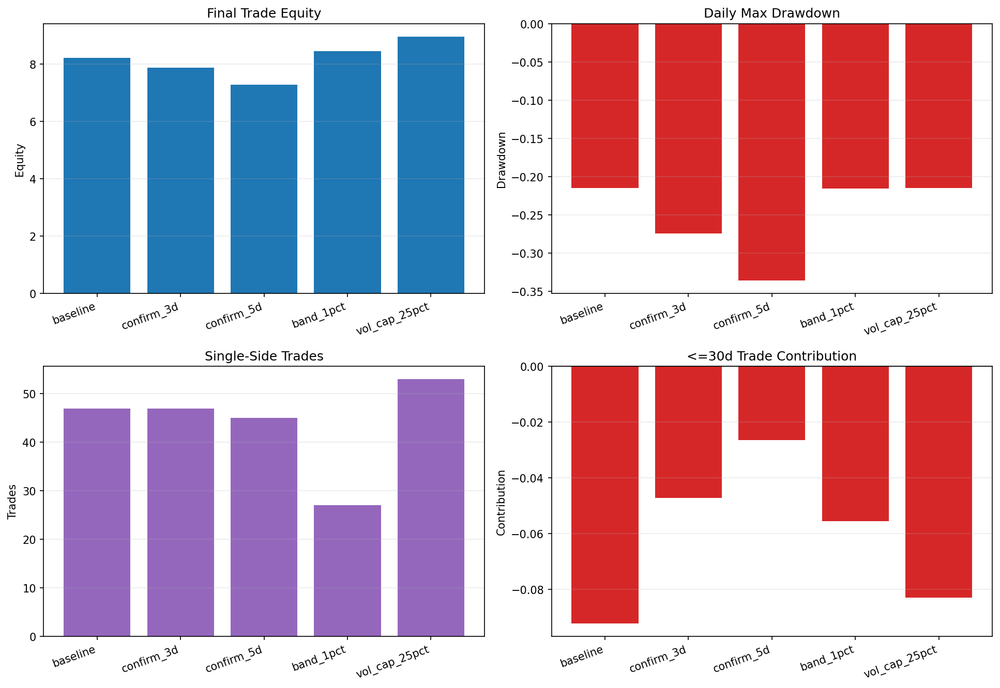

# 08 MA Filter Improvement

日期：2026-05-19

这一课开始真正进入“策略改进”。

前面 7 课我们一直围绕 SPY 双均线策略学习量化研究流程。第 7 课得到一个很关键的发现：

```text
短期交易整体亏钱
长期趋势交易贡献主要收益
```

所以第 8 课的问题很自然：

```text
能不能减少短期假突破，同时保留长期趋势收益？
```

## 先建立正确心态

策略改进不是看到收益变高就结束。

你必须先说清楚：

```text
我到底想解决什么问题？
```

本课的问题不是“随便找一个最终收益最高的版本”，而是：

```text
减少短期假突破。
```

所以判断过滤器好坏时，不能只看最终净值，还要看：

- 交易次数有没有下降
- 短期交易数量有没有下降
- 短期交易拖累有没有下降
- 最大回撤有没有恶化
- 是否还保留长期大趋势

## 实验策略

基准策略仍然是：

- 标的：SPY
- 策略：10/200 双均线
- 执行模型：next-open
- 滑点：单边 2 bps
- 佣金：单边 1 bps

比较 5 个版本：

| variant | 含义 |
| --- | --- |
| baseline | 原始 10/200 双均线 |
| confirm_3d | 连续 3 天满足信号才切换状态 |
| confirm_5d | 连续 5 天满足信号才切换状态 |
| band_1pct | 短均线高于长均线 1% 才买入，低于长均线 1% 才卖出 |
| vol_cap_25pct | 20 日年化波动率低于 25% 才允许持有 |

## 过滤器 1：确认天数

原始双均线只要短均线略微高于长均线，就可能买入。

确认过滤器要求：

```text
连续 N 天满足条件，才真的切换状态。
```

核心代码：

```python
def apply_confirmation_filter(raw_signal: pd.Series, days: int) -> pd.Series:
    state = 0
    true_streak = 0
    false_streak = 0
    values = []

    for raw_value in raw_signal.fillna(0).astype(int):
        if raw_value == 1:
            true_streak += 1
            false_streak = 0
        else:
            false_streak += 1
            true_streak = 0

        if state == 0 and true_streak >= days:
            state = 1
        elif state == 1 and false_streak >= days:
            state = 0

        values.append(state)

    return pd.Series(values, index=raw_signal.index, dtype=int)
```

这个逻辑很直观：

```text
不要刚金叉就买
等它连续确认几天
```

但它有一个副作用：

```text
买入会变慢，卖出也会变慢。
```

## 过滤器 2：均线差距

`band_1pct` 的逻辑是：

```text
短均线高于长均线 1% 才买入
短均线低于长均线 1% 才卖出
中间区域保持原仓位
```

核心代码：

```python
def apply_band_filter(ma_short, ma_long, band_pct, valid=None):
    ratio = ma_short / ma_long - 1
    state = 0
    values = []

    for is_valid, gap in zip(valid.fillna(False), ratio):
        if not is_valid or pd.isna(gap):
            state = 0
        elif state == 0 and gap > band_pct:
            state = 1
        elif state == 1 and gap < -band_pct:
            state = 0
        values.append(state)

    return pd.Series(values, index=ma_short.index, dtype=int)
```

这个过滤器的本质是：

```text
不要在两条均线贴得很近的时候频繁进出。
```

## 过滤器 3：波动率上限

`vol_cap_25pct` 的逻辑是：

```text
只有当 20 日年化波动率低于 25% 时，才允许持有。
```

这个想法不是直接过滤均线假突破，而是避免高波动环境。

所以它能不能解决本课问题，要看数据，而不是凭感觉。

## 完整实验代码

脚本在 `scripts/08_ma_filter_improvement.py`。

核心调用：

```python
results = evaluate_filter_variants(
    df,
    variants=DEFAULT_FILTER_VARIANTS,
    short_window=10,
    long_window=200,
    transaction_cost_bps=3.0,
    slippage_bps=2.0,
    commission_bps=1.0,
)

plot_filter_variant_comparison(results, output_path=output_png)
```

这里的 `transaction_cost_bps=3.0` 是日度净值曲线里的单边成本近似：

```text
2 bps 滑点 + 1 bps 佣金 = 3 bps
```

交易日志里仍然单独按滑点和佣金计算。

## 图表



读图顺序：

- 左上：最终交易净值。
- 右上：最大回撤。
- 左下：单边交易次数。
- 右下：30 天以内短期交易对总收益的贡献。

如果一个过滤器最终净值变高，但短期交易没有减少，就不算真正解决了本课问题。

## 实验结果

| variant | final_trade_equity | annualized_return | max_drawdown | calmar | single_side_trades | round_trip_trades | win_rate | top_trade_share | short_trade_count | short_trade_contribution |
| --- | ---: | ---: | ---: | ---: | ---: | ---: | ---: | ---: | ---: | ---: |
| baseline | 8.2201 | 8.33% | -21.53% | 0.39 | 47 | 24 | 62.50% | 82.61% | 7 | -9.21% |
| confirm_3d | 7.8687 | 8.15% | -27.45% | 0.30 | 47 | 24 | 58.33% | 84.16% | 6 | -4.72% |
| confirm_5d | 7.2810 | 7.84% | -33.59% | 0.23 | 45 | 23 | 56.52% | 98.17% | 8 | -2.64% |
| band_1pct | 8.4544 | 8.45% | -21.53% | 0.39 | 27 | 14 | 78.57% | 66.41% | 1 | -5.56% |
| vol_cap_25pct | 8.9648 | 8.69% | -21.53% | 0.40 | 53 | 27 | 62.96% | 84.98% | 9 | -8.30% |

## 结果解读

### confirm_3d 和 confirm_5d

确认过滤器确实让短期交易拖累变小：

```text
baseline: -9.21%
confirm_3d: -4.72%
confirm_5d: -2.64%
```

但代价很明显：

```text
confirm_3d 最大回撤：-27.45%
confirm_5d 最大回撤：-33.59%
baseline 最大回撤：-21.53%
```

原因很可能是：

```text
确认天数不仅延迟买入，也延迟卖出。
```

所以它减少了一些噪声，但让风险控制变慢。

### band_1pct

`band_1pct` 更符合本课目标。

它的变化：

```text
单边交易：47 -> 27
完整交易：24 -> 14
胜率：62.50% -> 78.57%
短期交易数：7 -> 1
最终交易净值：8.2201 -> 8.4544
```

它的核心价值不是最终净值略高，而是它确实减少了频繁进出。

### vol_cap_25pct

`vol_cap_25pct` 最终净值最高：

```text
8.9648
```

但它不算最干净的假突破过滤器，因为：

```text
交易次数从 47 增加到 53
短期交易数从 7 增加到 9
```

也就是说，它可能改变了持仓结构，但没有解决“短期假突破太多”的问题。

## 本课结论

从本课目标看：

```text
band_1pct 是更值得继续研究的改进候选。
```

但注意，这还不是最终策略。

现在只能说：

```text
band_1pct 在这次历史样本里更符合减少假突破的目标。
```

下一步必须继续做：

- 样本内 / 验证 / 样本外检查
- `band_pct` 参数敏感性
- 其他 ETF 或指数验证
- 更高成本压力测试
- 检查是否错过长期大趋势

## 本课真正要学会什么

策略改进的正确流程是：

```text
先发现问题
再提出改进
再定义评价标准
最后看数据是否支持
```

不要只看哪个版本最终收益最高。

本课最重要的一句话：

```text
好改进不是让回测更好看，而是解决了你一开始定义的问题。
```

## 复习题

1. 为什么确认 5 天减少了短期亏损，却让最大回撤变差？
2. `band_1pct` 为什么能减少假突破？
3. 为什么 `vol_cap_25pct` 收益最高，但不一定是本课最好的改进？
4. 为什么策略改进不能只看最终净值？
5. 如果继续研究 `band_1pct`，下一步必须做哪些验证？
