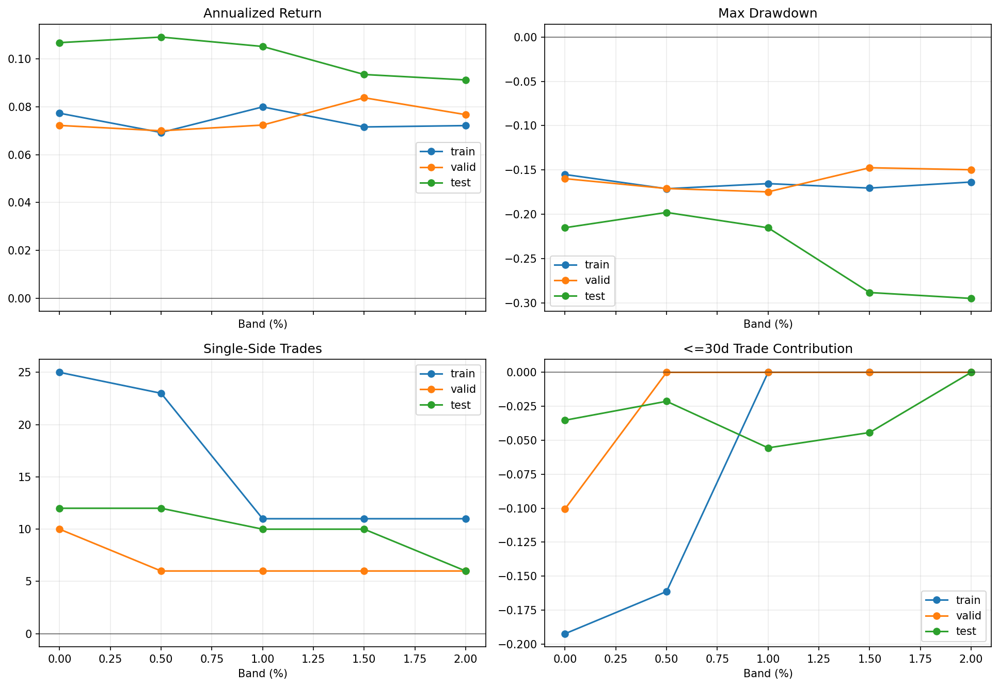

# 09 Band Robustness

日期：2026-05-19

第 8 课我们找到了一个候选改进：

```text
band_1pct
```

它的逻辑是：

```text
短均线高于长均线 1% 才买入
短均线低于长均线 1% 才卖出
```

第 9 课要做的事很关键：

```text
不要因为一次回测好看，就相信它。
```

我们要检查 `band_1pct` 是不是只是偶然。

## 本课问题

一个策略改进看起来有效，可能有三种情况：

```text
真的解决了问题
只是这个参数刚好贴合历史
只是这个样本刚好运气好
```

所以第 9 课要问：

```text
band_1pct 在不同时间段是否还可以？
0.5%、1.5%、2% 附近是否也能工作？
成本提高后是否还有效？
```

## 验证框架

我们做三类检查：

1. 样本切分：train / valid / test。
2. 参数敏感性：`band_pct = 0%、0.5%、1%、1.5%、2%`。
3. 成本压力：baseline 和 `band_1pct` 在不同成本下比较。

核心纪律：

```text
如果只有一个参数有效，旁边参数都崩，那它很可能是过拟合。
```

## 关键代码

完整脚本在 `scripts/09_band_robustness.py`。

参数范围：

```python
band_pcts = [0.0, 0.005, 0.01, 0.015, 0.02]
```

运行样本切分和参数敏感性：

```python
results = evaluate_band_sensitivity(
    df,
    band_pcts=band_pcts,
    short_window=10,
    long_window=200,
    transaction_cost_bps=3.0,
    slippage_bps=2.0,
    commission_bps=1.0,
)
```

运行成本压力测试：

```python
cost_results = evaluate_band_cost_sensitivity(
    df,
    band_pcts=[0.0, 0.01],
    cost_bps_values=[0, 3, 10, 25, 50],
    short_window=10,
    long_window=200,
)
```

## 核心逻辑

`evaluate_band_sensitivity` 做的事是：

```text
每一个 band_pct
    生成策略净值
    生成交易日志
    按 train / valid / test 切分
    计算收益、回撤、交易次数、短期交易贡献
```

这比只看全样本最终净值严格得多。

## 图表



读图顺序：

- 左上：不同 band 在不同区间的年化收益。
- 右上：不同 band 的最大回撤。
- 左下：交易次数是否随过滤增强而下降。
- 右下：短期交易贡献是否改善。

## Train 结果

| band_pct | period | annualized_return | max_drawdown | calmar | single_side_trades | round_trip_trades | win_rate | short_trade_count | short_trade_contribution |
| --- | --- | ---: | ---: | ---: | ---: | ---: | ---: | ---: | ---: |
| 0.00% | train | 7.73% | -15.52% | 0.50 | 25 | 12 | 58.33% | 4 | -19.24% |
| 0.50% | train | 6.92% | -17.12% | 0.40 | 23 | 11 | 54.55% | 3 | -16.13% |
| 1.00% | train | 7.99% | -16.55% | 0.48 | 11 | 5 | 80.00% | 0 | 0.00% |
| 1.50% | train | 7.15% | -17.05% | 0.42 | 11 | 5 | 80.00% | 0 | 0.00% |
| 2.00% | train | 7.21% | -16.37% | 0.44 | 11 | 5 | 80.00% | 0 | 0.00% |

在训练区，`1.0%` 年化收益最高，但 Calmar 不如 baseline。

这说明它不是全面碾压，而是做了取舍：

```text
少交易，少假突破，但可能也改变了风险路径。
```

## Valid 结果

| band_pct | period | annualized_return | max_drawdown | calmar | single_side_trades | round_trip_trades | win_rate | short_trade_count | short_trade_contribution |
| --- | --- | ---: | ---: | ---: | ---: | ---: | ---: | ---: | ---: |
| 0.00% | valid | 7.22% | -15.99% | 0.45 | 10 | 5 | 40.00% | 2 | -10.05% |
| 0.50% | valid | 6.99% | -17.10% | 0.41 | 6 | 3 | 66.67% | 0 | 0.00% |
| 1.00% | valid | 7.23% | -17.48% | 0.41 | 6 | 3 | 66.67% | 0 | 0.00% |
| 1.50% | valid | 8.37% | -14.75% | 0.57 | 6 | 3 | 66.67% | 0 | 0.00% |
| 2.00% | valid | 7.67% | -14.98% | 0.51 | 6 | 3 | 66.67% | 0 | 0.00% |

验证区里，`1.5%` 最好。

这给我们一个重要提醒：

```text
不要迷信 1.0% 这个数字。
```

真正值得关注的是：

```text
0.5% 到 1.5% 附近整体不差。
```

## Test 结果

| band_pct | period | annualized_return | max_drawdown | calmar | single_side_trades | round_trip_trades | win_rate | short_trade_count | short_trade_contribution |
| --- | --- | ---: | ---: | ---: | ---: | ---: | ---: | ---: | ---: |
| 0.00% | test | 10.67% | -21.53% | 0.50 | 12 | 7 | 85.71% | 1 | -3.52% |
| 0.50% | test | 10.90% | -19.80% | 0.55 | 12 | 7 | 85.71% | 1 | -2.13% |
| 1.00% | test | 10.51% | -21.53% | 0.49 | 10 | 6 | 83.33% | 1 | -5.56% |
| 1.50% | test | 9.34% | -28.85% | 0.32 | 10 | 6 | 66.67% | 1 | -4.43% |
| 2.00% | test | 9.12% | -29.51% | 0.31 | 6 | 4 | 75.00% | 0 | 0.00% |

测试区是最关键的。

这里结论更保守：

```text
0.5% 最好
1.0% 还能接受
1.5% 和 2.0% 明显变差
```

这说明 band 过滤不是越强越好。

过滤太强时，可能会：

- 买入太晚
- 卖出太晚
- 错过部分趋势
- 让回撤变深

## 成本压力测试

| cost_bps | variant | final_trade_equity | annualized_return | max_drawdown | calmar | single_side_trades |
| ---: | --- | ---: | ---: | ---: | ---: | ---: |
| 0.0 | baseline | 8.3394 | 8.39% | -21.43% | 0.39 | 47 |
| 0.0 | band_1.00% | 8.5257 | 8.48% | -21.44% | 0.40 | 27 |
| 3.0 | baseline | 8.2201 | 8.33% | -21.53% | 0.39 | 47 |
| 3.0 | band_1.00% | 8.4544 | 8.45% | -21.53% | 0.39 | 27 |
| 10.0 | baseline | 7.9485 | 8.20% | -21.74% | 0.38 | 47 |
| 10.0 | band_1.00% | 8.2903 | 8.37% | -21.75% | 0.38 | 27 |
| 25.0 | baseline | 7.3963 | 7.91% | -22.21% | 0.36 | 47 |
| 25.0 | band_1.00% | 7.9493 | 8.20% | -22.22% | 0.37 | 27 |
| 50.0 | baseline | 6.5600 | 7.43% | -22.99% | 0.32 | 47 |
| 50.0 | band_1.00% | 7.4119 | 7.93% | -23.00% | 0.34 | 27 |

这张表对 `band_1pct` 比较有利。

原因很简单：

```text
baseline 交易 47 次
band_1pct 交易 27 次
```

成本越高，少交易的优势越明显。

## 本课结论

`band_1pct` 通过了初步稳健性检查，但不能说已经可靠。

更准确的结论是：

```text
均线差距过滤这个方向有价值。
0.5% 到 1.0% 附近比单点 1% 更值得关注。
过滤太强会伤害测试区表现。
```

所以我们不会说：

```text
1% 是最佳参数。
```

我们只说：

```text
小幅均线差距过滤，可能比原始金叉死叉更稳。
```

## 下一步

现在还不能实盘。

下一步要做多资产验证：

```text
SPY 之外，QQQ、DIA、IWM、EFA、TLT 是否也支持这个结论？
```

如果只在 SPY 有效，那它可能是 SPY 历史路径的偶然。

如果在多个资产上都能减少噪声交易，才更像一个可迁移的规则。

## 复习题

1. 为什么不能只看 `band_1pct` 一个参数？
2. 为什么 1.5% 和 2.0% 在测试区变差是重要警告？
3. 为什么成本越高，`band_1pct` 相对 baseline 越有优势？
4. 为什么我们不说“1% 是最佳参数”？
5. 下一步为什么要做多资产验证？
