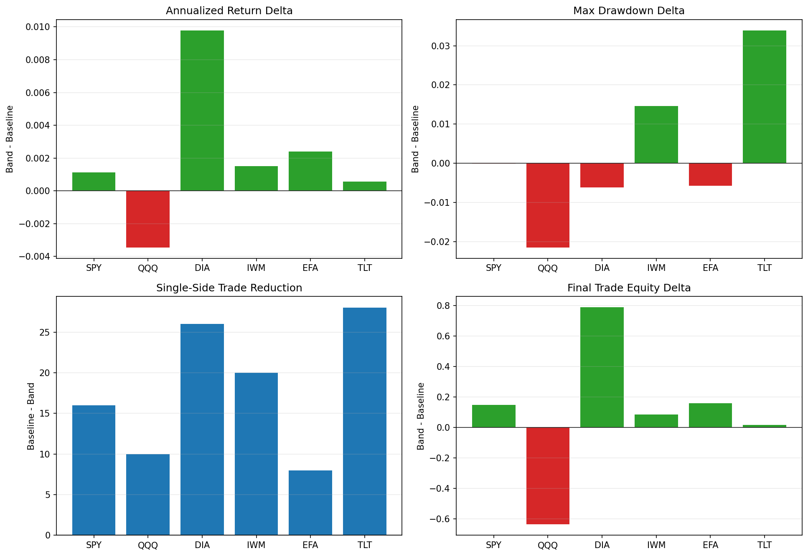

# 10 Multi-Asset Validation

日期：2026-05-19

前面几课我们一直在 SPY 上研究 `band_1pct`。

第 10 课要做一个非常重要的检查：

```text
这个改进是不是只在 SPY 上有效？
```

如果一个规则只在一个资产上有效，它可能只是贴合了那条历史曲线。真正值得继续研究的规则，至少应该在相近逻辑的多个市场上有一定可迁移性。

## 本课问题

第 9 课的结论是：

```text
0.5% 到 1.0% 附近的小幅均线差距过滤值得继续研究。
```

但这只回答了 SPY 内部的稳健性。

第 10 课继续问：

```text
换成 QQQ、DIA、IWM、EFA、TLT 后，这个结论还成立吗？
```

这一步叫多资产验证。

## 资产池

本课选 6 个 ETF：

| symbol | 含义 | 资产类型 |
| --- | --- | --- |
| SPY | 标普 500 ETF | 美国大盘股 |
| QQQ | 纳斯达克 100 ETF | 美国科技成长股 |
| DIA | 道琼斯工业平均 ETF | 美国蓝筹股 |
| IWM | 罗素 2000 ETF | 美国小盘股 |
| EFA | 美国以外发达市场 ETF | 海外股票 |
| TLT | 长久期美国国债 ETF | 债券 |

统一从 2005-01-01 开始测试，避免不同资产上市时间差异太大。

## 策略设置

每个资产都跑两套规则：

```text
baseline: 原始 10/200 双均线
band_1pct: 短均线高于长均线 1% 才买入，低于长均线 1% 才卖出
```

统一执行假设：

- next-open 成交
- 单边 2 bps 滑点
- 单边 1 bps 佣金

## 关键代码

完整脚本在 `scripts/10_multi_asset_validation.py`。

下载多资产数据：

```python
symbols = ["SPY", "QQQ", "DIA", "IWM", "EFA", "TLT"]

data_by_symbol = {
    symbol: download_ohlcv(symbol=symbol, start="2005-01-01", auto_adjust=True)
    for symbol in symbols
}
```

运行多资产验证：

```python
results = evaluate_multi_asset_band_filter(
    data_by_symbol,
    band_pct=0.01,
    short_window=10,
    long_window=200,
    transaction_cost_bps=3.0,
    slippage_bps=2.0,
    commission_bps=1.0,
)

comparison = summarize_multi_asset_band_filter(results)
```

这里的 `comparison` 不是单独看策略结果，而是看：

```text
band_1pct 相对 baseline 改善了多少？
```

## 图表



读图顺序：

- 左上：年化收益差值，`band - baseline`。
- 右上：最大回撤差值，越高代表回撤越浅。
- 左下：减少了多少单边交易。
- 右下：最终交易净值差值。

如果一个规则在多数资产上都减少交易次数，但只在少数资产上提高收益，那它可能更像“降噪工具”，不是收益增强器。

## 原始结果

| symbol | variant | final_trade_equity | annualized_return | max_drawdown | calmar | single_side_trades | round_trip_trades | short_trade_count | time_in_market |
| --- | --- | ---: | ---: | ---: | ---: | ---: | ---: | ---: | ---: |
| SPY | baseline | 6.6451 | 9.28% | -21.53% | 0.43 | 39 | 20 | 6 | 76.12% |
| SPY | band_1.00% | 6.7933 | 9.40% | -21.53% | 0.44 | 23 | 12 | 1 | 76.10% |
| QQQ | baseline | 9.9297 | 11.36% | -28.26% | 0.40 | 45 | 23 | 6 | 77.03% |
| QQQ | band_1.00% | 9.2939 | 11.02% | -30.41% | 0.36 | 35 | 18 | 2 | 76.66% |
| DIA | baseline | 3.6497 | 6.26% | -21.04% | 0.30 | 57 | 29 | 13 | 78.05% |
| DIA | band_1.00% | 4.4389 | 7.24% | -21.66% | 0.33 | 31 | 16 | 3 | 77.94% |
| IWM | baseline | 2.8223 | 4.98% | -33.49% | 0.15 | 63 | 32 | 10 | 66.88% |
| IWM | band_1.00% | 2.9093 | 5.13% | -32.03% | 0.16 | 43 | 22 | 3 | 66.60% |
| EFA | baseline | 3.2242 | 5.64% | -25.35% | 0.22 | 45 | 23 | 6 | 67.57% |
| EFA | band_1.00% | 3.3847 | 5.88% | -25.92% | 0.23 | 37 | 19 | 5 | 67.88% |
| TLT | baseline | 1.5106 | 1.95% | -38.71% | 0.05 | 68 | 34 | 17 | 55.70% |
| TLT | band_1.00% | 1.5288 | 2.01% | -35.32% | 0.06 | 40 | 20 | 5 | 54.86% |

## 相对 baseline 的变化

| symbol | baseline_final_trade_equity | band_final_trade_equity | annualized_return_delta | max_drawdown_delta | calmar_delta | trade_reduction | short_trade_reduction | band_beats_baseline |
| --- | ---: | ---: | ---: | ---: | ---: | ---: | ---: | --- |
| SPY | 6.6451 | 6.7933 | 0.11% | -0.01% | 0.01 | 16 | 5 | True |
| QQQ | 9.9297 | 9.2939 | -0.34% | -2.15% | -0.04 | 10 | 4 | False |
| DIA | 3.6497 | 4.4389 | 0.98% | -0.62% | 0.04 | 26 | 10 | True |
| IWM | 2.8223 | 2.9093 | 0.15% | 1.46% | 0.01 | 20 | 7 | True |
| EFA | 3.2242 | 3.3847 | 0.24% | -0.57% | 0.00 | 8 | 1 | True |
| TLT | 1.5106 | 1.5288 | 0.06% | 3.40% | 0.01 | 28 | 12 | True |

## 结果解读

### 1. 多数资产改善，但不是全部

`band_1pct` 在 6 个资产里，有 5 个最终交易净值高于 baseline。

这说明它不是完全只适配 SPY。

但 QQQ 明显变差：

```text
baseline 最终交易净值：9.9297
band_1pct 最终交易净值：9.2939
```

所以不能说：

```text
band 过滤一定更好。
```

只能说：

```text
band 过滤在多数测试资产上有帮助。
```

### 2. 减少交易次数非常稳定

所有资产上，`band_1pct` 都减少了交易次数。

例如：

```text
SPY: 39 -> 23
DIA: 57 -> 31
IWM: 63 -> 43
TLT: 68 -> 40
```

这说明它作为“降噪工具”比较稳定。

### 3. 减少短期交易也比较稳定

所有资产上，30 天以内短期交易数量都下降。

例如：

```text
DIA: 13 -> 3
IWM: 10 -> 3
TLT: 17 -> 5
```

这和我们最初定义的问题一致：

```text
减少短期假突破。
```

### 4. QQQ 是重要反例

QQQ 的特点是趋势强、成长属性明显。

`band_1pct` 在 QQQ 上减少了交易，但收益和回撤都变差。

可能原因是：

```text
强趋势资产更怕延迟入场。
```

过滤器挡掉了噪声，也可能挡掉了一部分早期趋势收益。

这就是为什么不能只看 SPY。

## 本课结论

第 10 课的结论是：

```text
band_1pct 有一定可迁移性，但不是普适规则。
```

更细一点说：

- 它稳定减少交易次数。
- 它稳定减少短期交易数量。
- 它在多数资产上提高最终交易净值。
- 它在 QQQ 上变差，说明不同资产需要不同处理。

所以它更像：

```text
一个可继续研究的降噪过滤器
```

而不是：

```text
一个所有资产通用的收益增强器
```

## 下一步

现在我们已经从单资产扩展到多资产。

下一步应该进入组合层：

```text
如果多个资产都有信号，资金怎么分配？
```

第 11 课建议做：

```text
多资产等权趋势组合
```

这会引入新的核心问题：

- 单资产策略表现一般，组合后是否更稳？
- 多资产之间相关性如何影响回撤？
- 等权组合和只交易 SPY 有什么区别？
- 同时持有多个资产时，交易成本如何累计？

## 复习题

1. 为什么只在 SPY 上验证不够？
2. 为什么 QQQ 变差是一个重要结果，而不是坏消息？
3. `band_1pct` 在多资产中最稳定改善的是收益、回撤，还是交易次数？
4. 为什么“减少交易次数”不等于“一定提高收益”？
5. 下一步为什么要从单资产进入组合层？
