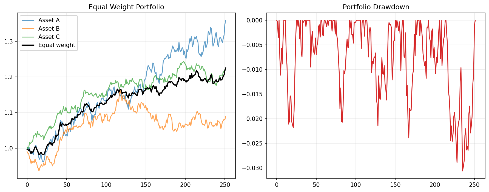

# 11 Equal Weight Trend Portfolio

状态：真实数据实跑版。

对应 RoadMap：阶段 6：组合构建

## 本课问题

多个资产各自有趋势信号时，如何合成一个等权组合？

## 必须理解的概念

- 等权组合
- 主动持仓数
- 组合收益
- 组合回撤
- 资产分散

## 真实数据设置

- symbols: SPY, QQQ, DIA, IWM, EFA, TLT
- start_date: 2006-01-03
- end_date: 2026-05-18
- rows: 5125
- setup: MA 10/200 band 1%, next-open, 3 bps cost

## 关键代码

```python
weights = positions.div(positions.sum(axis=1), axis=0).fillna(0)
portfolio_return = (weights * open_to_next_open_returns).sum(axis=1) - turnover * cost_rate
```

完整脚本：`scripts/11_equal_weight_trend_portfolio.py`

可运行 notebook：`notebooks/11_equal_weight_trend_portfolio.ipynb`

正式报告：`reports/`

## 实跑结果

| case | final_equity | ann_return | ann_vol | max_drawdown | sharpe | calmar | turnover | avg_exposure |
| --- | --- | --- | --- | --- | --- | --- | --- | --- |
| SPY trend only | 5.9452 | 9.16% | 12.03% | -21.53% | 0.7617 | 0.4254 | 23.0000 | 75.24% |
| Equal active trend portfolio | 4.7201 | 7.93% | 13.67% | -24.36% | 0.5800 | 0.3255 | 108 | 91.94% |
| Equal-weight buy and hold | 6.6584 | 9.77% | 15.99% | -45.75% | 0.6111 | 0.2136 | nan | nan |

## 图示



## 讲解

- 等权趋势组合把风险分散到股票、海外、债券和黄金等不同资产上。
- 组合的平均持仓数量比单资产策略更高，因此路径通常更平滑。
- 这不是证明组合一定更赚钱，而是先验证组合层是否改善风险路径。

## 详细讲解

### 1. 本章到底在解决什么问题

前面几章我们一直在研究单个资产上的策略，比如只在 SPY 上做均线、过滤、成本和多资产验证。第 11 章开始进入组合层，问题从：

```text
这个资产今天该不该买？
```

变成：

```text
如果多个资产今天都可以买，资金怎么分？
```

这一步非常关键。单资产策略只决定一个标的的进出场，组合策略决定整个账户的资金分配。现实交易里，你最后面对的不是一条 SPY 曲线，而是一个账户净值曲线，所以组合层是量化从“策略想法”走向“资金管理”的第一步。

### 2. 本章资产池为什么选这些 ETF

本章使用 6 个 ETF：

| symbol | 含义 | 角色 |
| --- | --- | --- |
| SPY | 标普 500 ETF | 美国大盘股 |
| QQQ | 纳斯达克 100 ETF | 美国科技成长股 |
| DIA | 道琼斯工业 ETF | 美国蓝筹股 |
| IWM | 罗素 2000 ETF | 美国小盘股 |
| EFA | 美国以外发达市场 ETF | 海外股票 |
| TLT | 长久期美国国债 ETF | 债券资产 |

它们不是随便选的。SPY、QQQ、DIA、IWM 都是股票类资产，但风格不同；EFA 加入海外市场；TLT 加入债券。这样做的目的不是凑数量，而是让组合有不同来源的风险暴露。

如果你只把 SPY、VOO、IVV 放进组合，看起来是 3 个资产，实际上几乎还是同一个风险来源。真正的组合要关心资产之间是不是有差异，而不是名称是不是不同。

### 3. 趋势信号怎么来

本章仍然沿用前面已经验证过的趋势思路：

```text
短期均线：10 日均线
长期均线：200 日均线
过滤带：1%
执行方式：next-open
成本：单边 3 bps
```

信号含义是：

```text
如果 10 日均线高于 200 日均线超过 1%，认为趋势向上，可以持有。
如果已经持有，只有当 10 日均线低于 200 日均线超过 1%，才退出。
```

这里的 1% band 是为了减少均线附近来回穿越导致的假信号。注意，它不是为了让回测更好看，而是为了解决一个明确问题：

```text
减少短期噪声造成的频繁交易。
```

### 4. 为什么要 shift 一天

代码里有一个很重要的步骤：

```python
active = signals.shift(1).fillna(0)
```

这表示今天的仓位来自昨天收盘后已经知道的信号。原因是：均线信号需要今天收盘价才能计算出来，你不可能在今天开盘时提前知道今天收盘后的均线。

所以正确顺序是：

```text
第 t 天收盘：计算信号
第 t+1 天开盘：按这个信号交易
第 t+1 天到第 t+2 天：承担持仓收益
```

这就是我们前面讲过的 next-open 逻辑。它比 close-to-close 更保守，也更接近真实交易。

### 5. 等权到底是什么意思

核心代码是：

```python
weights = positions.div(positions.sum(axis=1), axis=0).fillna(0)
```

假设今天 6 个资产里有 3 个资产出现趋势信号：

```text
SPY = 1
QQQ = 1
TLT = 1
其他 = 0
```

那么持仓数量是 3，等权后：

```text
SPY 权重 = 1 / 3
QQQ 权重 = 1 / 3
TLT 权重 = 1 / 3
其他权重 = 0
```

如果只有 1 个资产有信号，那它就是 100% 权重。如果 6 个资产都有信号，每个资产就是 1/6。这里的等权不是永远每个资产 1/6，而是：

```text
在当前有趋势信号的资产之间等权。
```

所以本章表格里的 `avg_exposure = 91.94%` 表示组合平均大约 91.94% 的资金处于持仓状态，不是每天都满仓，也不是每天都空仓。

### 6. 组合收益怎么计算

组合收益可以拆成三步：

```python
gross_return = (weights * open_returns).sum(axis=1)
cost = turnover * cost_bps / 10000
net_return = gross_return - cost
```

第一步，计算每个资产的收益贡献：

```text
资产收益贡献 = 资产权重 × 资产收益率
```

第二步，把所有资产收益贡献加起来：

```text
组合毛收益 = 所有资产收益贡献之和
```

第三步，扣掉交易成本：

```text
组合净收益 = 组合毛收益 - 换手成本
```

这里你要养成一个习惯：以后看到任何组合策略，都要问它有没有扣成本、成本怎么算、换手怎么算。没有成本的组合回测通常会过于乐观。

### 7. 三个对照组分别代表什么

本章结果里有三行：

| case | 含义 |
| --- | --- |
| SPY trend only | 只在 SPY 上做同一套趋势规则 |
| Equal active trend portfolio | 在 6 个资产上做趋势信号，有信号的资产之间等权 |
| Equal-weight buy and hold | 6 个资产不择时，长期等权持有 |

这三个不是随便比较的。它们分别回答三个问题：

```text
SPY trend only：
只做单资产趋势，表现如何？

Equal active trend portfolio：
把同样思想扩展成多资产组合，路径是否改善？

Equal-weight buy and hold：
如果我完全不择时，只靠资产分散，会怎样？
```

量化研究一定要有对照组。没有对照组，你就不知道策略到底赢在哪里，也不知道它只是承担了更多 beta，还是确实改善了风险收益结构。

### 8. 如何读这次结果

本章实跑结果是：

| case | final_equity | ann_return | ann_vol | max_drawdown | sharpe | calmar |
| --- | ---: | ---: | ---: | ---: | ---: | ---: |
| SPY trend only | 5.9452 | 9.16% | 12.03% | -21.53% | 0.7617 | 0.4254 |
| Equal active trend portfolio | 4.7201 | 7.93% | 13.67% | -24.36% | 0.5800 | 0.3255 |
| Equal-weight buy and hold | 6.6584 | 9.77% | 15.99% | -45.75% | 0.6111 | 0.2136 |

第一眼不要只看 `final_equity`。如果只看最终净值，buy and hold 最高，似乎它最好。但它最大回撤是 -45.75%，说明中间曾经接近腰斩。对于真实资金，这种路径非常难坚持。

SPY trend only 的最终净值低于 buy and hold，但最大回撤从 -45.75% 降到 -21.53%，Calmar 从 0.2136 升到 0.4254。这说明它牺牲了一部分牛市暴露，换来了更浅的回撤。

Equal active trend portfolio 的表现比较微妙：它没有超过 SPY trend only，最终净值、Sharpe、Calmar 都更低，最大回撤也更深一点。但它仍然明显降低了 buy and hold 的大回撤。这告诉我们：

```text
多资产组合不是自动更强。
```

组合层确实改变了风险路径，但本章这个最朴素的等权规则还不是最终答案。

### 9. 为什么多资产等权没有赢过 SPY trend only

这是本章最值得思考的地方。

第一个原因：资产池里不全是高收益资产。TLT、EFA、DIA、IWM 在某些阶段可能弱于 SPY 或 QQQ。等权组合会把资金分给它们，因此可能拉低最终收益。

第二个原因：等权没有考虑波动率。IWM 这类资产波动更高，TLT 在加息周期也会有很大回撤。简单等权把每个有信号的资产当成同等风险，这并不准确。

第三个原因：股票类 ETF 之间相关性并不低。SPY、QQQ、DIA、IWM 在危机中经常一起跌。你以为自己分散了，但风险来源仍然大量重叠。

第四个原因：趋势信号在不同资产上适配度不同。同样的 10/200 均线和 1% band，对 SPY 合适，不代表对 TLT、EFA、IWM 都合适。

这就是第 12-14 章要继续研究的原因：我们需要看相关性、回撤、仓位权重和再平衡。

### 10. 本章真正应该学到什么

本章不是为了证明：

```text
多资产等权趋势组合一定更赚钱。
```

本章真正要你建立的是组合研究框架：

```text
1. 先对每个资产生成信号。
2. 再把信号转成组合权重。
3. 用 next-open 收益计算组合收益。
4. 扣除换手成本。
5. 和单资产策略、buy and hold 做对照。
6. 不只看最终净值，还要看回撤、波动、Sharpe、Calmar 和暴露。
```

这是从“策略规则”走向“资金管理”的第一步。

### 11. 这一章对你的操作要求

你现在不需要急着改策略。你要先能用自己的话讲清楚：

```text
为什么 signals 要 shift？
为什么有信号的资产之间要重新归一化权重？
为什么组合最终净值不最高，但仍然可能有研究价值？
为什么等权只是基准，不是最终仓位管理方案？
```

能讲清楚这些，第 11 章才算真正过关。


## 本课结论

多资产趋势组合的价值不在于每个资产都更强，而在于把单一资产路径风险摊开。

## 复习问题

1. 本章策略或实验到底想解决什么问题？
2. 结果中最重要的风险指标是什么？
3. 如果换一个市场或成本假设，结论最可能在哪里变化？
4. 这个实验离真实交易还缺哪一步？
