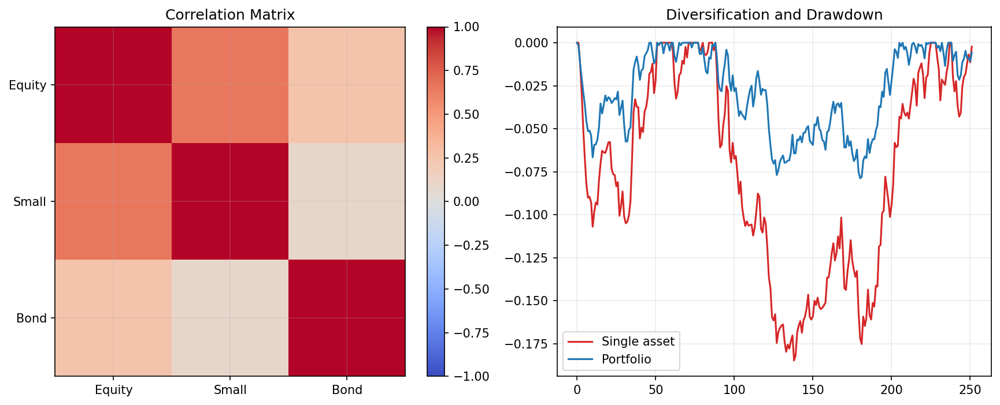

# 12 Portfolio Correlation and Drawdown

状态：真实数据实跑版。

对应 RoadMap：阶段 6：组合风险

## 本课问题

为什么单个资产表现一般，组合以后可能更稳？

## 必须理解的概念

- 相关性
- 分散化
- 组合回撤
- 危机相关性
- 收益来源重叠

## 真实数据设置

- symbols: SPY, QQQ, DIA, IWM, EFA, TLT
- start_date: 2006-01-03
- end_date: 2026-05-18
- rows: 5125
- setup: MA 10/200 band 1%; correlation on strategy returns

## 关键代码

```python
corr = strategy_returns.corr()
rolling_corr = returns['SPY'].rolling(126).corr(returns['TLT'])
```

完整脚本：`scripts/12_portfolio_correlation_drawdown.py`

可运行 notebook：`notebooks/12_portfolio_correlation_drawdown.ipynb`

正式报告：`reports/`

## 实跑结果

| metric | value |
| --- | --- |
| average_pair_correlation | 0.3934 |
| min_pair_correlation | -0.2163 |
| max_pair_correlation | 0.8495 |
| portfolio_max_drawdown | -0.2436 |
| median_single_asset_max_drawdown | -0.2817 |
| latest_126d_SPY_TLT_corr | 0.1136 |

## 图示



## 讲解

- 低相关资产能降低组合回撤，但相关性会随市场环境变化。
- SPY 与 TLT 的滚动相关性是观察股票/债券分散效果的重要窗口。
- 如果组合最大回撤没有明显低于单资产中位数，就要怀疑分散是否真实有效。

## 详细讲解

### 1. 为什么第 12 章紧跟第 11 章

第 11 章我们做了一个多资产等权趋势组合，结果发现它并没有自动赢过 `SPY trend only`。这不是坏事，反而是非常好的研究信号，因为它逼我们继续问：

```text
为什么多个资产放在一起，组合没有明显更强？
```

第 12 章就是回答这个问题的第一步。组合是否有价值，不只取决于每个资产单独表现好不好，还取决于它们之间是不是一起涨、一起跌。

如果几个资产经常一起涨跌，那么它们名字不同，本质上也可能是同一个风险来源。如果几个资产涨跌节奏不同，组合才可能降低路径风险。

### 2. 相关性到底是什么

相关性衡量的是两个收益序列同向运动的程度，取值范围大致是：

```text
+1：几乎完全同涨同跌
 0：线性关系很弱
-1：一个涨时另一个倾向于跌
```

注意，本章计算的是：

```python
corr = strategy_returns.corr()
```

这里不是价格相关性，而是“策略收益相关性”。也就是说，我们先对每个资产跑同一套趋势策略，得到每个资产自己的策略日收益，然后再看这些策略收益之间的相关性。

为什么不直接看价格相关性？因为我们最终交易的是策略，不是裸价格。如果策略经常空仓，或者趋势规则改变了收益路径，那么策略收益相关性比价格相关性更贴近账户层面的风险。

### 3. 为什么低相关能降低组合回撤

组合收益可以粗略理解为多个资产收益的加权平均：

```text
组合收益 = w1*r1 + w2*r2 + ... + wn*rn
```

但组合风险不是简单平均。两个资产同时下跌时，组合回撤会叠加；一个跌、另一个不跌甚至上涨时，组合回撤会被缓冲。

用最简化的两资产方差公式看：

```text
组合方差 =
w1^2 * sigma1^2
+ w2^2 * sigma2^2
+ 2 * w1 * w2 * sigma1 * sigma2 * corr
```

最后一项里的 `corr` 就是关键。如果相关性高，风险会互相加强；如果相关性低甚至为负，这一项会变小，组合波动和回撤就有机会下降。

这就是分散化的数学基础：

```text
分散化不是靠资产数量，而是靠风险来源不完全重叠。
```

### 4. 怎么读相关性矩阵

本章报告里的相关性矩阵是：

| symbol | SPY | QQQ | DIA | IWM | EFA | TLT |
| --- | ---: | ---: | ---: | ---: | ---: | ---: |
| SPY | 1.0000 | 0.8300 | 0.8495 | 0.7017 | 0.6530 | -0.2163 |
| QQQ | 0.8300 | 1.0000 | 0.6782 | 0.6143 | 0.5636 | -0.1871 |
| DIA | 0.8495 | 0.6782 | 1.0000 | 0.6578 | 0.6435 | -0.2141 |
| IWM | 0.7017 | 0.6143 | 0.6578 | 1.0000 | 0.5880 | -0.1795 |
| EFA | 0.6530 | 0.5636 | 0.6435 | 0.5880 | 1.0000 | -0.0818 |
| TLT | -0.2163 | -0.1871 | -0.2141 | -0.1795 | -0.0818 | 1.0000 |

读这个表有几个规则。

第一，对角线永远是 1。因为一个序列和自己完全相关。

第二，矩阵是对称的。`SPY vs QQQ` 和 `QQQ vs SPY` 是同一个数字。

第三，不要平均看，要找结构。比如：

```text
SPY-DIA = 0.8495
SPY-QQQ = 0.8300
SPY-IWM = 0.7017
SPY-EFA = 0.6530
SPY-TLT = -0.2163
```

这说明股票类资产之间相关性很高，尤其 SPY、QQQ、DIA 很像。它们放在一起能分散一些风格风险，但不能完全分散股市系统性风险。

TLT 和股票类资产长期是负相关或低相关，这就是它在组合里有价值的原因。它不一定收益最高，但它可能在股票策略受压时提供缓冲。

### 5. 本章指标逐个解释

本章实跑结果是：

| metric | value |
| --- | ---: |
| average_pair_correlation | 0.3934 |
| min_pair_correlation | -0.2163 |
| max_pair_correlation | 0.8495 |
| portfolio_max_drawdown | -24.36% |
| median_single_asset_max_drawdown | -28.17% |
| latest_126d_SPY_TLT_corr | 0.1136 |

`average_pair_correlation = 0.3934` 表示所有资产两两相关性的平均值大约是 0.39。这不是很低，因为股票类资产之间相关性高，把平均值抬上去了。

`min_pair_correlation = -0.2163` 来自 SPY 和 TLT。这个数字说明长期看，股票趋势策略和债券趋势策略有一定反向关系。

`max_pair_correlation = 0.8495` 来自 SPY 和 DIA。这个数字很高，说明它们虽然是两个 ETF，但策略收益路径非常接近。

`portfolio_max_drawdown = -24.36%` 是第 11 章多资产趋势组合的最大回撤。

`median_single_asset_max_drawdown = -28.17%` 是单资产策略最大回撤的中位数。组合回撤比单资产中位数浅，说明组合确实有一定分散效果。

但是这个改善不算巨大，因为组合里大量资产仍然是股票类风险。

`latest_126d_SPY_TLT_corr = 0.1136` 是最近 126 个交易日，也就是大约半年，SPY 和 TLT 策略收益的滚动相关性。它是正数，说明最近股票和债券并没有表现出很强的负相关保护。

这就是本章最重要的风险提醒：

```text
历史长期负相关，不代表最近仍然负相关。
```

### 6. 为什么相关性不是常数

很多新手会犯一个错误：看到长期相关性矩阵，就以为未来也稳定如此。

现实不是这样。相关性会随市场环境变化：

```text
通胀冲击时：股票和债券可能一起跌。
流动性危机时：很多资产可能一起被卖出。
降息衰退预期时：债券可能上涨、股票下跌。
科技牛市时：QQQ 可能明显强于其他股票 ETF。
```

所以我们看 SPY 和 TLT 的滚动相关性：

```python
rolling_corr = returns["SPY"].rolling(126).corr(returns["TLT"])
```

126 个交易日大约是半年。这个指标不是为了预测明天，而是为了监控组合保护机制有没有变化。

如果你原本指望 TLT 对冲股票，但最近相关性持续升高，那么组合的真实风险可能比历史回测更大。

### 7. 分散化的三个层次

你要区分三种“看起来像分散”的东西。

第一种是名称分散：

```text
我买了 SPY、QQQ、DIA，所以我有 3 个资产。
```

这只是名称不同，不一定风险不同。

第二种是风格分散：

```text
大盘、科技、小盘、海外、债券。
```

这比名称分散更好，但仍然可能在危机时一起下跌。

第三种是收益路径分散：

```text
这些策略收益序列在关键时期不一起亏。
```

这是量化最关心的分散。第 12 章研究的就是第三种。

### 8. 为什么组合回撤只改善了一部分

本章组合最大回撤是 -24.36%，单资产最大回撤中位数是 -28.17%。组合确实更稳了一点，但没有发生质变。

原因很直接：

```text
组合里 6 个资产，5 个都和股票风险有关或部分相关。
```

SPY、QQQ、DIA、IWM、EFA 在全球风险偏好下降时通常会一起受压。TLT 能提供一些不同风险来源，但它只有一个资产，而且在某些时期也不一定能对冲。

所以本章不是证明这个组合已经很好，而是告诉我们下一步应该研究：

```text
资产相关性是否足够低？
仓位是否应该按风险而不是按数量等权？
再平衡频率是否会影响换手和回撤？
```

这正好对应第 13、14 章。

### 9. 本章和第 11 章如何连起来

第 11 章看到的现象是：

```text
多资产等权趋势组合降低了 buy and hold 的深度回撤，
但没有赢过 SPY trend only。
```

第 12 章解释了原因：

```text
组合里股票类资产相关性很高，所以分散效果有限；
TLT 有分散价值，但相关性会随市场变化，不是永久保护。
```

这就是量化研究的正确节奏：不是看到结果就急着改参数，而是先解释结果为什么发生。

### 10. 本章真正要掌握的能力

学完第 12 章，你要能做到三件事。

第一，看到组合时，不再只问：

```text
收益是多少？
```

而是问：

```text
收益来源是不是重叠？
回撤是不是一起发生？
相关性在危机时会不会上升？
```

第二，能读懂相关性矩阵，知道哪些资产只是名字不同，哪些资产真的提供了不同风险来源。

第三，知道相关性是动态的，长期矩阵只能提供背景，不能替代滚动监控。

### 11. 本章过关标准

你能用自己的话解释下面四句话，第 12 章就算过关：

```text
低相关不是为了让收益更高，而是为了降低组合路径风险。
股票类 ETF 之间相关性高，所以它们不能完全分散系统性风险。
TLT 长期有分散价值，但近期相关性可能变正。
组合回撤改善有限时，要先检查相关性和风险来源，而不是直接调参数。
```


## 本课结论

相关性不是常数，组合风控必须关心危机时期相关性是否上升。

## 复习问题

1. 本章策略或实验到底想解决什么问题？
2. 结果中最重要的风险指标是什么？
3. 如果换一个市场或成本假设，结论最可能在哪里变化？
4. 这个实验离真实交易还缺哪一步？
