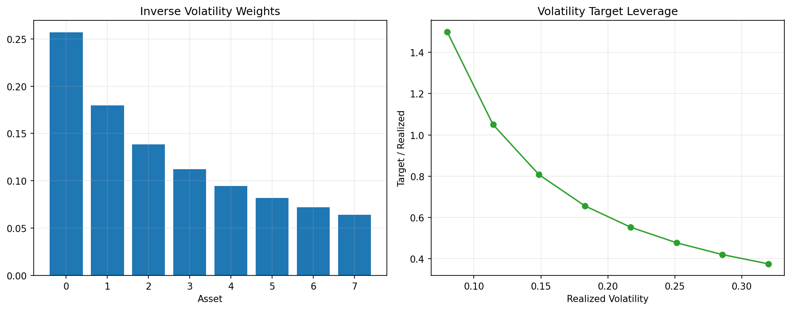

# 13 Position Sizing and Volatility Targeting

状态：真实数据实跑版。

对应 RoadMap：阶段 6：仓位管理

## 本课问题

信号告诉我们买不买，仓位管理决定买多少。

## 必须理解的概念

- 等权
- 波动率倒数加权
- 目标波动率
- 杠杆上限
- 暴露控制

## 真实数据设置

- symbols: SPY, QQQ, DIA, IWM, EFA, TLT
- start_date: 2006-01-03
- end_date: 2026-05-18
- rows: 5125
- setup: Equal, inverse-vol, and 10% volatility-target sizing

## 关键代码

```python
realized_vol = returns.rolling(63).std() * np.sqrt(252)
weight = (target_vol / realized_vol).clip(upper=max_leverage)
```

完整脚本：`scripts/13_position_sizing_volatility_targeting.py`

可运行 notebook：`notebooks/13_position_sizing_volatility_targeting.ipynb`

正式报告：`reports/`

## 实跑结果

| case | final_equity | ann_return | ann_vol | max_drawdown | sharpe | calmar | turnover | avg_exposure |
| --- | --- | --- | --- | --- | --- | --- | --- | --- |
| equal_active | 4.7201 | 7.93% | 13.67% | -24.36% | 0.5800 | 0.3255 | 108 | 91.94% |
| inverse_vol | 5.2141 | 8.46% | 13.04% | -23.65% | 0.6488 | 0.3576 | 132 | 91.92% |
| vol_target_10pct | 3.4373 | 6.26% | 10.54% | -19.11% | 0.5940 | 0.3276 | 124 | 79.05% |

## 图示



## 讲解

- 波动率倒数加权会降低高波动资产的权重，使单个资产不容易主导组合。
- 目标波动率能控制组合风险尺度，但会引入杠杆和低波动时期加仓风险。
- 仓位模型是否可用，要同时看收益、回撤、暴露和换手。

## 详细讲解

### 1. 第 13 章为什么重要

第 11 章我们学会了把多个资产的信号合成组合，第 12 章检查了资产之间的相关性和组合回撤。第 13 章开始处理一个更接近真实资金管理的问题：

```text
有信号，不代表应该买同样多。
```

信号回答的是方向问题：

```text
这个资产现在要不要持有？
```

仓位管理回答的是规模问题：

```text
如果要持有，应该放多少资金？
```

很多初学者会把注意力全部放在“买不买”上，但真正决定账户生死的，往往是“买多少”。一个方向判断正确但仓位过大的策略，仍然可能因为一次极端波动被打穿。

### 2. 等权仓位的缺陷

第 11 章的做法是等权：

```text
当前有 N 个资产出现信号，每个资产权重 = 1 / N
```

这个方法简单、透明、适合作为基准。但它有一个明显缺陷：

```text
它把每个资产当成同等风险。
```

现实中，SPY、IWM、TLT、EFA 的波动率并不一样。比如小盘股 IWM 通常比大盘股 SPY 更波动，长久期债券 TLT 在利率冲击下也可能非常剧烈。如果都给同样权重，实际风险贡献并不相等。

所以等权不是错，它只是最朴素的基准。第 13 章要研究的是：

```text
能不能让仓位和风险匹配，而不是只和资产数量匹配？
```

### 3. 本章比较了三种仓位方法

本章有三行结果：

| case | 含义 |
| --- | --- |
| equal_active | 第 11 章的有信号资产等权 |
| inverse_vol | 波动率倒数加权 |
| vol_target_10pct | 把组合风险控制到约 10% 年化波动率 |

它们的思想不同。

`equal_active` 是：

```text
只要有信号，每个资产拿同样资金。
```

`inverse_vol` 是：

```text
波动率越高，权重越低；
波动率越低，权重越高。
```

`vol_target_10pct` 是：

```text
先生成基础组合，再根据组合最近波动率调整总仓位，让目标年化波动率接近 10%。
```

这三种方法代表了仓位管理的三个阶段：简单、风险平衡、组合风险目标。

### 4. 波动率倒数加权怎么理解

核心思想是：

```python
realized_vol = returns.rolling(63).std() * np.sqrt(252)
inverse_vol_weight = 1 / realized_vol
```

如果两个资产都有信号：

```text
资产 A 年化波动率 = 10%
资产 B 年化波动率 = 20%
```

那么 B 的波动率是 A 的 2 倍。为了避免 B 主导组合风险，波动率倒数加权会给 B 更低权重。

直觉是：

```text
高波动资产少买一点，低波动资产多买一点。
```

这不是预测收益，而是在控制风险贡献。它假设一个保守观点：

```text
既然我不知道哪个资产未来收益更高，那至少不要让高波动资产天然占据更大风险。
```

### 5. 目标波动率怎么理解

目标波动率是另一种思路。它不只调整资产之间的相对权重，还调整整个组合的总暴露。

简化逻辑是：

```text
如果组合最近波动率高于目标：降低总仓位。
如果组合最近波动率低于目标：提高总仓位。
```

代码骨架是：

```python
weight = (target_vol / realized_vol).clip(upper=max_leverage)
```

如果目标波动率是 10%，组合最近波动率是 20%，那么理论仓位大约减半：

```text
10% / 20% = 0.5
```

如果组合最近波动率是 5%，理论仓位会变成 2 倍：

```text
10% / 5% = 2.0
```

但真实交易里不能无限加杠杆，所以要有 `max_leverage` 上限。本章设置了杠杆上限，避免低波动时期仓位无限放大。

### 6. 为什么目标波动率不是免费午餐

目标波动率听起来很高级，但它有几个风险。

第一，波动率是滞后的。你用过去 63 天估计风险，但未来风险可能突然跳升。低波动时期加仓，最怕下一刻进入高波动冲击。

第二，它可能在暴跌后降仓，错过反弹。波动率通常在下跌后升高，模型会降低仓位，但这也可能让策略在反弹初期暴露不足。

第三，它降低风险的同时，也可能降低收益。因为仓位变小后，牛市阶段赚得也少。

所以目标波动率不是为了保证更赚钱，而是为了让风险尺度更稳定。

### 7. 如何读本章结果

本章实跑结果是：

| case | final_equity | ann_return | ann_vol | max_drawdown | sharpe | calmar | avg_exposure |
| --- | ---: | ---: | ---: | ---: | ---: | ---: | ---: |
| equal_active | 4.7201 | 7.93% | 13.67% | -24.36% | 0.5800 | 0.3255 | 91.94% |
| inverse_vol | 5.2141 | 8.46% | 13.04% | -23.65% | 0.6488 | 0.3576 | 91.92% |
| vol_target_10pct | 3.4373 | 6.26% | 10.54% | -19.11% | 0.5940 | 0.3276 | 79.05% |

`inverse_vol` 是这次最均衡的结果：最终净值从 4.7201 提高到 5.2141，年化收益从 7.93% 提高到 8.46%，年化波动从 13.67% 降到 13.04%，最大回撤也从 -24.36% 改善到 -23.65%。

这说明在这个资产池和参数下，按波动率调整权重比简单等权更合理。

`vol_target_10pct` 的结果则更像风险压缩工具：年化波动降到 10.54%，最大回撤降到 -19.11%，但最终净值也降到 3.4373，年化收益只有 6.26%。

这不是失败，而是符合预期：

```text
你主动把组合风险压低，收益通常也会被压低。
```

所以不要用单一标准评价仓位模型。如果你的目标是追求更高收益，`vol_target_10pct` 未必最好；如果你的目标是控制账户波动和回撤，它就有价值。

### 8. 为什么 inverse_vol 这次更好

从第 12 章我们知道，组合里有不少股票类资产相关性较高。简单等权会让高波动资产在某些阶段对组合影响过大。

`inverse_vol` 做了一件朴素但有效的事：

```text
不让高波动资产自然放大组合风险。
```

它没有预测哪个资产收益最高，只是避免风险过度集中。因此它可能同时改善波动、回撤和 Sharpe。

但也要谨慎：这次有效，不代表永远有效。如果低波动资产未来收益很差，或者高波动资产进入强趋势，inverse_vol 也可能拖累收益。

### 9. 关键指标怎么理解

`ann_vol` 是年化波动率，代表净值曲线日收益的波动程度。它不是亏损，但它反映路径颠簸程度。

`max_drawdown` 是最大回撤，代表从历史高点到后续低点的最大跌幅。它比波动率更接近真实心理压力。

`sharpe` 粗略表示单位波动换来多少收益。本章没有扣无风险利率，所以更像简化版 Sharpe。

`calmar` 是年化收益除以最大回撤绝对值，专门强调回撤效率。

`avg_exposure` 是平均仓位暴露。`vol_target_10pct` 的平均暴露只有 79.05%，说明它经常降低总仓位，这也是它回撤更浅但收益更低的重要原因。

### 10. 仓位管理的正确心态

仓位管理不是让回测曲线一定更好看的工具。它的目标是让策略符合你的风险预算。

一个成熟的策略开发者不会只问：

```text
哪个版本收益最高？
```

而会问：

```text
哪个版本的风险是我能承受的？
哪个版本的回撤不会让我中途放弃？
哪个版本在成本、换手和执行上更稳？
```

这就是从“找策略”进入“管资金”的转变。

### 11. 本章过关标准

你能讲清楚下面四句话，第 13 章就算过关：

```text
信号决定买不买，仓位决定买多少。
等权简单透明，但默认每个资产风险相同。
波动率倒数加权是为了降低高波动资产的风险主导权。
目标波动率主要是控制风险尺度，不是保证提高收益。
```


## 本课结论

仓位管理不是提高收益的魔法，它首先是把风险尺度拉回可比较状态。

## 复习问题

1. 本章策略或实验到底想解决什么问题？
2. 结果中最重要的风险指标是什么？
3. 如果换一个市场或成本假设，结论最可能在哪里变化？
4. 这个实验离真实交易还缺哪一步？
