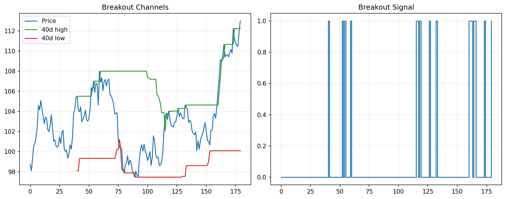

# 15 Breakout Strategy

状态：真实数据实跑版。

对应 RoadMap：阶段 4：经典策略族

## 本课问题

价格突破历史高点是否代表趋势开始？

## 必须理解的概念

- 突破
- Donchian channel
- 假突破
- 退出规则
- 趋势延续

## 真实数据设置

- symbols: SPY
- start_date: 2006-01-03
- end_date: 2026-05-18
- rows: 5125
- setup: Donchian breakout, next-open, 3 bps cost

## 关键代码

```python
channel_high = close.rolling(lookback).max().shift(1)
signal = close > channel_high
```

完整脚本：`scripts/15_breakout_strategy.py`

可运行 notebook：`notebooks/15_breakout_strategy.ipynb`

正式报告：`reports/`

## 实跑结果

| case | final_equity | ann_return | ann_vol | max_drawdown | sharpe | calmar | turnover | avg_exposure |
| --- | --- | --- | --- | --- | --- | --- | --- | --- |
| breakout_20d | 3.7889 | 6.77% | 10.52% | -24.37% | 0.6435 | 0.2778 | 153 | 65.58% |
| breakout_60d | 4.8283 | 8.05% | 11.09% | -23.02% | 0.7256 | 0.3496 | 47.0000 | 71.38% |
| breakout_120d | 5.2796 | 8.53% | 11.44% | -19.37% | 0.7450 | 0.4401 | 19.0000 | 71.36% |
| ma_10_200_band | 5.9452 | 9.16% | 12.03% | -21.53% | 0.7617 | 0.4254 | 23.0000 | 75.24% |

## 图示



## 讲解

- 短周期突破更敏感，也更容易被假突破反复打脸。
- 长周期突破更慢，但通常能过滤更多噪声。
- 突破和均线都是趋势思想，差异主要在信号定义和反应速度。

## 详细讲解

### 1. 突破策略到底在赌什么

突破策略的核心假设是：

```text
如果价格能突破过去一段时间的最高价，说明市场力量可能已经变强，后面有机会继续上涨。
```

它不是在预测明天一定上涨，而是在捕捉一种市场状态：

```text
价格已经强到足以突破前高，趋势可能正在形成。
```

这和前面学过的均线策略一样，都属于趋势跟随。区别是：

```text
均线策略看价格是否站在趋势均线之上。
突破策略看价格是否突破过去 N 天高点。
```

所以突破策略更像一个“价格创新高”的规则。

### 2. 本章的买入和卖出规则

课本里的核心代码是：

```python
channel_high = close.rolling(lookback).max().shift(1)
signal = close > channel_high
```

`channel_high` 是过去 `lookback` 天的最高收盘价。这里有一个关键细节：用了 `.shift(1)`。

这表示：

```text
今天判断是否突破时，只能使用昨天以前已经知道的数据。
```

如果不用 `shift(1)`，就可能把今天的价格也放进“过去最高价”里，形成未来函数或逻辑错误。

真实实现里还多了一个持仓状态：

```text
空仓时：如果收盘价突破过去 N 天高点，变成持有。
持有时：如果收盘价跌破过去 N 天低点，变成空仓。
```

也就是说，它不是每天重新问“今天是不是突破”，而是：

```text
突破后开始持有，直到跌破退出线才卖出。
```

### 3. 用 100W 账户怎么理解

本章只交易 SPY，所以权重很简单：

```text
signal = 1 -> SPY 权重 100%
signal = 0 -> SPY 权重 0%，现金 100%
```

如果账户是 100W：

```text
有突破信号：买入约 100W SPY
没有信号或触发退出：持有现金
```

如果账户后面涨到 120W，下一次仍然是：

```text
signal = 1 -> 买入约 120W SPY
```

所以本章仍然是“单资产、满仓/空仓”的教学策略，还没有复杂仓位管理。

### 4. 20 日、60 日、120 日突破有什么区别

本章比较了三个突破窗口：

```text
20 日：短周期突破
60 日：中周期突破
120 日：长周期突破
```

窗口越短，信号越敏感：

```text
优点：更快进场，更快反应。
缺点：更容易被假突破来回打脸，换手率更高。
```

窗口越长，信号越迟钝：

```text
优点：过滤更多短期噪声。
缺点：进场更慢，可能错过一段行情。
```

这就是量化策略里很常见的取舍：

```text
更快的信号，通常更吵；
更稳的信号，通常更慢。
```

### 5. 如何读本章结果

本章结果里，`breakout_20d` 的换手率是 153，明显高于 `breakout_60d` 的 47 和 `breakout_120d` 的 19。

这说明：

```text
20 日突破交易更频繁，更容易反复进出。
```

从结果看，`breakout_120d` 的最终净值、最大回撤和 Calmar 都比较好：

```text
final_equity = 5.2796
max_drawdown = -19.37%
calmar = 0.4401
```

这说明在这段 SPY 历史数据里，较长周期突破比短周期突破更稳。

但你不能因此直接得出“120 日永远最好”。正确结论应该是：

```text
在这个市场、这段历史、这个成本假设下，长一点的突破窗口更适合 SPY。
```

下一步应该做的是样本外验证和多资产验证，而不是只挑最好的参数。

### 6. 为什么还要和均线策略比较

结果里还有一行：

```text
ma_10_200_band
```

这是为了告诉你：突破策略不是孤立存在的。它和均线策略都属于趋势策略，只是信号定义不同。

```text
均线策略：价格相对均线的位置。
突破策略：价格相对历史高点的位置。
```

如果两个策略在同一段市场里都有效，说明这段市场可能确实有趋势特征。如果只有某个参数有效，就要警惕参数选择偏差。

### 7. 突破策略最大的问题

突破策略最怕的是假突破：

```text
价格刚突破前高，策略买入；
随后价格很快跌回去，策略亏损退出。
```

短周期突破更容易遇到这个问题，因为短期高点本身可能只是噪声。

实盘里通常会加更多约束，比如：

```text
突破幅度过滤
成交量确认
长期趋势过滤
最大止损
仓位上限
多资产分散
```

本章先不加这些，是为了让你看清楚突破策略最原始的骨架。

### 8. 本章过关标准

你能讲清楚下面四句话，第 15 章就算过关：

```text
突破策略是趋势跟随，不是预测明天涨跌。
lookback 越短，反应越快，假突破越多。
本章单资产策略里，signal=1 基本等于满仓 SPY。
突破策略必须警惕参数选择偏差，不能只看最好的窗口。
```

## 本课结论

突破策略的核心风险是假突破；参数越短，反应越快，噪声也越多。

## 复习问题

1. 本章策略或实验到底想解决什么问题？
2. 结果中最重要的风险指标是什么？
3. 如果换一个市场或成本假设，结论最可能在哪里变化？
4. 这个实验离真实交易还缺哪一步？
