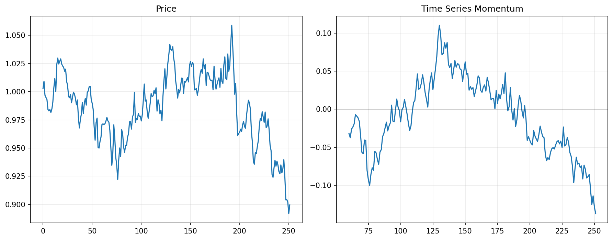

# 16 Time Series Momentum

状态：真实数据实跑版。

对应 RoadMap：阶段 4：经典策略族

## 本课问题

过去一段时间上涨的资产，未来是否更可能继续上涨？

## 必须理解的概念

- 绝对动量
- 回看窗口
- 跨资产动量
- 趋势持续
- 窗口敏感性

## 真实数据设置

- symbols: SPY, QQQ, DIA, IWM, EFA, TLT
- start_date: 2006-01-03
- end_date: 2026-05-18
- rows: 5125
- setup: Absolute momentum on 21/63/126/252 day lookbacks

## 关键代码

```python
momentum = close / close.shift(lookback) - 1
signal = momentum > 0
```

完整脚本：`scripts/16_time_series_momentum.py`

可运行 notebook：`notebooks/16_time_series_momentum.ipynb`

正式报告：`reports/`

## 实跑结果

| case | final_equity | ann_return | ann_vol | max_drawdown | sharpe | calmar | turnover | avg_exposure |
| --- | --- | --- | --- | --- | --- | --- | --- | --- |
| tsmom_21d | 3.6304 | 6.55% | 13.41% | -31.89% | 0.4879 | 0.2052 | 1283 | 91.41% |
| tsmom_63d | 2.6138 | 4.84% | 13.20% | -40.53% | 0.3665 | 0.1194 | 759 | 92.96% |
| tsmom_126d | 5.6039 | 8.84% | 13.11% | -22.49% | 0.6747 | 0.3932 | 509 | 92.96% |
| tsmom_252d | 3.5179 | 6.38% | 13.40% | -28.38% | 0.4763 | 0.2249 | 308 | 90.75% |

## 图示



## 讲解

- 时间序列动量不是预测具体价格，而是判断资产自身趋势是否为正。
- 不同窗口代表不同趋势尺度，窗口敏感性本身就是策略风险。
- 跨资产测试比单资产测试更能暴露动量规则是否稳健。

## 详细讲解

### 1. 时间序列动量是什么

时间序列动量的核心问题是：

```text
一个资产过去一段时间涨了，未来是否更可能继续涨？
```

它也叫绝对动量，因为它只和资产自己的过去比较：

```text
SPY 和 SPY 自己过去比；
QQQ 和 QQQ 自己过去比；
TLT 和 TLT 自己过去比。
```

这和横截面动量不一样。横截面动量会问：

```text
这一组资产里，谁涨得最多？
```

时间序列动量问的是：

```text
这个资产自己的趋势是不是为正？
```

### 2. 本章信号怎么生成

核心代码是：

```python
momentum = close / close.shift(lookback) - 1
signal = momentum > 0
```

假设 `lookback = 126`，意思就是：

```text
今天价格 / 126 个交易日前价格 - 1
```

如果结果大于 0，说明过去 126 天上涨：

```text
signal = 1，允许持有。
```

如果结果小于等于 0，说明过去 126 天没涨：

```text
signal = 0，保持空仓。
```

注意，这里不是预测上涨幅度，也不是预测明天收益率。它只是把市场状态分成两类：

```text
过去趋势为正：持有。
过去趋势不为正：不持有。
```

### 3. 本章如何分配 100W

第 16 章交易的是 6 个资产：

```text
SPY, QQQ, DIA, IWM, EFA, TLT
```

默认仍然使用等权仓位：

```text
有信号的资产之间平均分配资金。
```

如果账户 100W，某天信号是：

```text
SPY = 1
QQQ = 1
IWM = 0
EFA = 0
TLT = 1
DIA = 0
```

那么组合权重是：

```text
SPY：33.3%
QQQ：33.3%
TLT：33.3%
其他：0%
现金：0%
```

如果只有一个资产有信号：

```text
这个资产 100%，其他 0%。
```

如果所有资产都没有信号：

```text
全部现金。
```

所以本章的核心不是复杂仓位，而是比较不同动量窗口产生的信号质量。

### 4. 为什么测试 21、63、126、252 天

这些窗口代表不同时间尺度：

```text
21 天：约 1 个月
63 天：约 1 个季度
126 天：约半年
252 天：约 1 年
```

短窗口反应快，但容易被短期噪声影响。

长窗口反应慢，但更接近中长期趋势。

量化里不能只问“哪个窗口收益最高”，还要问：

```text
这个窗口为什么有效？
换一个市场还有效吗？
换一段时间还有效吗？
成本提高后还有效吗？
```

如果一个策略只有某一个窗口有效，其他窗口都很差，那就要警惕过拟合。

### 5. 如何读本章结果

本章结果中，`tsmom_126d` 表现最好：

```text
final_equity = 5.6039
ann_return = 8.84%
max_drawdown = -22.49%
sharpe = 0.6747
```

而 `tsmom_63d` 表现明显较差：

```text
final_equity = 2.6138
max_drawdown = -40.53%
```

这说明动量策略对窗口很敏感。窗口不是随便选的，它决定你捕捉的是短期趋势、中期趋势还是长期趋势。

另外，`tsmom_21d` 的 turnover 是 1283，说明交易非常频繁。即使回测里只扣了 3 bps 成本，真实交易中也要警惕：

```text
交易越频繁，滑点和冲击成本越可能吃掉收益。
```

### 6. avg_exposure 为什么这么高

本章几个版本的 `avg_exposure` 都在 90% 左右。

这表示：

```text
在多数时间里，至少有一些资产处于正动量状态，组合总体接近满仓。
```

它不代表每个资产一直满仓，而是组合层面经常有资金在市场里。

比如 6 个资产里，只要有 3 个资产信号为正，资金就会分给这 3 个资产。只要不是所有资产都没有信号，组合就可能接近 100% 暴露。

这和你刚才问的 100W 资金问题是同一个逻辑：

```text
有信号资产之间分资金；
没有信号的资产不占资金；
如果还有其他资产有信号，卖出的资金会分给其他资产，而不一定变现金。
```

### 7. 时间序列动量和突破策略的关系

第 15 章突破策略问：

```text
价格是否突破过去 N 天高点？
```

第 16 章时间序列动量问：

```text
价格是否高于 N 天前？
```

两者都属于趋势跟随，但触发条件不同。

突破策略更强调“创新高”：

```text
必须强到突破历史高点。
```

时间序列动量更宽松：

```text
只要比 N 天前高，就算趋势为正。
```

所以时间序列动量可能更早进入，也可能更容易遇到噪声。

### 8. 本章过关标准

你能讲清楚下面四句话，第 16 章就算过关：

```text
时间序列动量是资产和自己过去比，不是资产之间互相比。
lookback 决定趋势尺度，不是随便调的收益旋钮。
本章多资产组合默认有信号资产等权。
窗口敏感性本身就是策略风险，不能只挑最好的一行结果。
```

## 本课结论

时间序列动量要看跨资产一致性，不能只看一个窗口在一个资产上的表现。

## 复习问题

1. 本章策略或实验到底想解决什么问题？
2. 结果中最重要的风险指标是什么？
3. 如果换一个市场或成本假设，结论最可能在哪里变化？
4. 这个实验离真实交易还缺哪一步？
