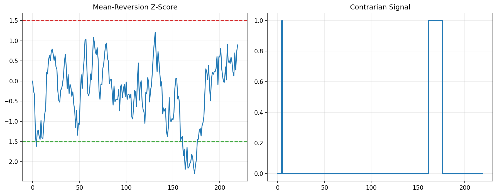

# 17 Mean Reversion Strategy

状态：真实数据实跑版。

对应 RoadMap：阶段 4：经典策略族

## 本课问题

价格偏离均值以后，什么时候会回归？

## 必须理解的概念

- 均值回归
- z-score
- 过度反应
- 止损
- 趋势市场风险

## 真实数据设置

- symbols: SPY
- start_date: 2006-01-03
- end_date: 2026-05-18
- rows: 5125
- setup: 20d z-score long/cash mean reversion

## 关键代码

```python
z = (close - close.rolling(window).mean()) / close.rolling(window).std()
signal = z < -entry_z
```

完整脚本：`scripts/17_mean_reversion_strategy.py`

可运行 notebook：`notebooks/17_mean_reversion_strategy.ipynb`

正式报告：`reports/`

## 实跑结果

| case | final_equity | ann_return | ann_vol | max_drawdown | sharpe | calmar | turnover | avg_exposure |
| --- | --- | --- | --- | --- | --- | --- | --- | --- |
| z_entry_0.75 | 2.5386 | 4.69% | 14.40% | -36.01% | 0.3255 | 0.1302 | 356 | 27.71% |
| z_entry_1.00 | 2.1773 | 3.90% | 14.15% | -39.47% | 0.2756 | 0.0988 | 302 | 25.70% |
| z_entry_1.50 | 2.0851 | 3.68% | 13.75% | -36.10% | 0.2676 | 0.1019 | 234 | 22.61% |
| z_entry_2.00 | 2.1773 | 3.90% | 13.04% | -36.53% | 0.2992 | 0.1068 | 176 | 18.50% |

## 图示



## 讲解

- 均值回归信号在震荡市场更容易发挥作用，在单边趋势中容易持续逆势。
- entry_z 越高，信号越少，等待更极端的偏离。
- 均值回归策略正式使用前必须有止损和失效条件。

## 详细讲解

### 1. 均值回归和趋势策略是反过来的

前面几章的均线、突破、时间序列动量，核心都是趋势跟随：

```text
涨了还可能继续涨，所以跟上去。
```

第 17 章的均值回归刚好相反：

```text
跌得太多可能会反弹，所以在过度下跌时买入。
```

它不追强，而是买弱。

这类策略的底层假设是：

```text
市场短期会过度反应，价格偏离均值后，有机会回到正常水平。
```

但这个假设很危险，因为有些下跌不是短期过度反应，而是趋势真的变坏了。

### 2. z-score 是什么

本章用 `z-score` 衡量价格偏离均值的程度：

```python
z = (close - close.rolling(window).mean()) / close.rolling(window).std()
```

你可以把它理解成：

```text
当前价格距离过去 20 天均值有几个标准差。
```

如果：

```text
z = -1
```

意思是当前价格低于 20 日均值 1 个标准差。

如果：

```text
z = -2
```

意思是当前价格低于 20 日均值 2 个标准差，偏离更极端。

本章做的是 long/cash 均值回归：

```text
z 足够低 -> 买入 SPY，等待反弹。
z 回到 0 以上 -> 卖出，回到现金。
```

### 3. 买入和卖出规则

核心代码是：

```python
signal = z < -entry_z
```

真实实现里是状态机：

```text
空仓时：如果 z < -entry_z，买入。
持有时：如果 z > exit_z，卖出。
```

本章 `exit_z = 0`，意思是：

```text
价格从低估状态回到均值附近或均值上方，就退出。
```

所以这不是“跌了就一直拿着”，而是一个短期反弹策略：

```text
跌到足够极端时买；
修复到均值附近时卖。
```

### 4. 用 100W 账户怎么理解

本章只交易 SPY，所以仍然是单资产满仓/空仓模型：

```text
signal = 1 -> SPY 权重 100%
signal = 0 -> SPY 权重 0%，现金 100%
```

如果账户 100W：

```text
z < -entry_z：买入约 100W SPY
z > 0：卖出 SPY，回到现金
```

它没有说“跌得越多买得越多”。本章只是最基础版本：

```text
触发条件满足就满仓；
不满足就空仓。
```

后续如果要实盘化，才会考虑：

```text
z = -1 买 30%
z = -2 买 60%
z = -3 买 90%
```

这种分层仓位模型。

### 5. entry_z 越高是什么意思

本章测试了：

```text
0.75, 1.00, 1.50, 2.00
```

`entry_z` 越高，要求价格跌得越极端才买入。

例如：

```text
entry_z = 0.75：跌到低于均值 0.75 个标准差就买。
entry_z = 2.00：跌到低于均值 2 个标准差才买。
```

所以：

```text
entry_z 越低，交易更多，信号更频繁；
entry_z 越高，交易更少，等待更极端机会。
```

这可以从结果里看出来。`z_entry_0.75` 的 turnover 是 356，`z_entry_2.00` 的 turnover 是 176，后者交易次数明显更少。

### 6. 如何读本章结果

本章所有版本的年化收益都不算高：

```text
3.68% 到 4.69%
```

但最大回撤并不低：

```text
-36% 到 -39% 左右
```

这说明一个重要问题：

```text
均值回归不是天然低风险。
```

很多人直觉上觉得“跌多了买，反弹就卖”很安全，但如果遇到真正的熊市或趋势下跌，策略可能不断买入正在变坏的资产。

这就是所谓：

```text
接飞刀风险。
```

本章结果也提醒你：低持仓时间不等于低风险。虽然 `avg_exposure` 只有 18% 到 28%，但一旦进场时机碰到大跌，回撤仍然可能很深。

### 7. 为什么均值回归必须有止损和失效条件

均值回归策略最大的问题是：

```text
你以为价格偏离了均值，但真正发生的可能是均值本身变了。
```

比如一家公司基本面恶化，一个市场进入长期熊市，或者宏观环境彻底变化。此时价格不是“暂时低估”，而是在重新定价。

所以真实均值回归策略通常要加：

```text
最大亏损止损
最长持有时间
趋势过滤
波动率过滤
分批建仓
单笔仓位上限
```

本章暂时没有这些，是为了先看清楚最基础的均值回归信号是否有生命力。

### 8. 均值回归适合什么市场

均值回归更喜欢震荡市场：

```text
价格跌下去又弹回来；
价格涨上去又回落。
```

它不喜欢单边趋势市场：

```text
越跌越跌，越涨越涨。
```

这也是为什么第 18 章会把趋势、突破、均值回归放在一起看。因为不同策略适合不同市场状态：

```text
趋势策略适合单边行情；
均值回归适合震荡行情；
多策略组合希望减少单一市场状态依赖。
```

### 9. 本章过关标准

你能讲清楚下面四句话，第 17 章就算过关：

```text
均值回归是买短期过度下跌，不是追涨。
z-score 衡量价格偏离短期均值的程度。
entry_z 越高，信号越少，交易越少。
均值回归必须有止损和失效条件，否则容易在趋势下跌中连续亏损。
```

## 本课结论

均值回归最大的敌人是均值本身发生变化，所以必须承认连续亏损风险。

## 复习问题

1. 本章策略或实验到底想解决什么问题？
2. 结果中最重要的风险指标是什么？
3. 如果换一个市场或成本假设，结论最可能在哪里变化？
4. 这个实验离真实交易还缺哪一步？
