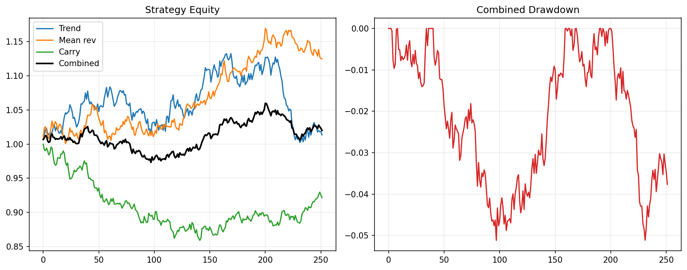

# 18 Multi-Strategy Portfolio

状态：真实数据实跑版。

对应 RoadMap：阶段 4/6：多策略组合

## 本课问题

趋势和均值回归能否互补？

## 必须理解的概念

- 策略相关性
- 多策略组合
- 收益来源
- 策略权重
- 失效轮换

## 真实数据设置

- symbols: SPY
- start_date: 2006-01-03
- end_date: 2026-05-18
- rows: 5125
- setup: Trend, breakout, mean-reversion strategy basket

## 关键代码

```python
strategy_returns = pd.concat([trend_return, breakout_return, mean_reversion_return], axis=1)
combo_return = strategy_returns.mean(axis=1)
```

完整脚本：`scripts/18_multi_strategy_portfolio.py`

可运行 notebook：`notebooks/18_multi_strategy_portfolio.ipynb`

正式报告：`reports/`

## 实跑结果

| case | final_equity | ann_return | ann_vol | max_drawdown | sharpe | calmar |
| --- | --- | --- | --- | --- | --- | --- |
| trend | 5.9452 | 9.16% | 12.03% | -21.53% | 0.7617 | 0.4254 |
| breakout | 4.8283 | 8.05% | 11.09% | -23.02% | 0.7256 | 0.3496 |
| mean_reversion | 2.1773 | 3.90% | 14.15% | -39.47% | 0.2756 | 0.0988 |
| equal_strategy_combo | 4.2001 | 7.31% | 10.02% | -20.76% | 0.7293 | 0.3522 |

## 图示



## 讲解

- 趋势和突破通常同源，相关性往往比名字看起来更高。
- 均值回归可能与趋势类策略互补，但也可能拖累强趋势阶段。
- 多策略组合要看策略收益相关性，不是只数策略数量。

## 详细讲解

### 1. 第 18 章研究的不是多资产，而是多策略

前面第 11-14 章讲的是：

```text
多个资产之间怎么分配资金？
```

第 18 章换了一个角度，问的是：

```text
多个策略之间怎么分配资金？
```

本章仍然只交易一个标的：

```text
SPY
```

但它同时比较三套不同策略：

```text
trend：均线趋势策略
breakout：突破策略
mean_reversion：均值回归策略
```

所以这章的重点不是 SPY、QQQ、TLT 怎么分，而是：

```text
趋势策略、突破策略、均值回归策略之间怎么分。
```

这就是“策略组合”的第一步。

### 2. 本章三个子策略分别是什么

`trend` 是前面学过的均线趋势策略：

```text
价格处于长期趋势上方 -> 持有 SPY
趋势变差 -> 空仓
```

`breakout` 是第 15 章的突破策略：

```text
价格突破过去 60 天高点 -> 持有 SPY
价格跌破退出线 -> 空仓
```

`mean_reversion` 是第 17 章的均值回归策略：

```text
价格短期跌得比较深 -> 买入 SPY 等反弹
价格回到均值附近 -> 卖出
```

这三个策略都只做 long/cash：

```text
有信号就买 SPY；
没有信号就持有现金。
```

区别在于它们喜欢的市场状态不同。

### 3. 100W 账户如何分给三个策略

本章核心代码是：

```python
strategy_returns = pd.concat([trend_return, breakout_return, mean_reversion_return], axis=1)
combo_return = strategy_returns.mean(axis=1)
```

`mean(axis=1)` 的意思是：

```text
三个策略等权，各拿 1/3 资金。
```

如果账户是 100W，可以理解成：

```text
trend 子账户：33.3W
breakout 子账户：33.3W
mean_reversion 子账户：33.3W
```

每个子账户独立运行自己的买卖规则。

例如某天：

```text
trend = 1
breakout = 1
mean_reversion = 0
```

那么真实资金暴露大约是：

```text
trend 子账户买 SPY：33.3W
breakout 子账户买 SPY：33.3W
mean_reversion 子账户持现金：33.3W
总 SPY 暴露：66.7W
总现金：33.3W
```

如果三个策略都看多：

```text
总 SPY 暴露：100W
现金：0
```

如果三个策略都没信号：

```text
SPY 暴露：0
现金：100W
```

所以第 18 章的 `equal_strategy_combo` 不是“每个资产等权”，而是：

```text
每个策略等权。
```

### 4. 为什么不能只看策略数量

很多初学者会以为：

```text
策略越多，分散越好。
```

这不一定对。

如果三个策略本质上都在赚同一种行情，比如都在赚“SPY 上涨趋势”，那它们看起来名字不同，真实风险来源却很接近。

例如：

```text
均线趋势策略
突破策略
时间序列动量策略
```

这三个名字不同，但都偏趋势跟随。市场大涨时可能一起赚钱，市场震荡时可能一起被打脸。

这就是本章为什么强调：

```text
多策略组合要看策略收益相关性。
```

不是策略数量越多越好，而是收益来源越不同越好。

### 5. 趋势和突破为什么可能高度相关

`trend` 和 `breakout` 的规则不同：

```text
trend 看价格和均线的位置；
breakout 看价格是否突破历史高点。
```

但它们喜欢的市场环境很像：

```text
持续上涨、趋势清晰、少震荡。
```

所以它们的收益曲线经常会同涨同跌。

这说明一个重要事实：

```text
策略名字不同，不代表风险来源不同。
```

如果两个策略相关性很高，把它们组合在一起，分散效果会有限。

### 6. 均值回归为什么可能互补，也可能拖累

均值回归和趋势策略的思路相反。

趋势策略是：

```text
涨了继续买，跌破趋势就走。
```

均值回归是：

```text
跌得太多就买，反弹到均值附近就走。
```

所以在震荡市场里，均值回归可能补充趋势策略的弱点。

但在强趋势市场里，它也可能拖累组合。例如大牛市时，趋势策略长期持有，均值回归可能因为等不到“跌得足够深”的机会，暴露不足；大熊市时，均值回归可能过早抄底，遭遇连续亏损。

所以均值回归不是天然增强器，它只是一个不同来源的策略。是否值得加入，要看加入后组合的整体风险收益是否改善。

### 7. 如何读本章结果

本章结果是：

```text
trend：final_equity 5.9452，max_drawdown -21.53%
breakout：final_equity 4.8283，max_drawdown -23.02%
mean_reversion：final_equity 2.1773，max_drawdown -39.47%
equal_strategy_combo：final_equity 4.2001，max_drawdown -20.76%
```

你应该注意两点。

第一，组合的最终净值低于单独的 `trend`：

```text
4.2001 < 5.9452
```

这说明把策略混在一起不一定提高收益。因为本章里的 `mean_reversion` 表现较弱，等权加入后会拖低整体收益。

第二，组合的最大回撤略低于 `trend`：

```text
-20.76% 比 -21.53% 略浅
```

这说明多策略组合确实带来了一点风险平滑，但收益牺牲比较明显。

所以本章的正确结论不是“多策略一定更好”，而是：

```text
组合以后，要同时看收益、波动、回撤和相关性。
```

### 8. equal_strategy_combo 的真实含义

`equal_strategy_combo` 是策略层面的等权组合：

```text
1/3 trend
1/3 breakout
1/3 mean_reversion
```

它不是优化后的组合，也不是最终实盘方案。

它只是一个基准，用来回答：

```text
如果我简单平均三个策略，会发生什么？
```

如果这个简单组合已经明显改善风险收益，说明策略之间可能有不错的互补性。

如果简单组合反而变差，就要继续研究：

```text
是不是某个策略质量太差？
是不是策略权重不合理？
是不是策略相关性太高？
是不是某个市场阶段拖累太明显？
```

### 9. 下一步可以怎么改进

真实的多策略组合不会只停留在平均。

后续可以研究：

```text
按策略波动率倒数加权
按策略 Sharpe 加权
按回撤状态降低某策略权重
给弱策略更低上限
用滚动相关性判断策略是否失效
按市场状态切换策略
```

但这些都要非常谨慎，因为策略权重本身也会过拟合。

一个常见错误是：

```text
看到 trend 历史最好，就给 trend 最大权重；
看到 mean_reversion 历史差，就完全删掉。
```

这可能只是用历史答案调参数。正确做法是先定义原则，再验证。

### 10. 本章过关标准

你能讲清楚下面四句话，第 18 章就算过关：

```text
第 18 章是策略之间分资金，不是资产之间分资金。
equal_strategy_combo 表示三个策略各拿 1/3 资金。
策略名字不同，不代表收益来源不同，要看相关性。
多策略组合不保证提高收益，它的首要价值是分散单一策略失效风险。
```

## 本课结论

多策略组合的关键不是策略数量，而是收益来源是否真的不同。

## 复习问题

1. 本章策略或实验到底想解决什么问题？
2. 结果中最重要的风险指标是什么？
3. 如果换一个市场或成本假设，结论最可能在哪里变化？
4. 这个实验离真实交易还缺哪一步？
