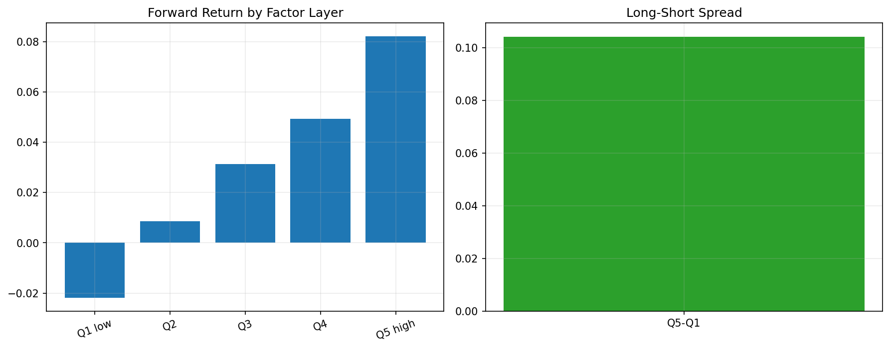

# 19 Factor Research Basics

状态：预习版课本。正式上到本章时，会补充完整实跑结果、报告和必要测试。

对应 RoadMap：阶段 5：因子研究

## 本课问题

如何判断一个排序指标是否能解释未来收益？

## 为什么重要

这一章的目的不是多记一个术语，而是把前面学到的研究流程迁移到新的问题上。

你读这一章时要一直问：

```text
这个规则想解决什么问题？
它赚的是 beta、alpha、风险溢价，还是执行/约束优势？
它最容易在哪种市场环境失效？
```

## 核心概念

- 因子
- 横截面排序
- 分层回测
- 多空组合
- 因子收益

## 代码骨架

```python
factor_rank = factor.groupby(date).rank(pct=True)
quantile = pd.qcut(factor_rank, 5, labels=False)
layer_return = future_return.groupby([date, quantile]).mean()
```

这段代码是本章的最小思想骨架。正式上课时，我们会把它扩展成可复用函数、脚本、notebook 和报告。

## 图示



这张图是预习图，用来帮助你先建立直觉。正式实验图会在本章开讲时根据真实数据生成。

## 实验任务

- 构造动量因子
- 按因子分 5 层
- 观察高低层未来收益差异

## 验收标准

- 能解释分层回测
- 能区分因子收益和单资产择时
- 能指出幸存者偏差风险

## 本课结论

本章预习阶段你要先掌握问题定义和研究框架。真正做实验时，不以“曲线好看”为标准，而以是否解决本章一开始定义的问题为标准。

## 下一步

第 20 章学习 IC、Rank IC 和换手率。
