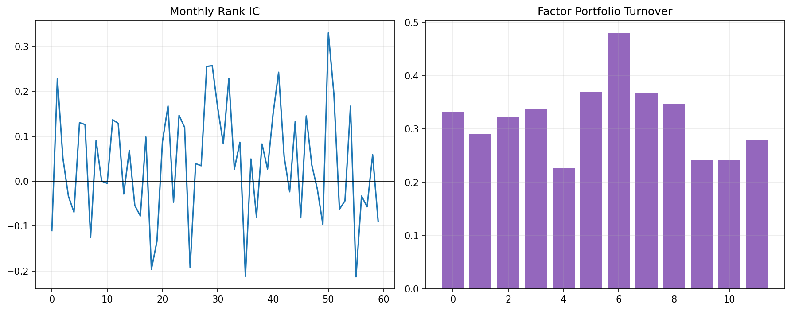

# 20 Factor IC and Turnover

状态：真实数据实跑版。

对应 RoadMap：阶段 5：因子检验

## 本课问题

因子排序和未来收益到底有没有稳定关系？

## 必须理解的概念

- IC
- Rank IC
- ICIR
- 换手率
- 可交易性

## 真实数据设置

- symbols: SPY, QQQ, DIA, IWM, EFA, TLT, GLD, XLE, XLF, XLK, XLU, XLV, XLI, XLY, XLP
- start_date: 2006-01-03
- end_date: 2026-05-18
- rows: 5125
- setup: Rank IC and top-bucket turnover for 6-month momentum

## 关键代码

```python
rank_ic = factor.rank(axis=1).corrwith(future_return.rank(axis=1), axis=1)
```

完整脚本：`scripts/20_factor_ic_and_turnover.py`

可运行 notebook：`notebooks/20_factor_ic_and_turnover.ipynb`

正式报告：`reports/`

## 实跑结果

| metric | value |
| --- | --- |
| months | 238 |
| mean_rank_ic | -0.0171 |
| rank_ic_std | 0.3995 |
| icir | -0.0428 |
| positive_ic_rate | 0.4694 |
| average_top_bucket_turnover | 0.3051 |

## 图示



## 讲解

- Rank IC 衡量的是横截面排序和未来收益排序的关系。
- ICIR 比单个月 IC 更重要，因为它观察稳定性。
- 换手率高会让因子收益更难落地。

## 详细讲解

### 1. 第 20 章解决什么问题

第 19 章用分层回测问：

```text
高分组未来收益是否比低分组更好？
```

第 20 章进一步把这个问题量化成一个数字：

```text
因子排名和未来收益排名，到底相关不相关？
```

这个数字就是 `Rank IC`。

所以第 20 章不是新策略，而是因子体检。它检查第 19 章那个动量因子到底有没有稳定排序能力。

### 2. IC 是什么

`IC` 是 Information Coefficient，信息系数。

你可以先把它理解成：

```text
因子分数和未来收益之间的相关性。
```

如果因子分数越高，未来收益越高，IC 就偏正。

如果因子分数和未来收益没关系，IC 就接近 0。

如果因子分数越高，未来收益反而越差，IC 就偏负。

在因子研究里，IC 不是看净值曲线，而是看信号本身有没有信息。

### 3. Rank IC 是什么

本章用的是 `Rank IC`，也就是排名相关性。

它不直接比较原始数值，而是比较排名：

```text
因子排名 vs 未来收益排名
```

原因是金融数据里极端值很多。直接用原始收益做相关性，可能被少数极端月份扭曲。用排名会更稳一点。

本章核心代码是：

```python
rank_ic = factor.rank(axis=1).corrwith(future_return.rank(axis=1), axis=1)
```

含义是：

```text
每个月，在所有 ETF 之间算一次排名相关性。
```

也就是说，Rank IC 是一个月一个值，不是整个历史只有一个值。

### 4. 用一个小例子理解 Rank IC

假设某个月有 5 个 ETF，因子排名是：

```text
QQQ：第 1 名
SPY：第 2 名
XLE：第 3 名
GLD：第 4 名
TLT：第 5 名
```

下个月真实收益排名如果是：

```text
QQQ：第 1 名
SPY：第 2 名
XLE：第 3 名
GLD：第 4 名
TLT：第 5 名
```

那么 Rank IC 接近 +1，说明排序非常准。

如果下个月真实收益排名完全反过来：

```text
TLT：第 1 名
GLD：第 2 名
XLE：第 3 名
SPY：第 4 名
QQQ：第 5 名
```

那么 Rank IC 接近 -1，说明因子方向可能反了。

如果未来收益排名乱七八糟，和因子排名没关系，Rank IC 接近 0。

### 5. mean_rank_ic 怎么读

本章结果是：

```text
mean_rank_ic = -0.0171
```

这个数接近 0，而且略微为负。

它的意思是：

```text
平均来看，这个因子排序没有稳定预测未来收益排序。
```

这和第 19 章的结论是一致的。第 19 章里 `Q5_high` 看起来比 `Q1_low` 好一点，但 `high_minus_low` 很弱。第 20 章用 Rank IC 进一步说明：

```text
这个排序关系不稳定。
```

### 6. rank_ic_std 和 ICIR 是什么

本章结果里：

```text
rank_ic_std = 0.3995
icir = -0.0428
```

`rank_ic_std` 是 Rank IC 的波动程度。它告诉你每个月的 IC 起伏有多大。

`ICIR` 是：

```text
mean_rank_ic / rank_ic_std
```

它类似 Sharpe 的思想：

```text
平均 IC 有多高？
这个平均值相对于波动是否稳定？
```

如果平均 IC 很高，但波动也极大，那稳定性仍然差。

本章 `ICIR = -0.0428`，非常接近 0，还略微为负。这说明：

```text
这个因子的排序能力没有稳定优势。
```

### 7. positive_ic_rate 是什么

本章结果：

```text
positive_ic_rate = 46.94%
```

意思是：

```text
238 个月里，Rank IC 为正的月份不到一半。
```

如果一个因子有稳定方向性，我们希望它不一定每个月都对，但至少正 IC 月份应该明显多于负 IC 月份。

现在不到 50%，说明这个动量因子在这个 ETF 横截面里并没有稳定地把未来赢家排到前面。

### 8. 换手率为什么重要

第 20 章除了 IC，还看了：

```text
average_top_bucket_turnover = 0.3051
```

这里的 top bucket 是最高分组，也就是第 19 章里的 `Q5_high`。

换手率问的是：

```text
最高分组每个月变动有多大？
```

如果上个月最高分组是：

```text
QQQ, XLK, XLY
```

这个月最高分组变成：

```text
QQQ, XLK, XLE
```

那就说明有一个 ETF 被替换了。

平均换手率 0.3051 可以粗略理解成：

```text
每个月最高分组里大约有 30% 左右的持仓需要调整。
```

这会带来交易成本、滑点、税费和执行复杂度。

### 9. 为什么高 IC 还不够

假设一个因子平均 IC 很好，但换手率极高：

```text
每个月都要大幅换仓。
```

那纸面收益可能无法落地，因为交易成本会吃掉优势。

所以因子至少要同时看两件事：

```text
有没有预测能力：IC / ICIR
能不能交易落地：换手率 / 成本 / 容量
```

本章这个因子的问题更直接：

```text
IC 本身就很弱，换手率再低也救不了。
```

### 10. 第 20 章和第 19 章的关系

第 19 章是肉眼看分层：

```text
Q1 到 Q5 有没有单调改善？
high_minus_low 有没有收益？
```

第 20 章是数字化检验：

```text
每个月的因子排序和未来收益排序相关吗？
这个相关性稳定吗？
高分组换手大不大？
```

所以你可以这样记：

```text
第 19 章：看分层曲线。
第 20 章：看 IC 稳定性和换手率。
```

### 11. 本章结果说明什么

本章关键结果是：

```text
mean_rank_ic = -0.0171
icir = -0.0428
positive_ic_rate = 46.94%
average_top_bucket_turnover = 30.51%
```

结论很明确：

```text
这个 6 个月 ETF 动量因子，在当前资产池和样本期里没有稳定排序能力。
```

这不是坏事。因子研究就是要尽早淘汰弱信号。

如果一个因子在第 19、20 章都站不住，后面就不要急着把它包装成策略。

### 12. 本章过关标准

你能讲清楚下面四句话，第 20 章就算过关：

```text
Rank IC 衡量因子排名和未来收益排名的相关性。
ICIR 衡量 IC 的稳定性，不是只看某一个月准不准。
换手率决定因子能不能在扣除成本后落地。
本章结果说明这个 ETF 动量因子的排序能力很弱。
```

## 测试数据图示


## 本课结论

高 IC 如果伴随极高换手，可能只是纸面优势。

## 复习问题

1. 本章策略或实验到底想解决什么问题？
2. 结果中最重要的风险指标是什么？
3. 如果换一个市场或成本假设，结论最可能在哪里变化？
4. 这个实验离真实交易还缺哪一步？
