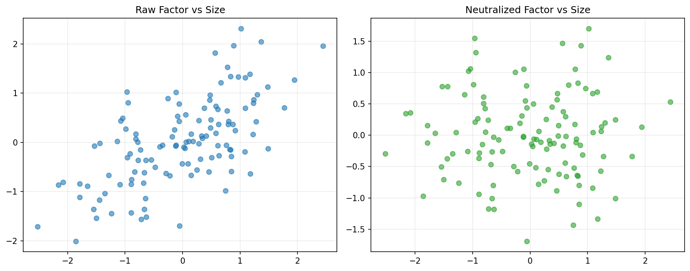

# 21 Factor Neutralization

状态：真实数据实跑版。

对应 RoadMap：阶段 5：因子预处理

## 本课问题

因子有效是真因子有效，还是暴露了 beta 或波动率？

## 必须理解的概念

- 去极值
- 标准化
- beta 中性
- 波动率中性
- 残差化

## 真实数据设置

- symbols: SPY, QQQ, DIA, IWM, EFA, TLT, GLD, XLE, XLF, XLK, XLU, XLV, XLI, XLY, XLP
- start_date: 2006-01-03
- end_date: 2026-05-18
- rows: 5125
- setup: Neutralize momentum factor against rolling beta and volatility

## 关键代码

```python
neutral_factor = factor - X @ np.linalg.lstsq(X, factor, rcond=None)[0]
```

完整脚本：`scripts/21_factor_neutralization.py`

可运行 notebook：`notebooks/21_factor_neutralization.ipynb`

正式报告：`reports/`

## 实跑结果

| case | final_equity | ann_return | ann_vol | max_drawdown | sharpe | calmar | mean_rank_ic | icir | positive_ic_rate |
| --- | --- | --- | --- | --- | --- | --- | --- | --- | --- |
| raw | 0.8702 | -0.68% | 14.83% | -47.11% | -0.0458 | -0.0144 | -0.0171 | -0.0428 | 46.94% |
| neutralized | 1.1754 | 0.79% | 10.97% | -34.45% | 0.0725 | 0.0231 | 0.0068 | 0.0213 | 47.35% |

## 图示



## 讲解

- 中性化后 IC 变好，说明原因子里可能有不想要的 beta/波动率暴露。
- 中性化后 IC 变差，也不等于错误，可能说明暴露本身就是收益来源。
- 中性化要服务于问题定义，而不是机械套用。

## 本课结论

中性化是诊断工具，不是固定仪式；它可能去掉噪声，也可能去掉有效信息。

## 复习问题

1. 本章策略或实验到底想解决什么问题？
2. 结果中最重要的风险指标是什么？
3. 如果换一个市场或成本假设，结论最可能在哪里变化？
4. 这个实验离真实交易还缺哪一步？
