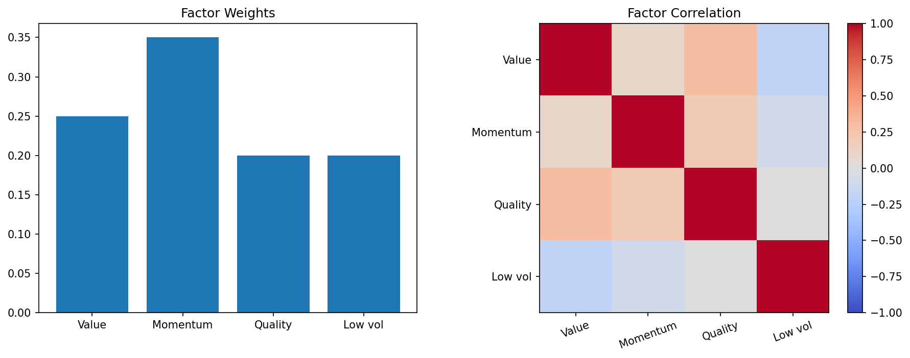

# 22 Multi-Factor Model

状态：真实数据实跑版。

对应 RoadMap：阶段 5：多因子组合

## 本课问题

多个弱因子如何组合成更稳的信号？

## 必须理解的概念

- 多因子
- 等权合成
- 因子相关性
- 低波动因子
- 动量因子

## 真实数据设置

- symbols: SPY, QQQ, DIA, IWM, EFA, TLT, GLD, XLE, XLF, XLK, XLU, XLV, XLI, XLY, XLP
- start_date: 2006-01-03
- end_date: 2026-05-18
- rows: 5125
- setup: Momentum, reversal and low-volatility ETF factors

## 关键代码

```python
score = z_momentum + z_reversal + z_low_volatility
portfolio = score.rank(axis=1, pct=True)
```

完整脚本：`scripts/22_multi_factor_model.py`

可运行 notebook：`notebooks/22_multi_factor_model.ipynb`

正式报告：`reports/`

## 实跑结果

| case | final_equity | ann_return | ann_vol | max_drawdown | sharpe | calmar |
| --- | --- | --- | --- | --- | --- | --- |
| momentum | 1.0453 | 0.22% | 15.26% | -45.13% | 0.0142 | 0.0048 |
| reversal | 0.2775 | -6.09% | 15.26% | -72.63% | -0.3988 | -0.0838 |
| low_volatility | 0.9502 | -0.25% | 14.88% | -54.43% | -0.0168 | -0.0046 |
| composite | 1.2506 | 1.10% | 14.16% | -41.33% | 0.0778 | 0.0266 |

## 图示



## 讲解

- 多因子组合要检查因子之间是否高度重复。
- 单因子强弱会轮换，组合因子的目标是降低单一来源失效风险。
- 如果 composite 只是复制 momentum，那就不是真正的多因子。

## 本课结论

多因子不是堆指标，而是组合不同且有解释力的收益来源。

## 复习问题

1. 本章策略或实验到底想解决什么问题？
2. 结果中最重要的风险指标是什么？
3. 如果换一个市场或成本假设，结论最可能在哪里变化？
4. 这个实验离真实交易还缺哪一步？
