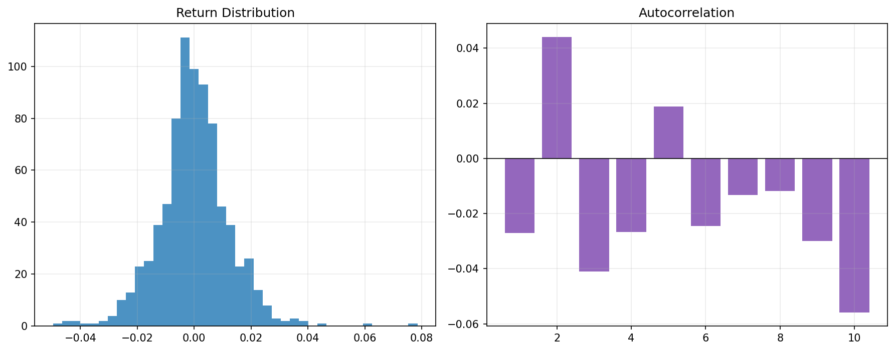

# 23 Financial Time Series Basics

状态：预习版课本。正式上到本章时，会补充完整实跑结果、报告和必要测试。

对应 RoadMap：阶段 7：金融统计

## 本课问题

如何避免把随机噪声误判成规律？

## 为什么重要

这一章的目的不是多记一个术语，而是把前面学到的研究流程迁移到新的问题上。

你读这一章时要一直问：

```text
这个规则想解决什么问题？
它赚的是 beta、alpha、风险溢价，还是执行/约束优势？
它最容易在哪种市场环境失效？
```

## 核心概念

- 分布
- 厚尾
- 自相关
- 平稳性
- 显著性

## 代码骨架

```python
autocorr = returns.autocorr(lag=1)
rolling_vol = returns.rolling(63).std() * np.sqrt(252)
shuffled = returns.sample(frac=1)
```

这段代码是本章的最小思想骨架。正式上课时，我们会把它扩展成可复用函数、脚本、notebook 和报告。

## 图示



这张图是预习图，用来帮助你先建立直觉。正式实验图会在本章开讲时根据真实数据生成。

## 实验任务

- 画收益率分布
- 计算自相关
- 比较真实序列和打乱序列

## 验收标准

- 能解释厚尾
- 能说明自相关为什么重要
- 能区分统计显著和可交易

## 本课结论

本章预习阶段你要先掌握问题定义和研究框架。真正做实验时，不以“曲线好看”为标准，而以是否解决本章一开始定义的问题为标准。

## 下一步

第 24 章学习协整和配对交易。
