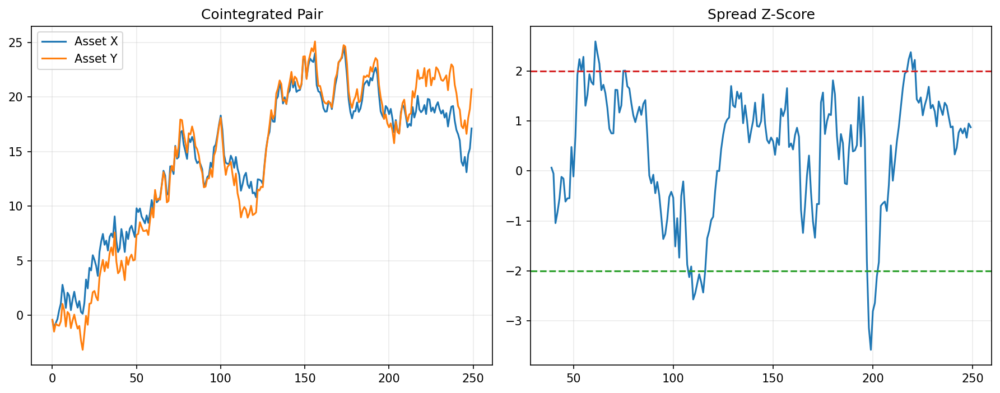

# 24 Pairs Trading and Cointegration

状态：真实数据实跑版。

对应 RoadMap：阶段 7：协整和配对

## 本课问题

两只资产价格一起走时，价差偏离能否交易？

## 必须理解的概念

- 配对交易
- 价差
- z-score
- 相关不等于协整
- 半衰期

## 真实数据设置

- symbols: SPY, QQQ
- start_date: 2006-01-03
- end_date: 2026-05-18
- rows: 5125
- setup: OLS hedge ratio on first 60% sample; z-score spread trading

## 关键代码

```python
spread = log_y - hedge_ratio * log_x
z = (spread - spread.rolling(60).mean()) / spread.rolling(60).std()
```

完整脚本：`scripts/24_pairs_trading_cointegration.py`

可运行 notebook：`notebooks/24_pairs_trading_cointegration.ipynb`

正式报告：`reports/`

## 实跑结果

| case | final_equity | ann_return | ann_vol | max_drawdown | sharpe | calmar | hedge_ratio | half_life_days | trades |
| --- | --- | --- | --- | --- | --- | --- | --- | --- | --- |
| SPY_QQQ_spread_reversion | 1.7046 | 2.66% | 7.41% | -22.79% | 0.3584 | 0.1166 | 1.3529 | 258.6158 | 213 |

## 图示



## 讲解

- SPY 和 QQQ 高相关，但价差交易真正关心的是 spread 是否会回归。
- 半衰期只是粗略估计，不代表每次偏离都能按时回归。
- 双腿交易必须考虑两边成本和对冲比例误差。

## 详细讲解

### 1. 第 24 章为什么是一个新阶段

前面很多策略都是单资产或多资产方向策略：

```text
看涨就买；
看空就空仓；
资金在资产或策略之间分配。
```

第 24 章的配对交易不一样。它不是单纯判断 SPY 或 QQQ 会不会涨，而是问：

```text
SPY 和 QQQ 的相对关系是否偏离正常水平？
偏离后是否有回归机会？
```

所以配对交易赚的不是单边市场上涨，而是两只资产之间的相对价差回归。

### 2. 相关不等于协整

这是本章最重要的观念。

两只资产相关性高，只说明：

```text
它们经常同涨同跌。
```

但配对交易真正需要的是：

```text
两者之间的价差长期有回归特征。
```

如果两只资产只是一起上涨，但价差可以越拉越大，那相关性再高也不适合做均值回归配对。

所以：

```text
相关性回答“是否一起动”；
协整或价差回归回答“偏离后是否会回来”。
```

### 3. 本章为什么选 SPY 和 QQQ

SPY 代表美股大盘，QQQ 代表纳斯达克 100，二者有很强的共同市场 beta。

它们通常会一起受美股整体风险偏好影响：

```text
牛市时一起涨；
熊市时一起跌；
但 QQQ 通常更偏科技成长，弹性更大。
```

这让它们适合做教学案例，因为你能直观看到：

```text
它们相关，但不完全一样。
```

配对交易要利用的正是这种“相似但不完全相同”的关系。

### 4. hedge_ratio 是什么

本章先用前 60% 的样本估计对冲比例：

```python
hedge_ratio = _ols_beta(log_spy.iloc[:train_end], log_qqq.iloc[:train_end])
```

结果里：

```text
hedge_ratio = 1.3529
```

可以粗略理解成：

```text
QQQ 对 SPY 的价格变化更敏感；
构造价差时，需要用约 1.35 倍 SPY 去匹配 QQQ。
```

这不是普通买入权重，而是构造 spread 的比例。

### 5. spread 是什么

核心代码是：

```python
spread = log_qqq - hedge_ratio * log_spy
```

它表示：

```text
QQQ 的对数价格，扣掉按 hedge_ratio 调整后的 SPY 对数价格。
```

如果 spread 很高，说明：

```text
QQQ 相对 SPY 偏贵。
```

如果 spread 很低，说明：

```text
QQQ 相对 SPY 偏便宜。
```

配对交易就是围绕这个 spread 做均值回归。

### 6. z-score 如何产生交易信号

本章把 spread 转成 z-score：

```python
z = (spread - spread.rolling(60).mean()) / spread.rolling(60).std()
```

含义是：

```text
当前 spread 距离过去 60 天均值有几个标准差。
```

交易规则是：

```text
z > 2：spread 太高，做空 spread
z < -2：spread 太低，做多 spread
abs(z) < 0.5：价差回到均值附近，平仓
```

这里的 `2` 是入场阈值，`0.5` 是退出阈值。

### 7. 做多 spread 和做空 spread 是什么意思

因为：

```text
spread = log_qqq - hedge_ratio * log_spy
```

所以做多 spread 大致是：

```text
买 QQQ；
卖空 SPY。
```

做空 spread 大致是：

```text
卖空 QQQ；
买 SPY。
```

更精确地说，SPY 那条腿要按 hedge_ratio 调整。

如果 z 很高，说明 QQQ 相对 SPY 偏贵，策略预期价差回落：

```text
做空 QQQ；
做多 SPY。
```

如果 z 很低，说明 QQQ 相对 SPY 偏便宜，策略预期价差上升：

```text
做多 QQQ；
做空 SPY。
```

### 8. 用 100W 账户怎么理解

配对交易不是简单的“100W 买一个资产”。

它通常是双腿交易。比如 z 很低，策略做多 spread：

```text
买入 QQQ；
同时卖空 SPY；
希望 QQQ 相对 SPY 修复。
```

如果账户 100W，真实仓位可以设计成很多种，例如：

```text
50W 多 QQQ；
约 50W 按对冲比例卖空 SPY。
```

也可以按风险、保证金或波动率调整两条腿。

本章回测是收益率级别的研究版本，没有完整模拟保证金、借券、融资利率和精确股数。它先让你理解配对交易的核心：

```text
交易的是相对价差，不是单边方向。
```

### 9. half_life 是什么

本章结果里：

```text
half_life_days = 258.6158
```

半衰期粗略表示：

```text
价差偏离后，大约多久会回归一半。
```

这个数非常长，接近一年交易日。

这说明 SPY/QQQ 这个 spread 的回归速度并不快。它不是那种几天内快速修复的高频配对。

所以半衰期不能机械理解成：

```text
258 天后一定赚钱。
```

它只是对价差回归速度的粗略估计。

### 10. 如何读本章结果

本章结果是：

```text
final_equity = 1.7046
ann_return = 2.66%
ann_vol = 7.41%
max_drawdown = -22.79%
sharpe = 0.3584
trades = 213
```

这个结果说明：

```text
策略有一点收益，但不强；
波动率不高，但回撤并不浅；
交易次数不少，双腿成本会很重要。
```

年化收益 2.66% 不高，最大回撤 -22.79% 却不小。对配对交易来说，这不是特别理想的风险收益。

所以本章不能得出“SPY/QQQ 配对很适合实盘”的结论。更准确的结论是：

```text
这个例子展示了配对交易流程，但交易质量还需要更严格检验。
```

### 11. 配对交易实盘最容易忽略什么

第一，双腿成本。你不是只买一个资产，而是两边都要成交。

第二，卖空和融资成本。做空腿需要考虑借券、利息和保证金。

第三，对冲比例会漂移。历史估计的 hedge_ratio 未来可能失效。

第四，相关结构会变化。SPY 和 QQQ 的关系不是永恒不变。

第五，极端行情中价差可能继续扩大。均值回归策略最怕“越偏越远”。

### 12. 本章过关标准

你能讲清楚下面四句话，第 24 章就算过关：

```text
配对交易赚的是相对价差回归，不是单边上涨。
相关性高不等于价差一定会回归。
z-score 用来衡量 spread 偏离均值的程度。
双腿交易必须考虑对冲比例、两边成本和关系失效风险。
```

## 测试数据图示


## 本课结论

配对交易不是看到相关就交易，而是要验证价差是否有回归特征。

## 复习问题

1. 本章策略或实验到底想解决什么问题？
2. 结果中最重要的风险指标是什么？
3. 如果换一个市场或成本假设，结论最可能在哪里变化？
4. 这个实验离真实交易还缺哪一步？
