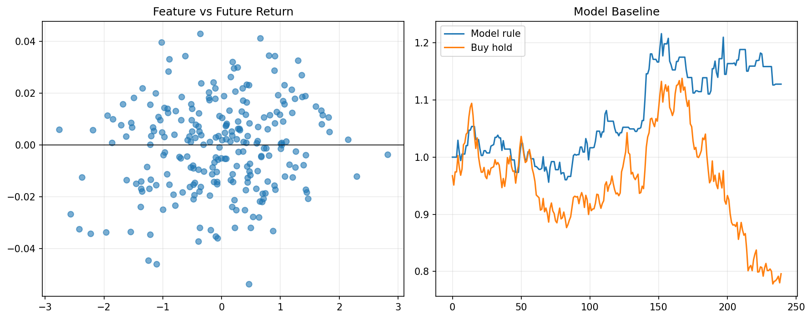

# 25 Machine Learning Signal Baseline

状态：预习版课本。正式上到本章时，会补充完整实跑结果、报告和必要测试。

对应 RoadMap：阶段 8：机器学习量化

## 本课问题

机器学习能不能比简单规则更好？

## 为什么重要

这一章的目的不是多记一个术语，而是把前面学到的研究流程迁移到新的问题上。

你读这一章时要一直问：

```text
这个规则想解决什么问题？
它赚的是 beta、alpha、风险溢价，还是执行/约束优势？
它最容易在哪种市场环境失效？
```

## 核心概念

- 特征
- 标签
- 训练集
- 基准模型
- 交易指标

## 代码骨架

```python
features = pd.concat([momentum, volatility, volume_change], axis=1)
label = (future_return > 0).astype(int)
# train only on past data, compare with simple momentum baseline
```

这段代码是本章的最小思想骨架。正式上课时，我们会把它扩展成可复用函数、脚本、notebook 和报告。

## 图示



这张图是预习图，用来帮助你先建立直觉。正式实验图会在本章开讲时根据真实数据生成。

## 实验任务

- 构造价格特征
- 预测未来收益方向
- 和动量基准比较

## 验收标准

- 能说明准确率不是交易收益
- 能避免未来函数
- 能和简单基准比较

## 本课结论

本章预习阶段你要先掌握问题定义和研究框架。真正做实验时，不以“曲线好看”为标准，而以是否解决本章一开始定义的问题为标准。

## 下一步

第 26 章专门讲机器学习泄露和验证。
