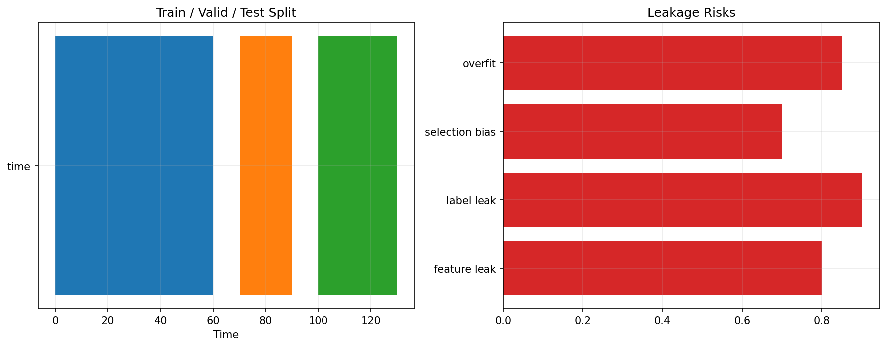

# 26 ML Validation and Leakage

状态：预习版课本。正式上到本章时，会补充完整实跑结果、报告和必要测试。

对应 RoadMap：阶段 8：防泄露

## 本课问题

为什么机器学习量化最容易被数据泄露骗？

## 为什么重要

这一章的目的不是多记一个术语，而是把前面学到的研究流程迁移到新的问题上。

你读这一章时要一直问：

```text
这个规则想解决什么问题？
它赚的是 beta、alpha、风险溢价，还是执行/约束优势？
它最容易在哪种市场环境失效？
```

## 核心概念

- 特征泄露
- 标签泄露
- 时间序列切分
- purge
- embargo

## 代码骨架

```python
train = data.loc[:train_end]
valid = data.loc[valid_start:valid_end]
test = data.loc[test_start:]
# never fit scaler or selector on future data
```

这段代码是本章的最小思想骨架。正式上课时，我们会把它扩展成可复用函数、脚本、notebook 和报告。

## 图示



这张图是预习图，用来帮助你先建立直觉。正式实验图会在本章开讲时根据真实数据生成。

## 实验任务

- 故意制造泄露案例
- 对比泄露和无泄露表现
- 写检查清单

## 验收标准

- 能识别常见泄露
- 能设计时间序列验证
- 能解释为什么随机 KFold 危险

## 本课结论

本章预习阶段你要先掌握问题定义和研究框架。真正做实验时，不以“曲线好看”为标准，而以是否解决本章一开始定义的问题为标准。

## 下一步

第 27 章进入研究管线工程化。
