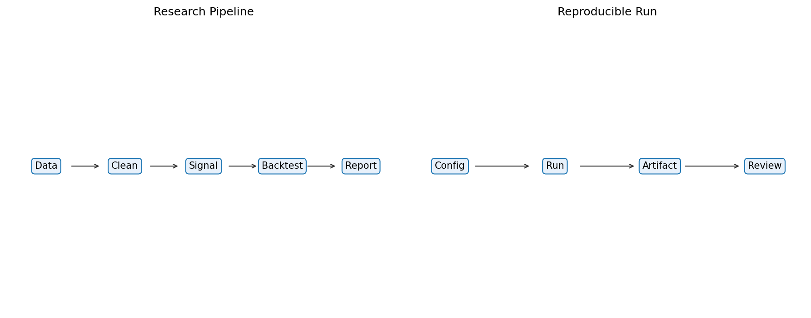

# 27 Research Pipeline Engineering

状态：真实数据实跑版。

对应 RoadMap：阶段 9：工程化

## 本课问题

如何让研究结果可复现，而不是 notebook 手工结果？

## 必须理解的概念

- 配置
- 数据缓存
- 实验参数
- 产物目录
- 日志

## 真实数据设置

- symbols: SPY, QQQ, DIA, IWM, EFA, TLT
- start_date: 2006-01-03
- end_date: 2026-05-18
- rows: 5125
- setup: Reusable pipeline run for the multi-asset trend strategy

## 关键代码

```python
config -> data -> signal -> backtest -> report -> artifacts
```

完整脚本：`scripts/27_research_pipeline_engineering.py`

可运行 notebook：`notebooks/27_research_pipeline_engineering.ipynb`

正式报告：`reports/`

## 实跑结果

| check | value | status |
| --- | --- | --- |
| data_rows | 5125 | pass |
| symbols | SPY,QQQ,DIA,IWM,EFA,TLT | pass |
| parameters_recorded | MA 10/200 band 1% | pass |
| cost_recorded | 3.0 | pass |
| reference_final_equity | 4.7201 | pass |

## 图示



## 讲解

- 工程化的第一步是固定数据、参数、输出路径和报告格式。
- 同一个入口脚本可以重复生成图、表和结论，减少手工复制错误。
- 研究管线不是为了炫技，而是为了让策略结论可审计。

## 本课结论

工程化的价值是让你下次能复现、审计和修改，而不是只留下一张好看的图。

## 复习问题

1. 本章策略或实验到底想解决什么问题？
2. 结果中最重要的风险指标是什么？
3. 如果换一个市场或成本假设，结论最可能在哪里变化？
4. 这个实验离真实交易还缺哪一步？
