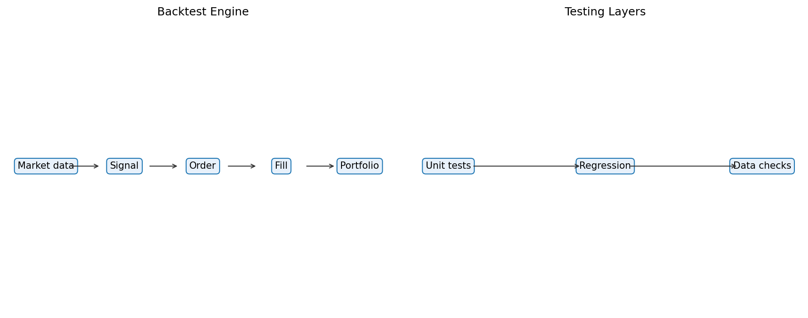

# 28 Backtest Framework Design

状态：真实数据实跑版。

对应 RoadMap：阶段 9：回测框架

## 本课问题

什么时候向量化回测不够，需要事件驱动框架？

## 必须理解的概念

- 数据层
- 信号层
- 订单层
- 成交层
- 组合层

## 真实数据设置

- symbols: SPY
- start_date: 2006-01-03
- end_date: 2026-05-18
- rows: 5125
- setup: Same MA strategy implemented by vectorized and event-driven loops

## 关键代码

```python
for bar in bars:
    signal = strategy.on_bar(bar)
    fill = broker.execute(signal)
    portfolio.update(fill)
```

完整脚本：`scripts/28_backtest_framework_design.py`

可运行 notebook：`notebooks/28_backtest_framework_design.ipynb`

正式报告：`reports/`

## 实跑结果

| case | vectorized_final_equity | event_final_equity | max_equity_difference | orders |
| --- | --- | --- | --- | --- |
| vectorized_vs_event | 5.9452 | 5.9452 | 0.0000 | 23.0000 |

## 图示



## 讲解

- 向量化回测适合快速研究，但订单、成交和状态边界不够显式。
- 事件驱动回测更接近实盘流程，能检查订单和持仓变化。
- 两者结果接近时，说明框架拆分没有改变策略逻辑。

## 详细讲解

### 1. 第 28 章为什么是从研究走向实盘的关键

前面的很多课程主要使用向量化回测。

向量化回测的典型写法是：

```text
先生成整列 signal；
再生成整列 return；
最后用 signal * return 得到策略收益。
```

这种方式非常适合学习和研究，因为它：

```text
代码短；
运行快；
方便画图；
方便比较参数；
容易验证策略大方向。
```

但实盘交易不是一整列数据同时发生。

实盘每天都是按顺序发生的：

```text
今天收到行情；
策略计算信号；
系统生成订单；
券商返回成交；
组合更新持仓；
第二天继续。
```

所以当你开始关心订单、成交、持仓、现金、异常处理时，向量化回测就不够了。

### 2. 向量化回测是什么

向量化回测可以理解成：

```text
用 DataFrame 一次性计算整段历史。
```

例如前面常见的逻辑：

```text
position = signal.shift(1)
strategy_return = position * next_open_return - turnover * cost
equity = (1 + strategy_return).cumprod()
```

它的优点是效率极高。

如果你只是想回答：

```text
这个信号过去有没有大致效果？
不同参数哪个更稳？
成本敏感性怎么样？
```

向量化回测就够用。

但它天然弱化了一个事实：

```text
交易是按时间一笔一笔发生的。
```

### 3. 事件驱动回测是什么

事件驱动回测更接近实盘流程。

本章关键代码是：

```python
for bar in bars:
    signal = strategy.on_bar(bar)
    fill = broker.execute(signal)
    portfolio.update(fill)
```

它不是一次性看完整段历史，而是每天往前走一步。

你可以把它理解成：

```text
bar：今天的行情事件；
strategy：策略根据当前信息生成目标；
broker：模拟订单如何成交；
portfolio：根据成交更新持仓和收益。
```

这套结构更复杂，但状态边界更清楚。

### 4. 五层结构怎么理解

本章要求理解五个层次：

```text
数据层；
信号层；
订单层；
成交层；
组合层。
```

数据层负责提供行情：

```text
今天的 open、high、low、close、volume。
```

信号层负责判断目标：

```text
策略想持有 1 还是 0；
或者想持有多少权重。
```

订单层负责把目标变成动作：

```text
当前持仓是 0；
目标持仓是 1；
所以订单是买入 1 单位。
```

成交层负责模拟能否成交、以什么价格成交、成本是多少。

组合层负责更新：

```text
现金；
持仓；
净值；
收益；
回撤；
暴露。
```

这五层拆开之后，你才能定位问题发生在哪。

### 5. 本章事件驱动代码在做什么

本章仍然使用 SPY 的均线趋势策略。

事件驱动版本的核心逻辑是：

```python
desired = float(signal.shift(1).fillna(0).loc[idx])
order = desired - position
cost = abs(order) * DEFAULT_COST_BPS / 10_000
position = desired
ret = position * open_return - cost
```

逐句解释：

```text
desired：今天应该持有的目标仓位；
order：目标仓位和当前仓位的差；
cost：交易这次变化需要付出的成本；
position：成交后更新持仓；
ret：用更新后的持仓计算下一段收益。
```

这里的 `signal.shift(1)` 很重要。

它表示：

```text
今天执行的是昨天已经知道的信号。
```

这可以避免当天收盘信号直接拿当天开盘成交的未来函数问题。

### 6. 为什么要让向量化和事件驱动结果对齐

本章实跑结果是：

```text
vectorized_final_equity = 5.9452
event_final_equity = 5.9452
max_equity_difference = 0.0000
orders = 23
```

这说明同一个策略逻辑，用向量化和事件驱动两种方式实现，净值完全一致。

这个检查非常重要。

如果两者结果不同，你要先排查：

```text
信号是否同一天生效；
成本是否一致；
收益区间是否一致；
订单是否重复；
初始仓位是否一致；
最后一天收益是否处理一致。
```

只有当两者对齐时，你才能说：

```text
事件驱动框架没有改坏原始策略逻辑。
```

### 7. 事件驱动什么时候必要

如果你只是做日线、低频、全仓或空仓的初步研究，向量化足够。

但下面这些情况，事件驱动会更合适：

```text
需要模拟订单；
需要处理部分成交；
需要区分下单价和成交价；
需要多资产现金约束；
需要盘中止损或止盈；
需要处理挂单、撤单、失败订单；
需要和券商 API 接近；
需要做模拟盘或实盘前演练。
```

也就是说：

```text
研究阶段偏向向量化；
执行阶段偏向事件驱动。
```

### 8. 用 100W 账户怎么理解本章

如果你有 100W，向量化回测通常只告诉你：

```text
信号为 1 时持有 SPY；
信号为 0 时持现金；
净值最后变成多少。
```

事件驱动回测会进一步问：

```text
今天原来持仓是多少？
目标持仓是多少？
要不要下单？
下多少？
用什么价格成交？
成交后持仓是否正确？
成本扣了吗？
```

实盘里，你真正亏钱或出错，常常不是因为大方向完全错，而是因为：

```text
订单重复发了；
仓位没有更新；
信号日期错位；
成交价格假设过于理想；
成本没有进组合；
异常状态没有处理。
```

事件驱动框架就是为了提前暴露这些问题。

### 9. 本章过关标准

你能讲清楚下面四句话，第 28 章就算过关：

```text
向量化回测适合快速研究，事件驱动回测适合检查交易流程。
事件驱动框架把数据、信号、订单、成交、组合状态拆开。
向量化和事件驱动结果对齐，是确认框架没有改坏策略逻辑。
越接近实盘，越需要显式处理订单、成交、持仓和异常状态。
```

## 测试数据图示


## 本课结论

事件驱动框架牺牲简洁性，换来更清楚的订单、成交和状态边界。

## 复习问题

1. 本章策略或实验到底想解决什么问题？
2. 结果中最重要的风险指标是什么？
3. 如果换一个市场或成本假设，结论最可能在哪里变化？
4. 这个实验离真实交易还缺哪一步？
