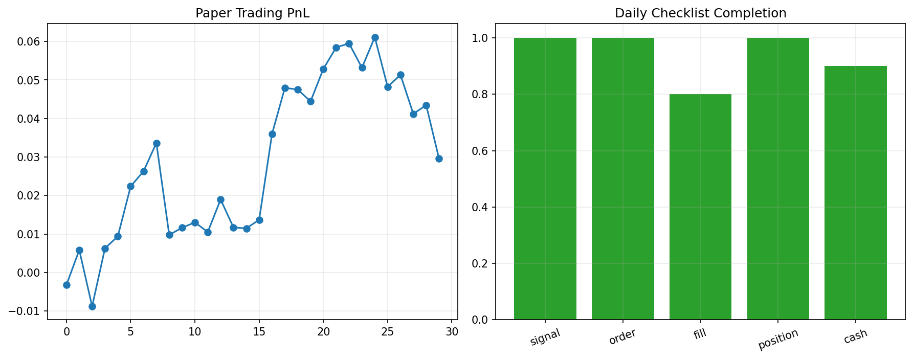

# 29 Paper Trading Checklist

状态：预习版课本。正式上到本章时，会补充完整实跑结果、报告和必要测试。

对应 RoadMap：阶段 10：模拟盘

## 本课问题

回测通过后，为什么还不能直接实盘？

## 为什么重要

这一章的目的不是多记一个术语，而是把前面学到的研究流程迁移到新的问题上。

你读这一章时要一直问：

```text
这个规则想解决什么问题？
它赚的是 beta、alpha、风险溢价，还是执行/约束优势？
它最容易在哪种市场环境失效？
```

## 核心概念

- 模拟盘
- 信号核对
- 订单核对
- 持仓核对
- 日志

## 代码骨架

```python
record = {'date': today, 'signal': signal, 'order': order, 'fill': fill, 'position': position}
paper_log.append(record)
```

这段代码是本章的最小思想骨架。正式上课时，我们会把它扩展成可复用函数、脚本、notebook 和报告。

## 图示



这张图是预习图，用来帮助你先建立直觉。正式实验图会在本章开讲时根据真实数据生成。

## 实验任务

- 设计每日模拟盘日志
- 记录信号和订单差异
- 统计模拟盘偏差

## 验收标准

- 能每天复盘信号
- 能解释回测和模拟盘差异
- 能发现执行问题

## 本课结论

本章预习阶段你要先掌握问题定义和研究框架。真正做实验时，不以“曲线好看”为标准，而以是否解决本章一开始定义的问题为标准。

## 下一步

第 30 章建立实盘前风险政策。
