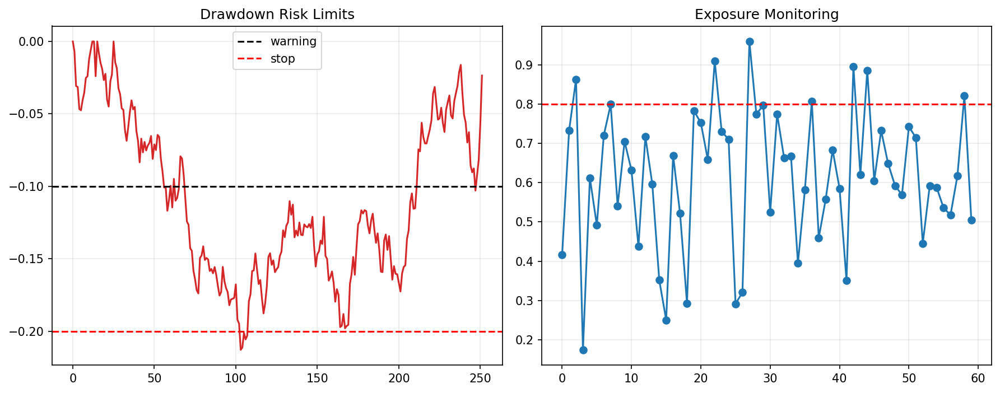

# 30 Risk Policy and Live Readiness

状态：预习版课本。正式上到本章时，会补充完整实跑结果、报告和必要测试。

对应 RoadMap：阶段 10：实盘前准备

## 本课问题

什么条件下，一个策略才有资格进入小资金实盘？

## 为什么重要

这一章的目的不是多记一个术语，而是把前面学到的研究流程迁移到新的问题上。

你读这一章时要一直问：

```text
这个规则想解决什么问题？
它赚的是 beta、alpha、风险溢价，还是执行/约束优势？
它最容易在哪种市场环境失效？
```

## 核心概念

- 最大亏损
- 最大回撤
- 仓位上限
- 停止交易规则
- 异常处理

## 代码骨架

```python
if drawdown < max_allowed_drawdown:
    halt_trading()
if position > max_position:
    reduce_position()
```

这段代码是本章的最小思想骨架。正式上课时，我们会把它扩展成可复用函数、脚本、notebook 和报告。

## 图示



这张图是预习图，用来帮助你先建立直觉。正式实验图会在本章开讲时根据真实数据生成。

## 实验任务

- 写风险政策
- 定义停止交易条件
- 设计异常处理流程

## 验收标准

- 能说清最大可亏损
- 有明确停手机制
- 有模拟盘记录和复盘报告

## 本课结论

本章预习阶段你要先掌握问题定义和研究框架。真正做实验时，不以“曲线好看”为标准，而以是否解决本章一开始定义的问题为标准。

## 下一步

完成 30 章后，进入实盘前专项审查，而不是盲目加资金。
